# Arquitetura do Subsistema de Prevenção da plataforma NatureProtector

## Resumo Executivo

O NatureProtector é uma plataforma orientada à prevenção e apoio operacional em contexto de incêndio rural. Nesta fase do projeto, o foco real está no subsistema de prevenção, na cadeia de dados que o alimenta e no fluxo operacional que transforma leituras simuladas em risco, alertas e estado observável.

Hoje já existe uma baseline funcional e reproduzível com `RabbitMQ`, `PostgreSQL`, `InfluxDB`, `Grafana`, `Backoffice.Api`, `Simulator.Host` e `Prevention.Host`. Também já existe uma base de dados preparada e harmonizada para a área piloto de `Proença-a-Nova`, com artefactos territoriais, meteorológicos e de cenários que o simulador consegue consumir.

Ao mesmo tempo, a arquitetura-alvo ainda não está totalmente fechada. O simulador já executa cenários e produz leituras determinísticas, mas ainda não está separado nas camadas que a investigação pede: verdade física, erro de medição e falha de transporte. O fluxo operacional já é durável, auditável e mais explícito do que na versão inicial: já existe validação semântica do sensor face à área, idempotência reforçada, fronteira interna `NormalizedReading -> RiskInput` e uma decisão explícita de elegibilidade para risco. Ainda falta, porém, transformar toda a semântica `accepted / rejected / normalized` em famílias de eventos e artefactos arquiteturais plenamente estabilizados.

Este documento assume explicitamente essa dupla realidade. O objetivo não é apenas descrever o desenho ideal, nem apenas catalogar ficheiros. O objetivo é explicar, de forma progressiva, como o projeto funciona hoje, qual é a arquitetura-alvo e onde estão os principais desvios, prioridades e próximos passos.

## Como Ler Este Documento

Este documento pode ser lido de três formas.

1. Leitura curta para apresentação: `Resumo Executivo`, `Enquadramento e Escopo`, `Arquitetura de Alto Nível`, `Fluxo Global de Dados`, `Arquitetura do Simulador`, `Fluxo Operacional`, `Estado Atual vs Arquitetura-Alvo`.
2. Leitura técnica completa: seguir a ordem natural do documento, porque ele vai do contexto mais abstrato para a proximidade ao código.
3. Leitura de manutenção: começar em `Aproximação à Implementação`, depois cruzar com `Persistência, Contratos e Semântica Temporal` e com `Checklist de Consistência`.
4. Leitura focada na persistência relacional atual: cruzar este documento com [postgresql-architecture.md](postgresql-architecture.md), que consolida o papel do `PostgreSQL` na runtime real.

## Convenções, Rótulos e Glossário

### Rótulos usados ao longo do documento

- `Implementado`: comportamento existente, verificável no repositório e na runtime atual.
- `Parcial`: comportamento ou estrutura já iniciados, mas ainda incompletos ou ainda não estabilizados.
- `Arquitetura-alvo`: desenho pretendido para a fase atual do projeto.
- `Evolução futura`: direção posterior à fase atual, ou aprofundamento já identificado.
- `Fora de escopo`: elementos conscientemente deixados de fora desta fase.

### Glossário

- `Subsistema de prevenção`: fatia da plataforma responsável por transformar leituras e contexto em risco, alertas e projeções operacionais.
- `Plano de controlo`: camada persistida que guarda a configuração ativa do sistema, incluindo área, grelha, sensores, perfis, cenários, rule sets e artefactos de dados.
- `Fluxo operacional`: cadeia de ingestão, validação, persistência, avaliação de risco, projeção e alerta.
- `Verdade física`: estado físico ou meteorológico de referência que o simulador pretende representar antes de aplicar erro de sensor ou falhas de transporte.
- `Sensor virtual`: representação simulada de um sensor que observa um contexto base e produz eventos.
- `Ficheiro de definição do cenário`: ficheiro JSON versionado que fixa os parâmetros de um cenário, o racional de escolha e as opções consumidas pelo simulador numa execução concreta.
- `Bootstrap`: processo de carga inicial que prepara uma base utilizável a partir de fontes externas ou de ficheiros já produzidos.
- `Modo autónomo local`: modo em que o simulador usa `appsettings` e ficheiros de definição locais, sem depender do plano de controlo em `PostgreSQL`.
- `Baseline`: conjunto preparado e harmonizado de dados de entrada usado como base canónica da demonstração.
- `Proveniência`: capacidade de rastrear um dado derivado até à sua origem, transformação, versão e contexto de utilização.
- `NormalizedReading`: modelo interno da prevenção que representa uma leitura já validada tecnicamente e semanticamente, antes de ser convertida em input de risco.
- `RiskInput`: fronteira mínima entre a pipeline operacional e o motor de scoring; impede que o motor de risco dependa diretamente do envelope bruto.
- `Elegibilidade para risco`: decisão explícita que separa uma leitura aceite para auditoria de uma leitura que deve gerar avaliação de risco.
- `Observabilidade temporal`: séries e medições escritas em InfluxDB para análise, diagnóstico e dashboards; não substitui o estado operacional durável em PostgreSQL.
- `Idempotência operacional`: capacidade de tratar duplicados, retries e colisões concorrentes sem criar efeitos lógicos repetidos.

## Enquadramento e Escopo

O problema que o projeto procura responder é o seguinte: como construir uma cadeia técnica coerente que permita passar de dados territoriais e meteorológicos a uma leitura operacional do risco, com capacidade de demonstrar comportamento plausível, auditável e reproduzível.

O foco da fase atual não é a plataforma NatureProtector completa em todas as frentes. O foco é a prevenção, entendida como uma cadeia completa:

`fontes externas -> aquisição e staging -> harmonização -> contexto territorial e meteorológico -> cenários -> simulador -> sensores virtuais -> eventos -> fluxo operacional -> persistência -> risco -> alertas -> visualização e evidência`

O papel da demonstração é central. O sistema não serve apenas para “correr código”. Tem de conseguir sustentar uma explicação perante um professor, mostrar coerência end-to-end e deixar claro onde está o que já existe, o que está parcialmente fechado e o que ainda é evolução futura.

Ficam fora de escopo desta fase:

- deteção e combate como subsistemas autónomos completos;
- integração produtiva com fontes externas autenticadas ainda bloqueadas;
- modelação operacional avançada de UI e dashboards completos de produto final;
- deployment distribuído de produção fora da baseline local.

**Estado atual.** O foco efetivo do repositório está alinhado com esta delimitação: prevenção, dados, cenários, simulador e fluxo operacional já têm material real.

**Arquitetura-alvo.** A fase atual pretende fechar o subsistema de prevenção como módulo demonstrável, rastreável e tecnicamente sério.

**Evolução futura.** A plataforma mais ampla pode depois estender esta base a outros subsistemas e a uma integração mais rica com fontes e interfaces.

## Drivers Arquiteturais e Decisões de Base

Os drivers que mais condicionam a arquitetura são estes.

| Driver | Porque importa | Consequência arquitetural |
| --- | --- | --- |
| Controlo de âmbito | O projeto é académico e precisa de convergir | foco numa área piloto, num subsistema e numa baseline local |
| Modularidade | O repositório deve refletir responsabilidades distintas | separação progressiva entre domínio, contratos, hosts e infraestruturas |
| Reprodutibilidade | Uma demonstração tem de poder ser repetida | seed determinística, ficheiros de definição, baseline versionada, Docker Compose |
| Auditabilidade | É preciso defender e explicar decisões | envelope comum, inbox durável, persistência de projeções e logs operacionais |
| Observabilidade | O fluxo end-to-end tem de ser demonstrável | escrita em InfluxDB, API de consulta, dashboards e métricas futuras |
| Extensibilidade | A fase atual não é o fim da plataforma | controlo em PostgreSQL, uso de ficheiros de definição, separação entre plano de controlo e execução |
| Coerência end-to-end | Os dados não podem ser peças soltas | cadeia de preparação de dados, cenários e simulador têm de alimentar diretamente a execução |

As decisões de base já fechadas pelo projeto são estas.

- `PostgreSQL` é a fonte de verdade do plano de controlo e do estado operacional persistido.
- `InfluxDB` armazena telemetria e séries temporais operacionais, mas não é condição obrigatória por defeito para considerar uma leitura operacionalmente processada.
- `RabbitMQ` desacopla produção e consumo de eventos.
- O simulador faz parte da fase atual e não é um extra periférico.
- Os datasets e cenários devem ser rastreáveis, versionados e legíveis.
- O fluxo técnico deve ser explicável desde a origem dos dados até à visualização operacional.
- A validação técnica e a validação semântica são fronteiras distintas: contrato inválido é rejeitado antes da inbox; sensor inexistente, inativo ou fora da área é materializado e depois colocado em quarentena.
- O cálculo de risco deve depender de inputs internos normalizados e elegíveis, não diretamente do envelope operacional bruto.

O principal tradeoff da fase atual é claro: a equipa privilegiou uma cadeia demonstrável e funcional antes de fechar a modularização ideal. Isso acelerou a construção da baseline, dos cenários e da runtime, mas deixou alguns desvios entre a decomposição lógica desejada e a estrutura atual do código.

**Estado atual.** As decisões tecnológicas principais já estão materializadas no código e na runtime.

**Arquitetura-alvo.** Falta alinhar melhor a estrutura modular com essas decisões já assumidas.

**Evolução futura.** A modularização pode aprofundar-se sem deitar fora a baseline e a cadeia técnica já existente.

## Contexto da Plataforma e Fronteiras

O subsistema de prevenção vive dentro da plataforma NatureProtector, mas recebe contexto de fora e produz saídas observáveis para fora.

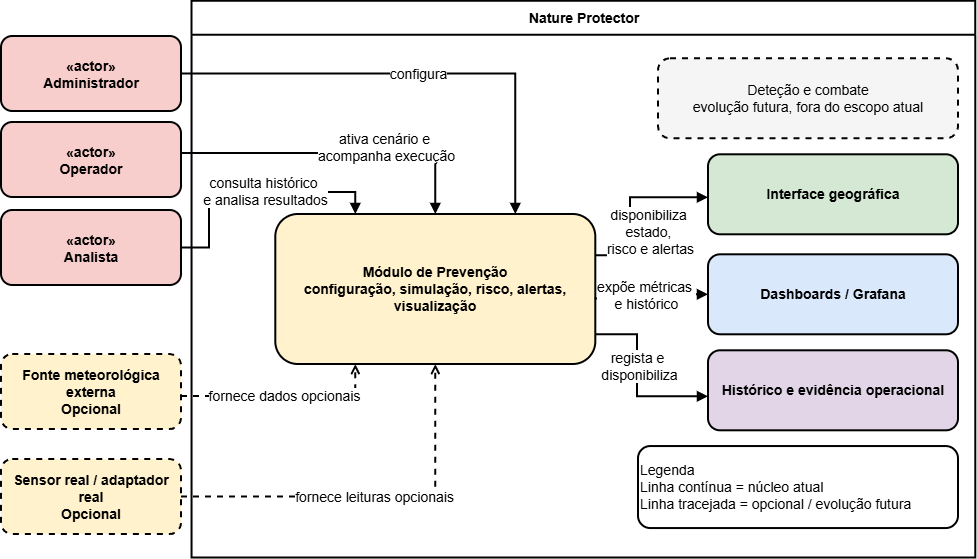

*Figura: contexto da plataforma NatureProtector, atores principais e fronteira do subsistema de prevenção. Fonte editável: [01-platform-context.drawio](diagrams/01-platform-context.drawio).*

Do lado esquerdo estão as fontes e atores que alimentam ou condicionam o sistema: dados geográficos, dados meteorológicos, histórico de incêndios, equipa técnica, utilizadores operacionais e, numa fase futura, integrações com sensores reais ou outros subsistemas.

Do lado direito estão as saídas observáveis: estado operacional, alertas ativos, histórico, evidência, API e dashboards.

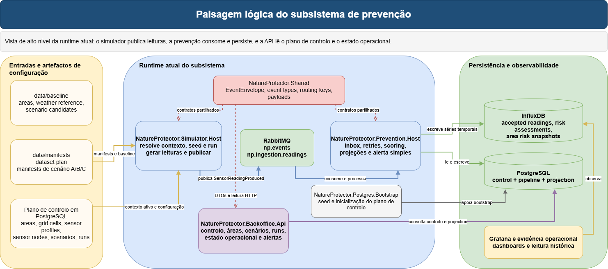

*Figura: paisagem lógica do subsistema de prevenção e dos componentes que já participam na runtime. Fonte editável: [02-prevention-subsystem-landscape.drawio](diagrams/02-prevention-subsystem-landscape.drawio).*

Nesta fase, a fronteira funcional da prevenção é a seguinte.

- `NatureProtector.Simulator.Host` produz leituras e eventos.
- `NatureProtector.Prevention.Host` consome, persiste, calcula risco e atualiza projeções.
- `NatureProtector.Backoffice.Api` expõe o plano de controlo e uma primeira superfície operacional.
- `NatureProtector.Infrastructure.Postgres` e `NatureProtector.Infrastructure.Influx` materializam a persistência.
- `data/` e `scripts/data/` alimentam o contexto necessário para os cenários e para a execução.

**Estado atual.** A plataforma global existe mais como enquadramento do que como runtime completa; a parte viva e coerente é o subsistema de prevenção com a sua cadeia de dados e execução.

**Arquitetura-alvo.** A fronteira entre prevenção, simulação, fluxo operacional e contratos deverá ficar ainda mais explícita na estrutura do repositório.

**Evolução futura.** Outros subsistemas poderão ligar-se a esta base, mas não condicionam a leitura principal desta fase.

## Arquitetura Lógica de Alto Nível

A arquitetura lógica pode ser resumida em seis blocos encadeados.

1. `Aquisição, preparação e harmonização de dados`
2. `Contexto territorial e meteorológico`
3. `Construção de cenários`
4. `Simulador e sensores virtuais`
5. `Fluxo operacional`
6. `Persistência, API, visualização e evidência`

Esta leitura evita um erro comum em documentação genérica: olhar apenas para componentes executáveis e esquecer a cadeia de preparação que torna possível uma simulação útil e defensável.

O projeto, tal como existe hoje, já liga estes blocos. No entanto, não os separa sempre com a nitidez arquitetural desejada. A arquitetura lógica é por isso mais limpa do que a decomposição física do código, mas continua fiel ao sistema real.

## Fluxo Global de Dados e Proveniência

O fluxo global de dados é o coração do projeto.

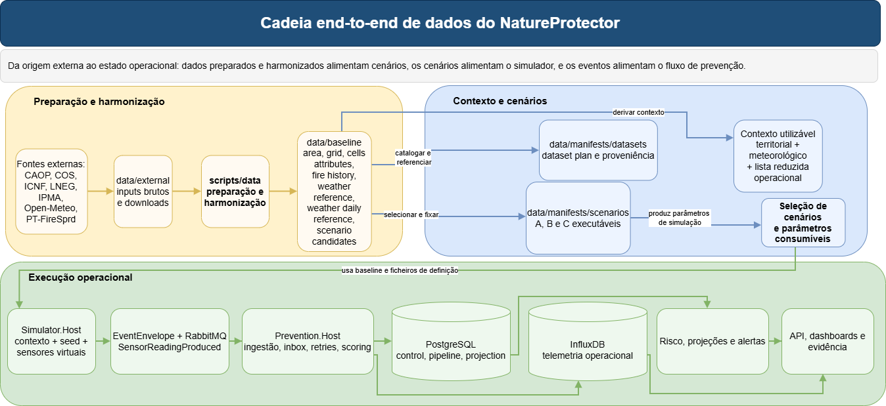

*Figura: cadeia end-to-end de dados, desde fontes externas até visualização e evidência. Fonte editável: [03-end-to-end-data-chain.drawio](diagrams/03-end-to-end-data-chain.drawio).*

### Fontes externas centrais

| Fonte | Papel no projeto | Estado |
| --- | --- | --- |
| `CAOP 2025` | limite oficial da área piloto e base geográfica inicial | `Implementado` |
| `COS 2018` | ocupação do solo e macroclasses territoriais | `Implementado` |
| `ICNF` perigosidade estrutural | contexto territorial de perigosidade rural | `Implementado` |
| `ICNF` área ardida | reforço do histórico e validação territorial | `Implementado` |
| `LNEG` slope/aspect | declive e exposição de vertentes | `Implementado` |
| `IPMA API` | estações próximas e observação recente local | `Implementado` |
| `Open-Meteo` | série horária histórica para construir a base meteorológica inicial | `Implementado` |
| `PT-FireSprd` | ponto de partida histórico para grandes incêndios e candidatos a cenário | `Implementado` |
| `ERA5-Land` oficial | referência meteorológica mais forte | `Parcial`, bloqueado por autenticação |
| `FIRMS`, `CEMS/EFFIS`, `CORINE`, `Tree Cover Density`, altitude | reforço de contexto e validação | `Parcial` ou `Evolução futura` |

### Critérios de escolha das fontes

As fontes não foram escolhidas apenas por disponibilidade. A seleção respondeu a cinco critérios práticos.

- cobertura suficiente para a área piloto;
- granularidade compatível com uma grelha de `1 km`;
- disponibilidade e repetibilidade de obtenção;
- valor explicativo para cenários e risco;
- viabilidade de integração nesta fase do projeto.

### Catálogo técnico resumido das fontes usadas ou previstas

| Fonte | Tipo | Formato ou interface | Escala ou periodicidade | Uso arquitetural | Limitações atuais |
| --- | --- | --- | --- | --- | --- |
| `CAOP 2025` | administrativa e vetorial | `gpkg`, `geojson` | recorte estático por concelho | delimitar a área piloto e gerar a grelha | depende de preparação inicial |
| `COS 2018` | uso do solo | `gpkg` | cobertura territorial estática | preencher ocupação do solo e macroclasses por célula | fotografia temporal fixa |
| `ICNF` perigosidade estrutural 2020-2030 | risco estrutural | raster | referência para vários anos (`2020-2030`) | enriquecer `cells_attributes` com perigosidade estrutural | representa risco estrutural, não as condições variáveis de um dia concreto |
| `ICNF` área ardida | histórico observado | shapefile, vetorial | anual por campanha | validar e reforçar `fire_history` | integração ainda limitada ao que está disponível |
| `LNEG` slope/aspect | topografia derivada | serviço `identify` | referência territorial estática | preencher `slope_deg` e `aspect_deg` | caminho técnico mais frágil do que usar um modelo digital de elevação (`DEM`) local completo |
| `IPMA API` | observação meteorológica | `json` | observação recente | validar coerência local e escolher estações próximas | não substitui uma série histórica longa |
| `Open-Meteo archive` | série meteorológica histórica | `json` | horária entre `2017-01-01` e `2025-12-31` | construir `weather_reference` e derivar contexto diário | fonte pública de arranque, mas não a fonte final ideal |
| `PT-FireSprd` | histórico de grandes incêndios | metadados tabulares e geográficos | histórico por evento | gerar `fire_history` e `scenario_candidates` | nem todos os eventos são diretamente locais |
| `ERA5-Land` oficial | reanálise meteorológica | API autenticada | horária | reforçar a série de referência e a plausibilidade física | bloqueado por autenticação |
| `FIRMS`, `CEMS/EFFIS` | observação e validação externa | APIs e downloads | histórico e evento | validação adicional de contexto e eventos | acesso manual ou autenticado |
| `CORINE`, altitude, `Tree Cover Density` | contexto territorial adicional | raster e vetorial | estático ou atualização lenta | enriquecer `cells_attributes` e melhorar realismo espacial | ainda não integrados de forma estável |

### Aquisição, staging, harmonização e rastreabilidade

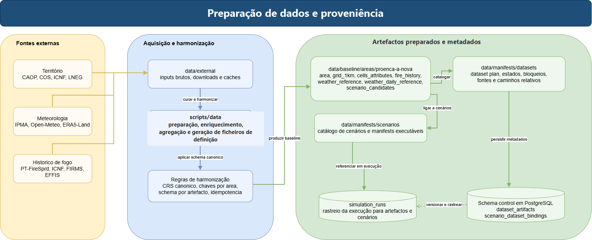

*Figura: aquisição, staging, harmonização, ficheiros de definição e proveniência dos artefactos de dados. Fonte editável: [04-data-curation-and-provenance.drawio](diagrams/04-data-curation-and-provenance.drawio).*

O projeto trabalha em quatro camadas de dados.

| Camada | Local | Papel |
| --- | --- | --- |
| `external` | `data/external/` | inputs brutos ou descarregados |
| `baseline` | `data/baseline/` | artefactos preparados e harmonizados, canónicos e legíveis pelo sistema |
| `manifests` | `data/manifests/` | ficheiros de catalogação e definição que ligam datasets, cenários e execuções |
| `runtime` | `data/runtime/` | saídas de simulação e exports temporários |

Esta organização já é uma decisão arquitetural importante. O sistema não consome diretamente fontes soltas nem depende de trabalho manual invisível. Há uma tentativa explícita de transformar dados heterogéneos em artefactos canónicos, pequenos, reprodutíveis e documentados.

O staging existe hoje sobretudo como organização de ficheiros e sequência de scripts, mais do que como serviço runtime autónomo. Essa distinção deve ser explicitada para evitar linguagem enganadora: há staging arquitetural, mas não há ainda um serviço dedicado de staging em execução contínua.

### Artefactos concretos já produzidos na baseline atual

Os artefactos mais importantes já existentes para `Proença-a-Nova` são estes.

| Artefacto | Papel | Estado atual |
| --- | --- | --- |
| `area.gpkg` e `area.geojson` | limite preparado da área piloto | `Implementado` |
| `grid_1km.gpkg` e `grid_1km.geojson` | unidade analítica espacial | `Implementado`, `467` células |
| `cells_attributes.csv` e `cells_attributes.parquet` | tabela mestra do território por célula | `Implementado` |
| `fire_history.csv` e `fire_history.parquet` | memória histórica territorial e contextual | `Implementado`, `30` registos |
| `scenario_candidates.csv` e `scenario_candidates.parquet` | lista reduzida de cenários candidatos | `Implementado`, `24` candidatos |
| `weather_reference.csv` e `weather_reference.parquet` | série meteorológica horária de referência | `Implementado`, `78.888` registos |
| `weather_daily_reference.csv` e `weather_daily_reference.parquet` | agregação diária e contexto comparável | `Implementado`, `3.287` dias |
| `proenca-a-nova-scenarios.generated.json` | catálogo de cenários gerados | `Implementado` |
| `scenario_a.base.json`, `scenario_b.high-risk.json`, `scenario_c.degraded-pipeline.json` | ficheiros de definição executáveis por cenário | `Implementado` |

### Versionamento, ficheiros de definição e rastreabilidade

O projeto já realiza parte importante da rastreabilidade no sistema de ficheiros e no plano de controlo, mas ainda não fecha toda a cadeia com o mesmo nível de maturidade.

Neste documento usamos preferencialmente a expressão `ficheiro de definição`. A pasta mantém o nome `data/manifests/` por razões históricas do repositório, mas o papel é simples: trata-se de um JSON que fixa aquilo que uma execução ou um catálogo deve usar. Há hoje dois casos principais:

- ficheiro de definição de datasets: cataloga que artefactos existem, em que estado estão e que bloqueios são conhecidos;
- ficheiro de definição de cenário: fixa a escolha do cenário, os seus parâmetros operacionais e o que o simulador deve consumir.

- `data/manifests/datasets/proenca-a-nova-dataset-plan.json` cataloga datasets, estados e bloqueios conhecidos;
- `data/manifests/scenarios/proenca-a-nova-scenarios.generated.json` fixa a lista final de cenários consumíveis;
- o schema `control` já inclui `dataset_artifacts` e `scenario_dataset_bindings`, aproximando a arquitetura-alvo;
- o schema `control` já inclui também `simulation_runs`, permitindo fechar progressivamente a ponte entre artefacto, cenário e execução.

Na prática, a proveniência já existe em três camadas.

1. origem e transformação na cadeia de preparação `scripts/data/`;
2. artefactos preparados e harmonizados e ficheiros de definição em `data/`;
3. ligação progressiva da execução ao plano de controlo em `PostgreSQL`.

### Modelo canónico atualmente inferido

O modelo canónico atual não está formalizado como um único schema público de dados, mas pode ser inferido com clareza a partir da baseline e dos ficheiros de definição.

- `area` e `grid_1km` fixam a geometria da área piloto;
- `cells_attributes` agrega o contexto territorial por célula;
- `fire_history` e `scenario_candidates` fixam a memória histórica e a lista reduzida de cenários candidatos;
- `weather_reference` dá uma série horária coerente;
- `weather_daily_reference` cria uma visão diária comparável, com índices e contexto relativo;
- os ficheiros de definição de datasets e cenários ligam esses artefactos a execuções e racional de escolha.

**Estado atual.** A proveniência já é materialmente forte ao nível dos ficheiros, scripts e ficheiros de definição, mas ainda não está toda refletida no plano de controlo.

**Arquitetura-alvo.** Cada `simulation_run` deve poder ser rastreada até aos artefactos exatos, fórmulas, limiares e versões de dados usados.

**Evolução futura.** A integração total de metadados de dataset em `PostgreSQL` deve tornar esta rastreabilidade auditável sem depender apenas do sistema de ficheiros.

## Construção do Contexto Territorial e Meteorológico

O sistema não trabalha diretamente sobre um concelho “em abstrato”. Trabalha sobre uma área piloto preparada e harmonizada e sobre uma unidade espacial concreta.

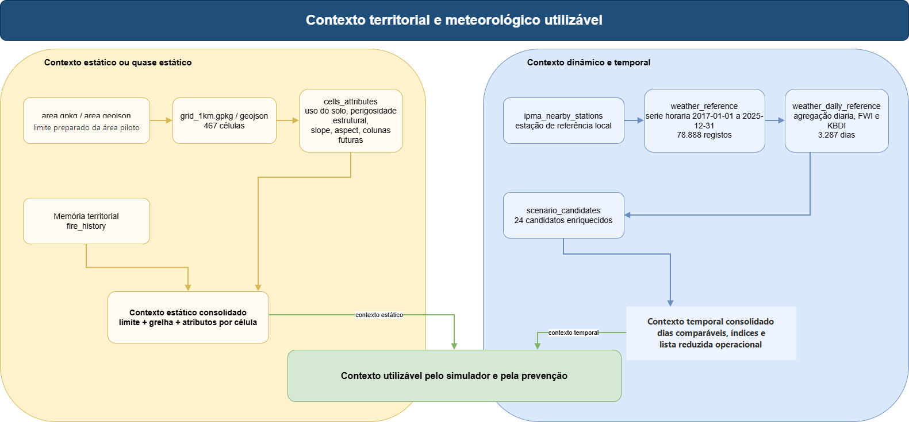

*Figura: passagem de dados brutos para contexto territorial e meteorológico utilizável pelo simulador e pela prevenção. Fonte editável: [05-territorial-and-weather-context.drawio](diagrams/05-territorial-and-weather-context.drawio).*

### Área piloto e unidade analítica

- área piloto atual: `Proença-a-Nova`;
- fonte base do limite: `CAOP 2025`;
- unidade analítica dominante: grelha de `1 km x 1 km`;
- número atual de células: `467`.

### Contexto territorial por célula

O artefacto `cells_attributes` funciona hoje como a tabela mestra do território. Cada célula já pode agregar:

- ocupação do solo e macroclasse dominante;
- perigosidade estrutural;
- declive;
- exposição de vertentes.

Há ainda colunas previstas, mas não totalmente fechadas, como `altitude_m` e `tree_cover_density`.

Nesta fase, convém distinguir explicitamente duas classes de contexto.

| Tipo de contexto | Conteúdo principal | Papel arquitetural |
| --- | --- | --- |
| Estático ou quase-estático | limite da área, grelha, uso do solo, perigosidade estrutural, declive, exposição de vertentes | molda a interpretação territorial e a plausibilidade espacial |
| Dinâmico ou temporal | série meteorológica horária, agregação diária, índices, lista reduzida de dias candidatos e estado do cenário ativo | alimenta a construção do cenário e a evolução temporal da simulação |

### Contexto meteorológico

O contexto meteorológico é construído em duas escalas complementares.

| Artefacto | Papel | Estado atual |
| --- | --- | --- |
| `ipma_nearby_stations` | lista reduzida de estações meteorológicas próximas | `Implementado` |
| `ipma_recent_observations` | validação recente de plausibilidade local | `Implementado` |
| `weather_reference` | série horária de referência | `Implementado`, `78.888` registos |
| `weather_daily_reference` | agregação diária e comparabilidade entre dias | `Implementado`, `3.287` dias |

O `weather_reference` cobre hoje o período de `2017-01-01` a `2025-12-31`. Esta série é usada para dar ao simulador uma base temporal coerente e para permitir comparações entre dias de referência.

A partir da leitura do código e dos scripts, a estação de referência mais próxima para a área piloto é `Proença-a-Nova, P.Moitas`, usada como ponto de validação local e não como única fonte temporal do sistema.

### Índices e contexto derivado

O projeto já calcula referências aproximadas de `FWI` e `KBDI`, bem como classificações contextuais associadas aos candidatos a cenário. Isto é importante porque a arquitetura não depende apenas de meteorologia “bruta”; depende de uma transformação de dados externos em contexto utilizável.

### Como os dados passam a contexto utilizável

A transformação principal pode ser lida em quatro passos.

1. delimitar a área e fixar a grelha;
2. enriquecer cada célula com atributos territoriais persistentes;
3. construir uma série meteorológica de referência e a sua agregação diária;
4. ligar a memória territorial e a memória meteorológica a candidatos concretos de cenário.

O resultado não é apenas “um conjunto de ficheiros”. É uma representação utilizável do território e do estado meteorológico que já consegue responder, entre outras, a estas perguntas:

- que células existem e que atributos estruturais têm;
- que dias são comparáveis entre si do ponto de vista meteorológico;
- que eventos históricos são plausíveis como base de cenário;
- que valores de referência devem alimentar o simulador e, mais tarde, as políticas de risco.

**Estado atual.** Já existe contexto territorial e meteorológico suficientemente rico para sustentar cenários executáveis e uma explicação defensável.

**Arquitetura-alvo.** O contexto deve ficar ainda mais explícito como input canónico do simulador, com separação entre atributos estáticos e dinâmicos.

**Evolução futura.** A substituição ou reforço por fontes oficiais autenticadas deve aumentar a robustez sem mudar a lógica global.

## Construção e Formalização de Cenários

Os cenários são a ponte entre a baseline de dados e a execução do simulador.

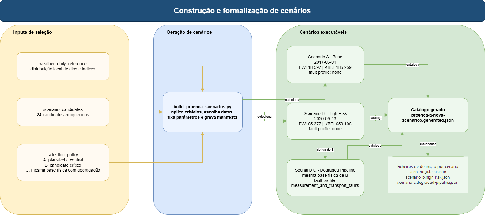

*Figura: transformação de candidatos históricos e meteorológicos em cenários executáveis e reprodutíveis. Fonte editável: [06-scenario-construction.drawio](diagrams/06-scenario-construction.drawio).*

### O que é um cenário neste projeto

Um cenário é um artefacto que fixa:

- uma área;
- uma data ou referência temporal;
- um racional de escolha;
- um conjunto de parâmetros físicos e operacionais;
- um perfil de erro e falha;
- informação suficiente para gerar uma execução reprodutível.

### Pré-seleção e seleção

Os `scenario_candidates` já não são apenas uma lista de eventos históricos. São uma lista reduzida enriquecida com contexto meteorológico e de índices, o que permite escolher dias comparáveis e justificar tecnicamente essa escolha.

Hoje já existem `24` candidatos enriquecidos.

### Tipos de cenário que a arquitetura deve distinguir

Mesmo quando o código ainda não os separa totalmente, a documentação deve distingui-los com clareza.

| Tipo de cenário | O que fixa | Papel |
| --- | --- | --- |
| Cenário físico | contexto meteorológico e territorial de base | define a verdade física ou quasi-física que se quer observar |
| Cenário de sensores | perfis de ruído, disponibilidade, sampling e erro de observação | transforma a verdade física em leitura virtual |
| Cenário operacional | atrasos, duplicações, silêncio, out-of-order e degradação do fluxo operacional | testa robustez operacional do subsistema |

Esta distinção é especialmente importante no cenário `C`, porque o objetivo arquitetural não é inventar outro clima, mas degradar a observação e o transporte mantendo a mesma base física do cenário crítico.

### Cenários atualmente materializados

| Cenário | Papel | Data de referência | Estado |
| --- | --- | --- | --- |
| `A` | dia base plausível de início de verão | `2017-06-01` | `Implementado` |
| `B` | dia de maior severidade e criticidade | `2020-09-13` | `Implementado` |
| `C` | degradação do cenário crítico sem alterar a base física | deriva de `B` | `Implementado` como ficheiro de definição e `Parcial` como comportamento runtime |

No estado atual:

- `A` usa um dia seco plausível e relativamente central na distribuição local;
- `B` usa um dia com ligação histórica forte à área e contexto crítico de índices;
- `C` reutiliza a base física do `B` e muda o perfil de degradação.

### Critérios concretos da escolha dos cenários atuais

| Cenário | Critério de escolha | Evidência resumida |
| --- | --- | --- |
| `A` | dia de verão plausível, seco, próximo do centro da distribuição local e não extremo | `2017-06-01`, `FWI 18.597`, `KBDI 185.259` |
| `B` | candidato historicamente forte, ligado à área piloto e com contexto crítico de índices | `2020-09-13`, `FWI 65.377`, `KBDI 650.106` |
| `C` | versão degradada do cenário `B`, preservando a mesma base física | reutiliza o contexto físico do `B` e introduz fault profile de medição e transporte |

### Seed determinística, perfis, perfis de falha e regras temporais

O sistema já suporta execução determinística baseada em seed, e o `Simulator.Host` já consegue consumir `ScenarioManifestPath` e `ScenarioManifestScenarioKey`.

Uma seed determinística não “congela” o cenário por magia. O que ela faz é fixar a sequência pseudoaleatória usada pelo `Random` do simulador. Se mantivermos a mesma seed, a mesma ordem de geração, o mesmo conjunto de sensores e o mesmo contexto de entrada, então o simulador repete as mesmas decisões de disponibilidade e os mesmos desvios de ruído.

Ainda assim, é importante distinguir duas coisas.

- Os ficheiros de definição já fixam o contexto do cenário e o racional de escolha.
- A geração efetiva de rede de sensores, perfis finos e fault models ainda não está toda externalizada nem completamente separada em runtime.

Nos ficheiros de definição atualmente gerados, esta formalização já inclui campos operacionais concretos, entre eles:

- `StartTimestamp`;
- `BaseTemperature`, `BaseHumidity` e `BaseWindSpeed`;
- `FailureRate` e `NoiseLevel`;
- `NumberOfCycles = 288`;
- `IntervalSeconds = 5`;
- `LogicalStepMinutes = 5`.

Um ciclo corresponde a um passo discreto da simulação. Em cada ciclo, o sistema calcula um `event_time`, gera uma leitura por sensor e publica esse lote. O benefício é duplo: tornar a progressão temporal controlável e permitir comparações repetíveis entre execuções.

No cenário `C`, a degradação futura já está explicitada no ficheiro de definição como intenção arquitetural através de injeções como:

- `invalid_sensor_state`;
- `delayed_delivery`;
- `duplicate_delivery`;
- `burst_outage`;
- `out_of_order_delivery`.

### Calibração, validação e limites atuais

A calibração e a validação existem hoje mais como disciplina metodológica do que como subsistema autónomo fechado.

- a plausibilidade é hoje sustentada pela baseline preparada e harmonizada, pelos critérios de escolha dos cenários e pela comparação com contexto territorial e meteorológico real;
- a validação é reforçada por índices derivados como `FWI` e `KBDI`, pela ligação a histórico de fogo e pela possibilidade de repetir execuções com a mesma seed;
- a validação ainda não está fechada como uma bateria independente de métricas formais do simulador, o que deve ser assumido sem ambiguidades.

**Estado atual.** Os cenários já são artefactos reais, versionados e executáveis.

**Arquitetura-alvo.** O cenário deve ser a unidade que liga formalmente datasets, configuração de sensores, regras temporais, seed, falhas de transporte e `simulation_run`.

**Evolução futura.** A calibração e validação cruzada dos cenários deve ficar mais explícita, sobretudo no cenário degradado.

## Arquitetura do Simulador

O simulador é uma peça central da fase atual. Ele não existe para “inventar dados”; existe para transformar contexto, cenário e perfis em leituras operacionais plausíveis e reprodutíveis.

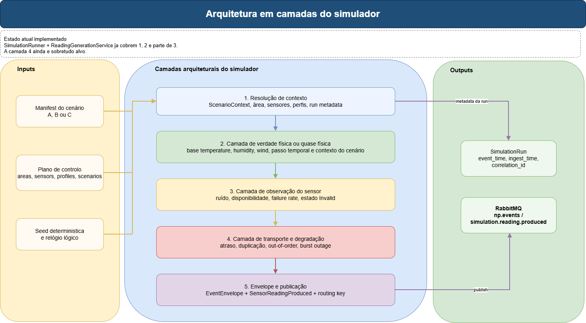

*Figura: arquitetura em camadas desejada para o simulador, distinguindo verdade física, erro de sensor e falhas de transporte. Fonte editável: [07-simulator-layered-architecture.drawio](diagrams/07-simulator-layered-architecture.drawio).*

### Fronteira do simulador

O simulador recebe:

- cenário;
- contexto da área;
- perfis de sensores;
- seed determinística;
- opcionalmente configuração do plano de controlo em `PostgreSQL`.

O simulador produz:

- leituras encapsuladas em `EventEnvelope<SensorReadingProducedPayload>`;
- metadados de `SimulationRun`;
- comportamento temporal coerente com a configuração do cenário.

No código atual, o serviço que materializa os valores é o `ReadingGenerationService`. É ele que, para cada sensor e para cada ciclo, combina a base do cenário, uma variação temporal simples, ruído controlado e a possibilidade de indisponibilidade, devolvendo o envelope pronto a publicar.

### Estado atual implementado

Hoje, a execução real já faz o seguinte.

- resolve um `SimulationContext`;
- escolhe uma seed;
- cria uma `SimulationRun`;
- calcula `event_time` a partir do instante inicial, do número de ciclos e do intervalo;
- gera leituras para temperatura, humidade e vento;
- publica eventos em `RabbitMQ`.

O gerador atual usa uma base do cenário, uma onda temporal simples e ruído controlado por perfil e cenário. Também já modela indisponibilidade do sensor através de `failure_rate`, marcando a leitura como `Invalid` quando falha.

### Modelo atual dos sensores virtuais

No estado atual, a geração de leitura já não é apenas aleatória. Existe um modelo pequeno, mas tecnicamente legível, para os três tipos de métrica hoje emitidos.

| Métrica | Base de cálculo atual | Limites aplicados |
| --- | --- | --- |
| Temperatura | `baseTemperature + 1.5 * sin(cycle / 3.0) + ruido` | `[-20, 60]` |
| Humidade | `baseHumidity - 4.0 * sin(cycle / 3.0) + ruido` | `[0, 100]` |
| Vento | `baseWindSpeed + abs(1.8 * sin(cycle / 3.0)) + ruido` | `[0, 35]` |

O ruído é centrado e a sua amplitude resulta da combinação entre perfil do sensor e ruído do cenário. A disponibilidade do sensor depende hoje de duas condições:

- o sensor estar ativo;
- um sorteio pseudoaleatório não cair abaixo de `failure_rate`.

Quando o sensor falha, a leitura é emitida com valor `0.0` e estado operacional `Invalid`. Isto já permite demonstrar comportamento degradado, mas ainda não equivale à arquitetura-alvo de erro de medição e falha de transporte separadas.

### Ruído, falhas, latência e degradação: estado atual vs alvo

| Tema | Estado atual | Arquitetura-alvo |
| --- | --- | --- |
| Ruído de medição | suportado por amplitude de ruído combinada | perfis explícitos por sensor e por métrica |
| Falha do sensor | disponibilidade via `failure_rate` | fault profiles mais ricos e distinguíveis |
| Latência | não modelada de forma autónoma na geração | latência tratada como propriedade própria do caminho operacional |
| Duplicação | prevista em cenários e documentos | falha operacional efetivamente injetada |
| Out-of-order | prevista em cenários e documentos | falha operacional efetivamente injetada |
| Silêncio ou burst outage | previsto nos ficheiros de definição do cenário degradado | modelo operacional explícito e repetível |

### Diferença entre estado atual e arquitetura-alvo

| Aspeto | Estado atual | Arquitetura-alvo |
| --- | --- | --- |
| Verdade física | implícita nas fórmulas do gerador | camada explícita e reutilizável |
| Erro de sensor | mistura de ruído e disponibilidade | camada própria de observação/medição |
| Falha de transporte | prevista nos ficheiros de definição e nos documentos | camada própria com atraso, duplicação, out-of-order e burst outage |
| Sensores | lista ainda vinda de `appsettings.json` ou plano de controlo | rede resolvida a partir do cenário e da configuração ativa |
| Métricas | temperatura, humidade, vento | expansão controlada e coerente com os cenários |

### Sequência de execução normal

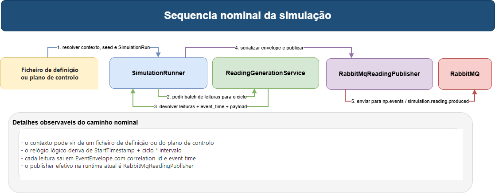

*Figura: sequência nominal da execução do simulador até à publicação em RabbitMQ. Fonte editável: [08-simulation-sequence-happy-path.drawio](diagrams/08-simulation-sequence-happy-path.drawio).*

### Observações importantes

- o cenário `C` já existe como artefacto de configuração, mas a injeção completa de falhas no fluxo operacional ainda é sobretudo alvo;
- o gerador atual é suficientemente útil para demonstração, mas ainda simplifica a passagem entre base física e observação de sensor;
- quando uma leitura é emitida com estado `Invalid`, o `PreventionWorker` rejeita-a antes da inbox como invalidez técnica/operacional de entrada; isso evita que a leitura contamine accepted readings, score, snapshots ou projeções;
- a coerência temporal já é explícita ao nível do `event_time`.

**Estado atual.** O simulador já é executável, determinístico e útil para a demonstração.

**Arquitetura-alvo.** Falta separar rigorosamente verdade física, erro de medição e falha de transporte.

**Evolução futura.** O cenário degradado deve preservar a mesma verdade física da sua base limpa e variar apenas na observação e no transporte.

## Fluxo Operacional do Subsistema

O fluxo operacional começa no `RabbitMQ` e termina em persistência, risco, projeções e alerta observável.

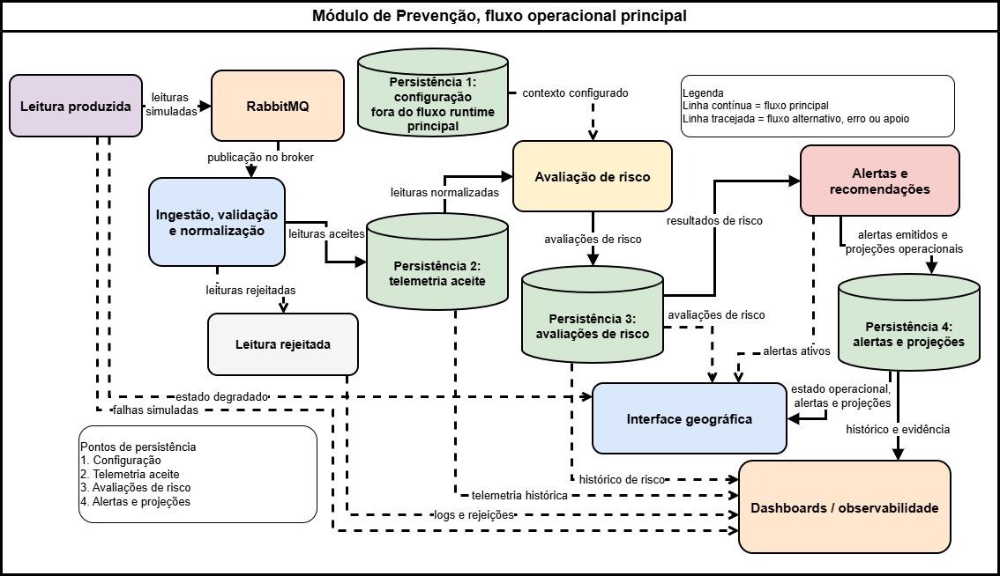

*Figura: vista global do fluxo operacional do subsistema de prevenção, da ingestão ao estado operacional. Fonte editável: [09-operational-pipeline-overview.drawio](diagrams/09-operational-pipeline-overview.drawio).*

### Fluxo principal

No estado atual, o caminho principal é este.

1. o simulador publica `SensorReadingProduced` em `np.events` com a routing key `simulation.reading.produced`;
2. a fila `np.ingestion.readings` é consumida pelo `Prevention.Host`;
3. o worker valida o contrato técnico, rejeita casos inválidos antes da inbox quando necessário, persiste o envelope tecnicamente válido na inbox durável e só depois faz `ack` ao broker;
4. o serviço de processamento valida semanticamente o sensor contra o plano de controlo, confirmando existência, estado ativo e pertença à área declarada;
5. eventos semanticamente inválidos são colocados em quarentena com motivo explícito, sem chegar à pipeline de risco;
6. eventos semanticamente válidos atravessam a fronteira interna `NormalizedReading -> RiskEligibilityResult -> RiskInput`;
7. se a leitura for aceite mas inelegível para risco, fica persistida como accepted reading e o processamento termina com sucesso, sem score nem projeções de risco;
8. se for elegível, é calculado um `RiskAssessment`, atualizado o snapshot de área, atualizadas as projeções operacionais e escrita a telemetria temporal configurada.

### Broker e topologia

Elementos já materializados:

- exchange: `np.events`;
- tipo: `topic`;
- queue principal: `np.ingestion.readings`;
- queue adicional: `np.observability.raw`;
- consumidor ativo principal: `Prevention.Host`.

### Blocos reais do fluxo operacional atual

Os blocos operacionais que já existem em runtime são estes.

| Bloco | Responsabilidade principal |
| --- | --- |
| `PreventionWorker` | consumo da fila principal, validação técnica, rejeição pré-inbox e materialização durável antes do `ack` |
| `PostgresReadingEventInbox` | deduplicação, registo do envelope, tentativas, retries, quarentena e idempotência perante duplicados concorrentes esperados |
| `ReadingEventProcessingService` | coordenação do processamento, validação semântica sensor-área e decisão entre sucesso, retry ou quarentena |
| `ReadingSemanticValidator` | valida existência do sensor, estado ativo e pertença à área declarada antes da pipeline de risco |
| `ReadingRiskPipeline` | normalização interna, persistência da leitura aceite, decisão de elegibilidade, scoring, snapshots, projeções e telemetria |
| `RiskEligibilityService` | fronteira explícita entre leitura aceite e leitura elegível para cálculo de risco |
| `InboxRetryWorker` | retoma e reprocessa eventos cuja próxima tentativa já é devida |
| `PostgresAreaOperationalProjectionStore` | atualiza estado por célula, estado por área e alerta ativo simples |
| `SimpleRiskScoringService` | scoring de risco por leitura elegível com limiares simples e explicáveis |

### Scoring atual, projeções e outputs operacionais

O risco atual ainda não corresponde ao motor final da arquitetura-alvo, mas já existe um caminho real e explicável.

A diferença arquitetural mais importante face à versão anterior é que o scoring já não deve ser lido como cálculo direto sobre o envelope RabbitMQ. O fluxo interno atual passa por `NormalizedReading`, depois por `RiskEligibilityResult`, depois por `RiskInput` e só então por `IRiskScoringService`. Esta alteração não muda os limiares atuais, mas prepara a substituição futura por motores mais ricos, como FWI, KBDI ou Haines, sem acoplar esses modelos ao contrato bruto de transporte.

| Métrica | Lógica de scoring atualmente ativa |
| --- | --- |
| Temperatura | `<20=.10`, `<25=.20`, `<30=.40`, `<35=.65`, `<40=.85`, `>=40=1.00` |
| Humidade | `>=70=.05`, `>=50=.20`, `>=35=.40`, `>=20=.70`, `<20=.95` |
| Vento | `<5=.10`, `<10=.30`, `<15=.55`, `<20=.75`, `>=20=.95` |

A classificação final passa depois por níveis de risco (`VeryLow`, `Low`, `Moderate`, `High`, `VeryHigh`, `Extreme`) e é agregada em snapshots por área. Isso alimenta:

- log durável de leituras aceites;
- log durável de avaliações de risco;
- log durável de snapshots de área;
- projeção operacional por célula;
- projeção operacional por área;
- um alerta ativo simples por área.

### Nova tentativa e quarentena

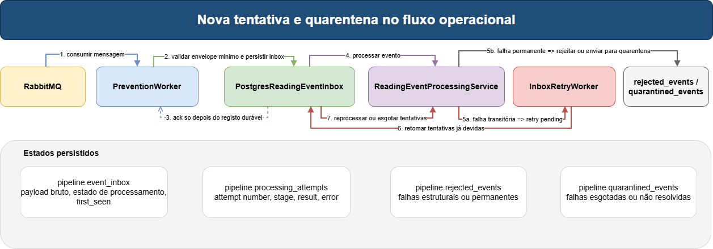

*Figura: caminho degradado do fluxo operacional com tentativas, reclassificação e quarentena persistida. Fonte editável: [10-pipeline-retry-and-quarantine-sequence.drawio](diagrams/10-pipeline-retry-and-quarantine-sequence.drawio).*

O projeto já tem uma primeira vaga séria de durabilidade operacional.

Isto já está implementado no código atual. Em particular:

- `PreventionWorker` rejeita e persiste mensagens inválidas em `pipeline.rejected_events` quando o corpo não pode ser desserializado ou quando o envelope é nulo;
- `ReadingEventProcessingService` decide se um evento válido deve ser concluído, reagendado para nova tentativa ou colocado em quarentena;
- eventos tecnicamente válidos mas semanticamente incompatíveis com o plano de controlo, como `sensor_not_found`, `sensor_inactive` e `sensor_area_mismatch`, são colocados em quarentena depois da inbox;
- leituras aceites mas inelegíveis para risco terminam como sucesso sem `RiskAssessment`, sem snapshot e sem projeções de risco;
- `InboxRetryWorker` retoma eventos cujo momento de nova tentativa já chegou.

- `pipeline.event_inbox`
- `pipeline.processing_attempts`
- `pipeline.rejected_events`
- `pipeline.quarantined_events`

Esta estrutura já permite:

- deduplicação por `event_id`;
- tratamento idempotente de unique violations esperadas em duplicados concorrentes;
- registo de tentativas;
- classificação de falhas;
- reprocessamento de eventos cujo momento de nova tentativa já chegou;
- quarentena persistida.

### Limites atuais

A arquitetura ainda não expõe por completo a semântica arquitetural `ReadingAccepted`, `ReadingRejected` e `ReadingNormalized` como famílias de eventos explícitas e estáveis no broker ou como artefactos persistidos próprios. Hoje o fluxo operacional já consegue rejeitar, persistir, validar semanticamente, normalizar internamente, decidir elegibilidade, reprocessar e produzir efeitos de negócio, mas `NormalizedReading`, `RiskInput` e `RiskEligibilityResult` são fronteiras internas de código, não eventos publicados. Além disso, uma interrupção durante o processamento ainda pode deixar eventos presos em `Processing`, porque não existe recuperação automática de tentativas interrompidas.

**Estado atual.** O fluxo operacional já é funcional, durável, idempotente nos duplicados principais e mais explícito do que uma simples cadeia em memória.

**Arquitetura-alvo.** Aceitação, rejeição, normalização, elegibilidade, risco e alertas devem aparecer como etapas arquiteturais explicitamente separadas e observáveis.

**Evolução futura.** A semântica de alertas, DLQ externa, replay e observabilidade detalhada deve enriquecer esta base.

## Persistência, Contratos e Semântica Temporal

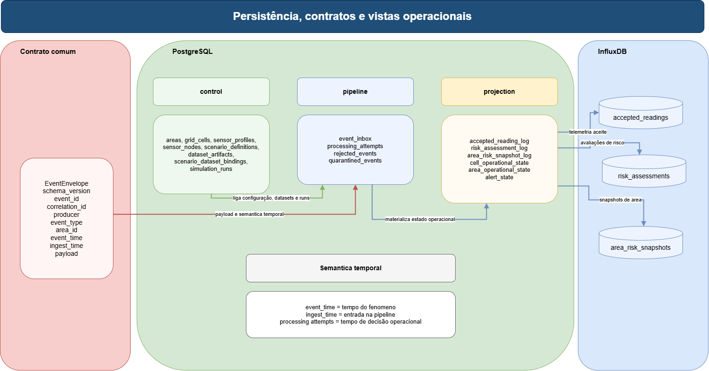

*Figura: principais pontos de persistência, logs operacionais e ligação entre contratos e armazenamento. Fonte editável: [11-persistence-views.drawio](diagrams/11-persistence-views.drawio).*

### Envelope de evento

O contrato comum de eventos já usa um envelope consistente com os campos:

- `schema_version`
- `event_id`
- `correlation_id`
- `producer`
- `event_type`
- `area_id`
- `event_time`
- `ingest_time`
- `payload`

Este contrato é uma peça arquitetural central porque garante desacoplamento, rastreabilidade e semântica temporal mínima comum entre produtores e consumidores.

### Payload atual de leitura produzida

O payload de `SensorReadingProduced` já transporta, entre outros, os campos:

- `SimulationRunId`
- `SensorId`
- `SensorName`
- `MetricType`
- `Unit`
- `Value`
- `Latitude`
- `Longitude`
- `OperationalState`

### Modelos internos da prevenção

A prevenção já introduz fronteiras internas que não mudam o contrato RabbitMQ, mas tornam o caminho de risco mais claro:

| Modelo | Papel | Estado |
| --- | --- | --- |
| `NormalizedReading` | representa a leitura tecnicamente e semanticamente válida antes do cálculo de risco | `Implementado` como modelo interno |
| `RiskEligibilityResult` | decide se uma leitura aceite deve gerar risco | `Implementado`; serviço default ainda permissivo |
| `RiskInput` | input mínimo do motor de scoring | `Implementado` |
| `RiskAssessment` | resultado persistido do scoring atual | `Implementado` |

Isto é uma preparação importante para índices reais. O motor futuro não deve consumir `EventEnvelope<SensorReadingProducedPayload>` diretamente; deve consumir um input de risco já normalizado, validado e enriquecido com o estado necessário.

### Persistência operacional em PostgreSQL

Os schemas atualmente relevantes são:

| Schema | Papel |
| --- | --- |
| `control` | configuração ativa, áreas, células, sensores, cenários, datasets e runs |
| `pipeline` | inbox, tentativas, rejeições e quarentena |
| `projection` | leituras aceites, avaliações de risco, snapshots de área, estado por célula, estado por área e alertas simples |

As tabelas mais relevantes já materializadas por schema são estas.

| Schema | Tabelas principais já ativas |
| --- | --- |
| `control` | `areas`, `area_contexts`, `grid_cells`, `sensor_profiles`, `sensor_networks`, `sensor_nodes`, `scenario_definitions`, `simulation_runs`, `dataset_artifacts`, `scenario_dataset_bindings`, `rule_set_versions`, `configuration_versions` |
| `pipeline` | `event_inbox`, `processing_attempts`, `rejected_events`, `quarantined_events` |
| `projection` | `accepted_reading_log`, `risk_assessment_log`, `area_risk_snapshot_log`, `cell_operational_state`, `area_operational_state`, `alert_state` |

### Persistência temporal em InfluxDB

As medições atualmente previstas para escrita são:

- `accepted_readings`
- `risk_assessments`
- `area_risk_snapshots`

Esta divisão é arquiteturalmente relevante porque impede que o projeto trate `PostgreSQL` e `InfluxDB` como redundâncias. Hoje cada um cumpre um papel diferente:

- `PostgreSQL` fixa estado de controlo, estado operacional durável e rasto de processamento;
- `InfluxDB` concentra séries temporais úteis para observabilidade, dashboards e leitura histórica leve.

A fronteira InfluxDB também já é configurável. Quando `InfluxDb:Enabled=false`, o host usa `NoOpInfluxWriteService` e não tenta escrever séries temporais. Quando `Enabled=true`, a política de falha e as measurements ativas são controladas pela infraestrutura de InfluxDB. Por defeito arquitetural, uma falha de InfluxDB pode ser tratada como falha de observabilidade tolerável, não como falha de negócio, desde que `FailPipelineOnWriteError=false`.

A escrita temporal também evoluiu para um batch lógico por evento. A pipeline pode agrupar os pontos derivados de uma leitura processada numa operação de escrita, reduzindo overhead sem alterar RabbitMQ, PostgreSQL, `BasicAck`, scoring ou contratos externos.

### Semântica temporal

O projeto já distingue, pelo menos conceptualmente e em contrato:

- `event_time`: tempo lógico do fenómeno simulado;
- `ingest_time`: momento de entrada no fluxo operacional;
- tempo de processamento e tentativas: persistido na inbox e nos logs de tentativa.

Essa distinção é essencial porque permite explicar latência, reordenação e degradação do fluxo operacional sem destruir a coerência do fenómeno observado.

Também é ela que abre espaço para a arquitetura-alvo distinguir:

- o tempo do fenómeno;
- o tempo da observação;
- o tempo da entrega;
- o tempo da decisão operacional.

**Estado atual.** A semântica temporal já existe e já é útil para a demonstração.

**Arquitetura-alvo.** A normalização e a modelação de estados semânticos do fluxo operacional devem explorar esta base de forma mais explícita.

**Evolução futura.** A telemetria, os logs de tentativa e os artefactos de execução devem convergir para um rasto ainda mais forte por `simulation_run`.

## Deployment e Runtime

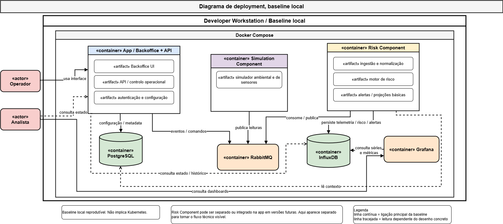

*Figura: baseline local real da runtime, com serviços, hosts e dependências. Fonte editável: [12-runtime-deployment-local-baseline.drawio](diagrams/12-runtime-deployment-local-baseline.drawio).*

### Baseline local real

O deployment atual relevante para demonstração é local e reproduzível com `Docker Compose`.

Serviços de infraestrutura:

- `RabbitMQ`
- `PostgreSQL`
- `InfluxDB`
- `Grafana`

Serviços aplicacionais:

- `NatureProtector.Simulator.Host`
- `NatureProtector.Prevention.Host`
- `NatureProtector.Backoffice.Api`
- `NatureProtector.Postgres.Bootstrap`

### Portas e superfície local de runtime

Pela baseline atual do repositório, a runtime local usa por omissão esta superfície:

| Serviço | Porta principal | Papel |
| --- | --- | --- |
| `RabbitMQ` | `5672` | transporte de eventos |
| `RabbitMQ Management` | `15672` | observação e administração local do broker |
| `PostgreSQL` | `5432` | plano de controlo e estado operacional persistido |
| `InfluxDB` | `8181` | escrita e consulta de séries temporais |
| `Grafana` | `3000` | visualização e dashboards |

### Flags e modos operacionais relevantes

Há três opções de runtime que ajudam a explicar o estado real do sistema.

| Componente | Flag ou modo | Leitura arquitetural |
| --- | --- | --- |
| `Simulator.Host` | `ControlPlaneEnabled` | permite resolver contexto de simulação a partir do plano de controlo em `PostgreSQL` em vez de depender apenas de `appsettings` ou de um ficheiro de definição |
| `Prevention.Host` | `PipelinePersistenceEnabled` | ativa a inbox durável, retries e persistência operacional em `PostgreSQL` |
| `Backoffice.Api` | `BackofficeApi.ControlPlaneEnabled` | expõe a primeira superfície HTTP ligada ao plano de controlo real |
| `Prevention.Host` | `InfluxDb.Enabled` | permite correr a pipeline sem dependência operacional de InfluxDB |
| `Prevention.Host` | `InfluxDb.FailPipelineOnWriteError` | decide se falhas de observabilidade temporal falham ou não o processamento operacional |
| `Prevention.Host` | `InfluxDb.Writes.*` | permite ativar ou desativar measurements específicas |

Isto ajuda a distinguir duas coisas que a documentação precisa de refletir com honestidade:

- a runtime atual já suporta um caminho durável e ligado a `PostgreSQL`;
- continuam a existir alguns modos de fallback ou caminhos alternativos úteis para carga inicial e evolução.

Quando `ControlPlaneEnabled = true`, o simulador resolve área, cenário e sensores a partir do `PostgreSQL`. Quando `ControlPlaneEnabled = false`, entra em modo autónomo local: usa `appsettings` e, se for o caso, um ficheiro de definição de cenário local, sem depender do plano de controlo.

### O que está ligado e o que ainda não está

O runtime real já fecha a cadeia principal, mas não tudo.

- `Simulator.Host -> RabbitMQ -> Prevention.Host -> PostgreSQL/InfluxDB -> Backoffice.Api` está ligado;
- `Grafana -> InfluxDB` está ligado, mas a camada de dashboards ainda está imatura;
- a fila `np.observability.raw` existe, mas ainda não tem o mesmo nível de exploração que a fila principal de ingestão;
- o deployment continua a ser de demonstração local e não uma arquitetura distribuída de produção.
- `NatureProtector.Postgres.Bootstrap` existe como utilitário de inicialização que carrega a configuração inicial do plano de controlo para `PostgreSQL`, mesmo não sendo um serviço de negócio contínuo.

### O que está efetivamente ligado

| Elemento | Estado na runtime atual |
| --- | --- |
| RabbitMQ | `Implementado` |
| PostgreSQL como plano de controlo e estado operacional | `Implementado` |
| InfluxDB para telemetria | `Implementado` |
| Grafana | `Parcial`, dashboards ainda pouco maduros |
| API de backoffice e leitura operacional | `Implementado` na primeira vaga |
| deployment distribuído de produção | `Fora de escopo` |

### Nota importante sobre honestidade documental

O documento deve representar a baseline local real, não um deployment idealizado. Isso é particularmente importante porque o projeto já passou por uma fase em que os diagramas de deployment eram mais aspiracionais do que executáveis.

**Estado atual.** A baseline local é real, coerente e suficiente para a demonstração.

**Arquitetura-alvo.** A separação entre runtime de demonstração e deployment desejado pode ser explicitada sem perder honestidade.

**Evolução futura.** A maturidade de dashboards, operações de backoffice e automatização da carga inicial pode crescer a partir desta base.

## Visualização, API e Evidência Operacional

O último troço da cadeia arquitetural não é acessório. A arquitetura não termina quando o risco é calculado; termina quando esse estado pode ser observado, consultado, explicado e usado como evidência técnica.

### Superfície atual de API

Na runtime atual, a primeira superfície de consulta e controlo é fornecida por `NatureProtector.Backoffice.Api`. Pela leitura do código, esta superfície já cobre:

- configurações e versões de controlo;
- áreas e células da grelha;
- perfis e nós de sensores;
- cenários e runs de simulação;
- estado operacional por área;
- estado operacional por célula;
- alertas ativos simples.

Ao nível da estrutura da API, isto já aparece materializado em controladores dedicados para:

- plano de controlo;
- áreas de controlo;
- configurações de controlo;
- runs de simulação do plano de controlo.

Isto é importante porque já existe uma ponte real entre:

- o plano de controlo em `PostgreSQL`;
- o estado operacional persistido em `projection`;
- a leitura externa do sistema para fins de demonstração e futura interface.

### Dashboards e observabilidade

O caminho de observabilidade já existe, mas ainda está numa vaga inicial.

| Bloco | Estado atual | Papel arquitetural |
| --- | --- | --- |
| `InfluxDB` | `Implementado` | retenção de séries temporais úteis para leitura e observação |
| `Grafana` | `Parcial` | visualização local e prova do fluxo end-to-end |
| datasource `Infinity` | `Implementado` | consulta de `InfluxDB` por HTTP/SQL |
| dashboards operacionais finais | `Parcial` | ainda em maturação |

Na prática, a arquitetura já suporta observação, mas ainda não fecha a superfície final de produto. Esta nuance tem de ficar clara: existe observabilidade real, mas não existe ainda um cockpit operacional maduro. Também é importante separar observabilidade disponível de observabilidade obrigatória: em ambiente local, InfluxDB pode ser desligado para isolar a pipeline operacional, mantendo PostgreSQL como fonte durável.

### Evidência arquitetural e valor demonstrável

O sistema já consegue gerar evidência em vários pontos:

- artefactos de baseline e ficheiros de definição em `data/`;
- eventos com envelope comum e semântica temporal;
- inbox durável, retries e quarentena em `PostgreSQL`;
- logs duráveis de leituras aceites, avaliações de risco e snapshots;
- medições em `InfluxDB`, quando a observabilidade temporal está ativa;
- leitura por API;
- visualização preliminar por `Grafana`.

Isto significa que a demonstração não depende apenas de logs de consola ou de uma narrativa verbal. Já existe uma base arquitetural para mostrar:

- o que entrou no sistema;
- o que foi aceite ou rejeitado;
- que risco foi calculado;
- que estado operacional ficou persistido;
- que artefactos de dados e cenários explicam esse comportamento.

**Estado atual.** A visualização e a evidência já existem como capacidade técnica real, mas ainda com superfície de apresentação limitada.

**Arquitetura-alvo.** A API e os dashboards devem tornar-se uma vista estável, clara e explicável do estado do subsistema.

**Evolução futura.** A evidência arquitetural deve convergir para painéis mais fortes, consulta histórica mais rica e melhor explicabilidade operacional.

## Aproximação à Implementação

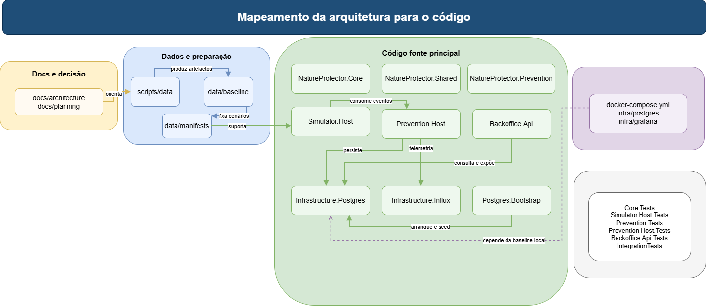

*Figura: correspondência entre blocos arquiteturais e partes do repositório. Fonte editável: [13-code-mapping-prevention-slice.drawio](diagrams/13-code-mapping-prevention-slice.drawio).*

### Mapeamento de alto nível

| Bloco arquitetural | Artefactos reais |
| --- | --- |
| domínio e modelos base | `src/NatureProtector.Core` |
| contratos e mensagens partilhadas | `src/NatureProtector.Shared` |
| lógica de risco, normalização mínima, elegibilidade e agregação | `src/NatureProtector.Prevention` |
| host de execução da prevenção, validação semântica, inbox e pipeline operacional | `src/NatureProtector.Prevention.Host` |
| host de execução da simulação | `src/NatureProtector.Simulator.Host` |
| persistência em PostgreSQL | `src/NatureProtector.Infrastructure.Postgres` |
| persistência em InfluxDB | `src/NatureProtector.Infrastructure.Influx` |
| inicialização da base de dados | `src/NatureProtector.Postgres.Bootstrap` |
| superfície HTTP | `src/NatureProtector.Backoffice.Api` |
| preparação de dados | `scripts/data/`, `data/baseline/`, `data/manifests/` |

### Elementos mais próximos da implementação

- `Simulator.Host/Program.cs` compõe leitura de cenário, seed, contexto e publisher.
- `SimulationRunner` controla a execução temporal da simulação.
- `ReadingGenerationService` contém hoje a lógica efetiva de geração de leituras, combinando base do cenário, variação temporal, ruído e indisponibilidade do sensor.
- `Prevention.Host/Program.cs` compõe inbox, retry worker, fluxo operacional e persistência.
- `ReadingRiskPipeline` concentra hoje o fluxo de normalização interna, persistência, elegibilidade, avaliação de risco, projeções e telemetria.
- `ReadingSemanticValidator` valida o deployment do sensor contra o plano de controlo antes de permitir entrada na pipeline de risco.
- `RiskEligibilityService` separa leitura aceite de leitura elegível para cálculo de risco.
- `NatureProtectorControlDbContext` materializa os schemas `control`, `pipeline` e `projection`.
- `InfluxWriteService`, `SafeInfluxWriteService` e `NoOpInfluxWriteService` fixam a fronteira temporal configurável de `InfluxDB`.

### Correspondência entre níveis de abstração e artefactos reais

| Nível arquitetural | Artefactos reais mais importantes |
| --- | --- |
| contexto e fronteira | `docs/architecture/`, `docs/planning/`, `src/README.md` |
| preparação de dados | `scripts/data/*.py`, `scripts/data/README.md`, `data/baseline/`, `data/manifests/` |
| simulador | `src/NatureProtector.Simulator.Host/Program.cs`, `SimulationRunner`, `ReadingGenerationService` |
| fluxo operacional | `src/NatureProtector.Prevention.Host/PreventionWorker.cs`, `ReadingEventProcessingService`, `ReadingSemanticValidator`, `ReadingRiskPipeline` |
| persistência relacional | `src/NatureProtector.Infrastructure.Postgres/` e `NatureProtectorControlDbContext` |
| persistência temporal | `src/NatureProtector.Infrastructure.Influx/InfluxWriteService.cs`, `SafeInfluxWriteService`, `NoOpInfluxWriteService` |
| consulta e backoffice | `src/NatureProtector.Backoffice.Api/` |
| validação automática | `tests/NatureProtector.*.Tests/` e `tests/NatureProtector.IntegrationTests/` |

### Modelo de domínio simplificado

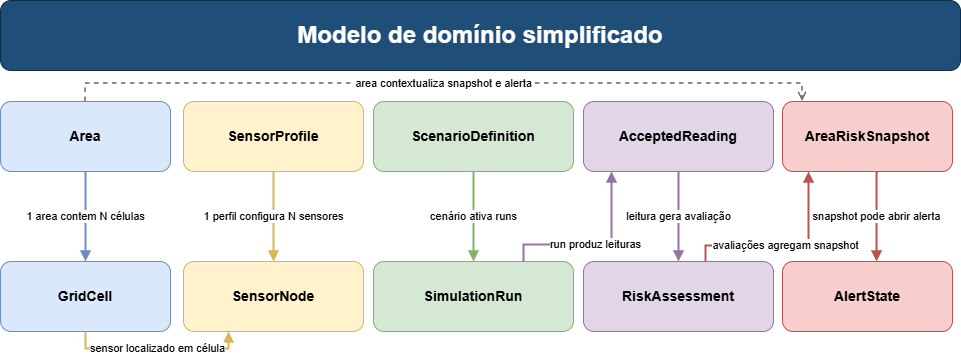

*Figura: modelo de domínio simplificado, centrado nos conceitos mais relevantes para a prevenção. Fonte editável: [14-domain-model-simplified.drawio](diagrams/14-domain-model-simplified.drawio).*

### Modelo de domínio detalhado

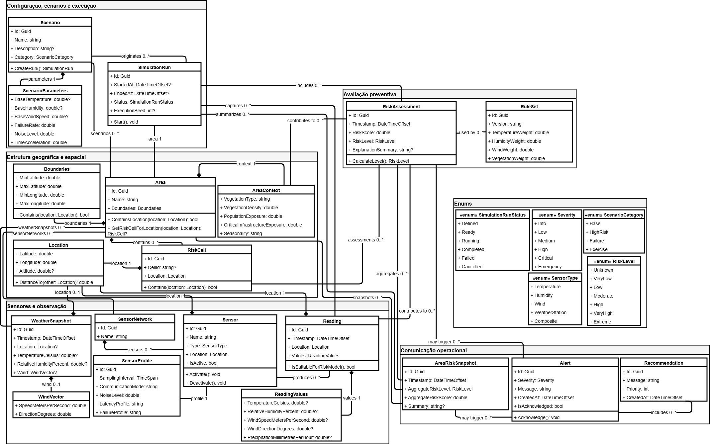

*Figura: modelo de domínio detalhado, usado como apoio técnico e não como diagrama introdutório. Fonte editável: [15-domain-model-detailed.drawio](diagrams/15-domain-model-detailed.drawio).*

### Desvios entre decomposição lógica e estrutura atual

| Tema | Situação atual | Leitura arquitetural |
| --- | --- | --- |
| `NatureProtector.Shared` | mistura contratos e detalhes de RabbitMQ | deve ser dividido em contratos e infraestrutura de eventos |
| `Simulator.Host` | contém mais do que simples orquestração | a lógica de simulação deve migrar para um módulo próprio |
| `Prevention.Host` | concentra o fluxo operacional e a orquestração | este fluxo pode ganhar identidade modular mais explícita |
| dashboards | ainda incipientes | a observabilidade existe, mas ainda não tem a superfície final |

**Estado atual.** O mapeamento para o código é claro e já sustenta uma documentação próxima da implementação.

**Arquitetura-alvo.** A estrutura física do repositório deve aproximar-se mais da arquitetura lógica.

**Evolução futura.** A modularização proposta no roadmap pode ser feita por extração progressiva sem perder o que já funciona.

## Estado Atual vs Arquitetura-Alvo vs Evolução

| Bloco | Estado atual | Arquitetura-alvo | Evolução futura |
| --- | --- | --- | --- |
| Contexto da plataforma | claro e documentável | estabilizar fronteiras | integrar outros subsistemas |
| Preparação de dados | forte e já produz baseline real | ligar formalmente datasets a runs e plano de controlo | reforçar fontes bloqueadas |
| Contexto territorial e meteorológico | operacional na área piloto | distinguir melhor estático e dinâmico | expandir áreas e fontes |
| Cenários | `A/B/C` materializados | ligar formalmente perfis, rede de sensores e runs | calibração e validação mais fortes |
| Simulador | determinístico e funcional | separar três camadas | modelos mais ricos e maior variedade de sensores |
| Fluxo operacional | inbox durável, retries, quarentena, validação semântica, idempotência reforçada, normalização interna e elegibilidade | eventos/artefactos explícitos para accepted, rejected, normalized, eligibility e risk | replay, DLQ e métricas operacionais |
| Persistência e API | primeira vaga já funcional; InfluxDB configurável e não crítico por defeito | alargar superfície de consulta e observabilidade | histórico, queries agregadas e dashboards mais maduros |
| Visualização | base técnica pronta | dashboards operacionais reais | produto mais completo |

Em síntese, o projeto já ultrapassou a fase puramente conceptual, mas ainda não atingiu a forma modular e metodológica final descrita nos documentos de investigação. A documentação deve, por isso, mostrar com clareza o que já existe, o que está em consolidação e o que permanece como evolução futura.

## Critérios de Qualidade, Validação e Evidência

Os critérios de qualidade que mais importam nesta fase são:

| Critério | Como aparece na arquitetura |
| --- | --- |
| Plausibilidade física | base meteorológica preparada e harmonizada, cenários justificados, uso de índices e parâmetros reproduzíveis |
| Utilidade operacional | fluxo end-to-end, avaliação de risco, alerta simples, API e dashboards |
| Rastreabilidade | ficheiros de definição, envelope comum, logs de inbox, persistência de projeções e runs |
| Robustez | retries, deduplicação, quarentena, persistência durável |
| Reprodutibilidade | baseline versionada, cenários A/B/C, seed determinística, Docker Compose |

### Assunções metodológicas que o documento assume explicitamente

Para manter honestidade técnica, o documento assume estas condições sem as esconder:

- a baseline de dados atual é suficientemente forte para demonstração, mas não representa ainda o conjunto final de fontes desejadas;
- o simulador atual já é útil e reproduzível, mas ainda não implementa plenamente a separação entre verdade física, erro de medição e falha de transporte;
- os alertas atuais são operacionais apenas numa forma simples e não ainda numa política final com histerese, cooldown e explicabilidade rica;
- a documentação toma o código como verdade principal do estado atual e os documentos de investigação como referência da arquitetura-alvo.

### Critérios objetivos para considerar a arquitetura-alvo da fase atual atingida

Esta fase só deve ser considerada arquiteturalmente fechada quando as condições seguintes forem verdadeiras em conjunto.

1. existe rastreio claro entre artefactos de dataset, cenário escolhido, `simulation_run` e outputs operacionais;
2. o simulador separa explicitamente a base física, a observação de sensor e a degradação de transporte;
3. o fluxo operacional distingue de forma estável `accepted`, `rejected`, `normalized` e `risk eligibility`;
4. o risco, os alertas e as projeções operacionais dependem de inputs canónicos e não diretamente de eventos raw;
5. a superfície de consulta por API e dashboards consegue demonstrar o fluxo end-to-end com evidência suficiente.

### Natureza da evidência disponível

| Tipo de afirmação | Base atual |
| --- | --- |
| “Está implementado” | comportamento verificado no código, na runtime ou nos dados existentes |
| “Está parcialmente suportado” | base técnica já existente, mas ainda sem forma final ou sem isolamento arquitetural completo |
| “Está previsto” | direção fechada por roadmap, documentação de escopo ou investigação, mas ainda não totalmente materializada |

### Evidência técnica já verificada

- a solução compila com sucesso;
- a solução passa os testes automáticos existentes, com validação recente da suite completa após as alterações de pipeline;
- a área piloto e os artefactos de baseline já existem em ficheiros reais;
- os cenários `A/B/C` já existem como ficheiros de definição consumíveis;
- a runtime já usa `RabbitMQ`, `PostgreSQL`, `InfluxDB` e `Backoffice.Api`.

Ao nível da validação automática já existente, a solução também tem cobertura distribuída por vários projetos de teste, incluindo:

- `NatureProtector.Core.Tests`;
- `NatureProtector.Simulator.Host.Tests`;
- `NatureProtector.Prevention.Tests`;
- `NatureProtector.Prevention.Host.Tests`;
- `NatureProtector.Backoffice.Api.Tests`;
- `NatureProtector.Infrastructure.Influx.Tests`;
- `NatureProtector.IntegrationTests`.

### Limitações que devem ser assumidas

- o modelo atual do simulador ainda simplifica a separação entre fenómeno, observação e transporte;
- os alertas ainda são simples e sem ciclo de vida rico;
- há fontes externas importantes ainda bloqueadas;
- os dashboards ainda estão atrás da maturidade do fluxo operacional;
- a modularização arquitetural ainda não acompanha totalmente a evolução funcional já alcançada;
- `NormalizedReading`, `RiskInput` e elegibilidade já existem como fronteiras internas, mas ainda não são eventos publicados nem artefactos persistidos próprios.

## Checklist de Consistência Arquitetural

| Tema | Código | Documentação interna | Diagramas | Ação recomendada |
| --- | --- | --- | --- | --- |
| Contexto da plataforma | consistente com o foco em prevenção | consistente | antigos diagramas de contexto são conceptuais | atualizar com fronteira real |
| Fluxo global de dados | consistente | forte em `scripts/data/README.md` | `DataFlow` antigo está misturado | refazer |
| Simulador | runtime existe | investigação pede mais separação | não há diagrama bom da versão atual | criar diagramas em camadas e sequência |
| Fluxo operacional | runtime já mais maduro do que os diagramas antigos | consistente com roadmap recente | `FluxoOperacional` precisa de atualização | rever e manter narrativa-base |
| Deployment | runtime real existe | `infra/README.md` parcialmente desatualizado | diagrama antigo está idealizado | refazer com baseline real |
| Domínio e classes | há material real no código | parcialmente documentado | diagrama antigo é útil mas pesado | dividir em simplificado e detalhado |

## Limitações, Riscos e Próximos Passos

Os riscos arquiteturais mais relevantes nesta fase são os seguintes.

- confundir a força da baseline de dados com uma maturidade total do simulador;
- apresentar o fluxo operacional como semanticamente mais rico do que ele ainda é;
- deixar os diagramas atrasados em relação ao código;
- manter demasiado comportamento dentro dos hosts, reduzindo clareza modular;
- depender em excesso de fontes públicas de arranque quando algumas fontes oficiais ainda estão bloqueadas.

Os próximos passos arquiteturais recomendados são estes.

1. refazer e consolidar os diagramas para que reflitam o estado atual e a arquitetura-alvo sem misturar níveis;
2. fechar melhor a ponte entre datasets, cenários e `simulation_runs`;
3. separar o simulador em verdade física, erro de sensor e falha de transporte;
4. evoluir a semântica interna `accepted / rejected / normalized / eligible` para artefactos e eventos arquiteturais mais explícitos;
5. ativar regras reais de elegibilidade e preparar o input necessário para índices como FWI, KBDI ou Haines sem criar pseudo-implementações;
6. enriquecer alertas, projeções, dashboards e superfície de consulta.

## Fecho

O valor arquitetural do NatureProtector, nesta fase, não está apenas na existência de vários componentes. Está na coerência da cadeia completa que já começa em fontes externas reais, passa por preparação de dados, contexto, cenários e simulação, entra num fluxo operacional durável e termina em persistência, risco, alerta e evidência.

Essa cadeia já existe. O que falta não é “inventar uma arquitetura”. O que falta é aproximar ainda mais o código, os diagramas e a narrativa técnica da arquitetura que o projeto já começou a materializar.
