# Implementação Atual: Onboarding Técnico

## 1. Finalidade do documento

Este documento é a referência principal para perceber a implementação atual do NatureProtector sem começar por leitura dispersa do código. O foco é onboarding técnico factual: mostrar como o repositório está organizado, como os dados são preparados, como o bootstrap materializa o control plane, como o runtime funciona hoje e como os testes ajudam a confirmar o comportamento real.

O objetivo não é substituir [architecture.md](architecture.md). Esse documento continua a ser a referência arquitetural de alto nível. Aqui, o propósito é descer para o nível da implementação atual da branch e explicar o sistema tal como ele existe hoje.

Este documento também deve ser lido como guia de leitura e não como substituto da fonte de verdade final. Sempre que houver conflito entre este texto e o código atual da branch, prevalece o código.

## 2. Como ler este documento

Este documento foi organizado por vistas. Cada vista funciona como uma porta de entrada para uma parte concreta do sistema.

1. Começar pelas primeiras quatro secções para alinhar objetivo, âmbito, convenções e gramática visual.
2. Seguir depois as vistas pela ordem narrativa: repositório, dados, cenários, configuração, bootstrap, simulador, prevenção, falhas, persistência, observabilidade, API e testes.
3. Em cada vista, usar primeiro a figura, depois a legenda, depois a leitura factual e, por fim, os ficheiros, classes e métodos que sustentam a explicação.

Para seguir o runtime end-to-end, a sequência mais útil é esta:

1. dados e scripts;
2. cenários e manifestos;
3. bootstrap e control plane;
4. simulador nominal;
5. prevenção nominal;
6. rejeição, retry e quarentena;
7. persistência e observabilidade;
8. API;
9. testes.

Percursos mínimos específicos:

- Para perceber só a prevenção: [src/NatureProtector.Prevention.Host/Program.cs](../../src/NatureProtector.Prevention.Host/Program.cs), [src/NatureProtector.Prevention.Host/PreventionWorker.cs](../../src/NatureProtector.Prevention.Host/PreventionWorker.cs), [src/NatureProtector.Prevention.Host/Processing/PostgresReadingEventInbox.cs](../../src/NatureProtector.Prevention.Host/Processing/PostgresReadingEventInbox.cs), [src/NatureProtector.Prevention.Host/Processing/ReadingEventProcessingService.cs](../../src/NatureProtector.Prevention.Host/Processing/ReadingEventProcessingService.cs), [src/NatureProtector.Prevention.Host/Processing/ReadingRiskPipeline.cs](../../src/NatureProtector.Prevention.Host/Processing/ReadingRiskPipeline.cs) e [tests/NatureProtector.Prevention.Host.Tests/Processing/PreventionWorkerTests.cs](../../tests/NatureProtector.Prevention.Host.Tests/Processing/PreventionWorkerTests.cs).
- Para perceber só a simulação: [src/NatureProtector.Simulator.Host/Program.cs](../../src/NatureProtector.Simulator.Host/Program.cs), [src/NatureProtector.Simulator.Host/Configuration/SimulatorOptionsValidator.cs](../../src/NatureProtector.Simulator.Host/Configuration/SimulatorOptionsValidator.cs), [src/NatureProtector.Simulator.Host/Services/PostgresSimulationContextSource.cs](../../src/NatureProtector.Simulator.Host/Services/PostgresSimulationContextSource.cs), [src/NatureProtector.Simulator.Host/Context/ScenarioContextFactory.cs](../../src/NatureProtector.Simulator.Host/Context/ScenarioContextFactory.cs), [src/NatureProtector.Simulator.Host/Services/SimulationRunner.cs](../../src/NatureProtector.Simulator.Host/Services/SimulationRunner.cs), [src/NatureProtector.Simulator.Host/Services/ReadingGenerationService.cs](../../src/NatureProtector.Simulator.Host/Services/ReadingGenerationService.cs) e [tests/NatureProtector.Simulator.Host.Tests/Services/SimulationRunnerTests.cs](../../tests/NatureProtector.Simulator.Host.Tests/Services/SimulationRunnerTests.cs).
- Para perceber API e control plane: [scripts/postgres/bootstrap-control-plane.ps1](../../scripts/postgres/bootstrap-control-plane.ps1), [src/NatureProtector.Postgres.Bootstrap/Program.cs](../../src/NatureProtector.Postgres.Bootstrap/Program.cs), [src/NatureProtector.Infrastructure.Postgres/Bootstrap/ControlPlaneBootstrapper.cs](../../src/NatureProtector.Infrastructure.Postgres/Bootstrap/ControlPlaneBootstrapper.cs), [src/NatureProtector.Backoffice.Api/Program.cs](../../src/NatureProtector.Backoffice.Api/Program.cs), [src/NatureProtector.Backoffice.Api/ControlPlane/Services/PostgresControlPlaneService.cs](../../src/NatureProtector.Backoffice.Api/ControlPlane/Services/PostgresControlPlaneService.cs), [tests/NatureProtector.Backoffice.Api.Tests/PostgresControlPlaneServiceTests.cs](../../tests/NatureProtector.Backoffice.Api.Tests/PostgresControlPlaneServiceTests.cs) e [tests/NatureProtector.Backoffice.Api.Tests/ControlPlaneApiTests.cs](../../tests/NatureProtector.Backoffice.Api.Tests/ControlPlaneApiTests.cs).

## 3. Âmbito e fonte de verdade

O âmbito deste documento é a implementação atual da branch, incluindo:

- organização do repositório;
- scripts e artefactos de `data/`;
- baseline local;
- bootstrap PostgreSQL;
- `Simulator.Host`;
- `Prevention.Host`;
- `Backoffice.Api`;
- persistência relacional e temporal;
- observabilidade atual;
- testes.

Ficam fora deste documento:

- arquitetura-alvo descrita como se já estivesse implementada;
- refatorações futuras;
- outputs efémeros de `bin/`, `obj/`, `TestResults/` e cobertura.

A fonte de verdade principal é:

1. o código atual da branch;
2. os scripts reais do repositório;
3. os artefactos reais em `data/`;
4. os testes executáveis;
5. os docs existentes apenas como enquadramento e inspiração editorial.

## 4. Convenções editoriais e visuais

### 4.1. Convenções visuais

- barra superior azul escura: nome da vista;
- caixa cinzenta logo abaixo: descrição curta da perspetiva;
- containers grandes: agrupamento de responsabilidades ou fases do fluxo;
- linhas contínuas: caminhos nominais;
- linhas tracejadas: alternativas, caminhos de recurso ou caminhos não dominantes.

### 4.2. Mini-legenda visual global

- `Azul`: hosts, runtime, serviços ativos e fluxo principal.
- `Amarelo`: inputs, configuração, manifestos, scripts e validação.
- `Verde`: broker, telemetria, observabilidade ou canais operacionais paralelos.
- `Cinzento`: PostgreSQL, estado durável e estrutura relacional.
- `Roxo`: API, testes, documentação e vistas transversais.
- `Vermelho`: rejeição, erro, quarentena e caminhos terminais.

## 5. Mapa do repositório e zonas de responsabilidade

Esta vista é a porta de entrada mais útil para alguém novo. O objetivo não é mostrar uma árvore seca de diretórios, mas sim a fronteira entre código de runtime, preparação de dados, infraestrutura local, validação por testes e documentação.

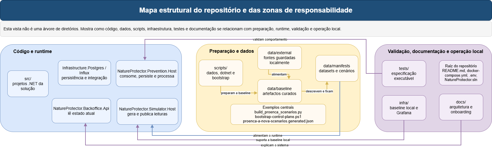

*Figura: mapa do repositório e zonas de responsabilidade. Fonte editável: [implementation-repository-map.drawio](diagrams/implementation-repository-map.drawio).*

### O que esta secção explica

O diagrama mostra cinco ideias importantes. Primeiro, `src/` é a zona onde vive o sistema em execução, incluindo hosts, domínio, contratos e persistência. Segundo, `scripts/` e `data/` não são acessórios: alimentam diretamente a baseline e o bootstrap. Terceiro, `infra/` não contém lógica de produto; fornece a baseline local com `rabbitmq`, `postgres`, `influxdb` e `grafana`. Quarto, `tests/` deve ser lido como especificação executável de partes importantes do sistema. Quinto, `docs/` não substitui o código como fonte de verdade, mas organiza a leitura.

A leitura correta desta vista é evitar três confusões comuns. A primeira é tratar `data/` como mera pasta de ficheiros estáticos, quando na prática essa pasta é parte da cadeia operacional. A segunda é olhar para `scripts/` como utilitários soltos, quando vários deles são pré-condição real do sistema demonstrável. A terceira é confundir artefactos de build ou cobertura com arquitetura. Esses outputs existem no workspace, mas não fazem parte do sistema documentado.

### Como ler a figura

Começar pela raiz do repositório e não pelos hosts. O sistema real nasce da combinação de:

- ficheiros de raiz, como [README.md](../../README.md), [docker-compose.yml](../../docker-compose.yml), [.env.example](../../.env.example) e [NatureProtector.sln](../../NatureProtector.sln);
- preparação de dados em `scripts/` e `data/`;
- runtime em `src/`;
- validação em `tests/`;
- baseline infra em `infra/`.

`bin/`, `obj/`, `TestResults/` e outputs de cobertura devem ser ignorados como fonte de verdade arquitetural.

### Projetos principais e respetivo papel real hoje

| Projeto | Papel real hoje | Tipo | Referências de projeto | Fluxos que ajuda a perceber |
| --- | --- | --- | --- | --- |
| `NatureProtector.Core` | Modelo de domínio base: áreas, grelha, sensores, risco, cenários e runs. | domínio puro | sem referências internas | bootstrap, simulador, prevenção, API |
| `NatureProtector.Shared` | Contratos partilhados, opções RabbitMQ e convenções de mensagens. | contratos e transporte | sem referências internas | simulador, prevenção, testes |
| `NatureProtector.Prevention` | Serviços de risco e abstrações de persistência usadas pela pipeline. | domínio aplicado | `Core`, `Shared` | prevenção nominal e projeções |
| `NatureProtector.Prevention.Host` | Host de consumo RabbitMQ, inbox, retries, quarentena, pipeline e projeções. | runtime | `Prevention`, `Shared`, `Infrastructure.Influx`, `Infrastructure.Postgres` | prevenção, falhas, persistência, observabilidade |
| `NatureProtector.Simulator.Host` | Host de simulação, resolução de contexto, run store e publicação. | runtime | `Core`, `Shared`, `Infrastructure.Postgres` | simulação, control plane, RabbitMQ |
| `NatureProtector.Infrastructure.Postgres` | `DbContext`, records persistidos, migrations, bootstrapper e acesso relacional. | persistência relacional e bootstrap | `Core` | bootstrap, simulator context, API, pipeline durável |
| `NatureProtector.Infrastructure.Influx` | Configuração e escrita temporal em InfluxDB. | persistência temporal | `Core`, `Shared` | observabilidade e pipeline nominal |
| `NatureProtector.Postgres.Bootstrap` | Ponto de entrada CLI para materializar a baseline no PostgreSQL. | bootstrap operacional | `Infrastructure.Postgres` | bootstrap e control plane |
| `NatureProtector.Backoffice.Api` | Superfície HTTP atual para ler `control.*`, `projection.*` e ativar configuração. | API | `Core`, `Shared`, `Infrastructure.Postgres` | control plane, leitura operacional, API |

### Dependências reais entre projetos

Aqui a fronteira mais importante é entre domínio, contratos, runtime e suporte. A dependência real entre projetos, confirmada nos ficheiros `.csproj`, é esta:

- `NatureProtector.Core` termina a camada de domínio puro. Não referencia outros projetos e não conhece persistência, broker nem web.
- `NatureProtector.Shared` fecha a camada de contratos de integração. Também não referencia outros projetos e define envelope, serialização, routing keys e topologia RabbitMQ.
- `NatureProtector.Prevention` referencia `Core` e `Shared`. É o ponto onde o domínio passa a incluir scoring, snapshots e contratos abstratos de persistência.
- `NatureProtector.Infrastructure.Postgres` referencia apenas `Core`. Isto ajuda a manter a camada relacional neutra face aos hosts.
- `NatureProtector.Infrastructure.Influx` referencia `Core` e `Shared`, porque escreve telemetria sobre entidades de domínio e envelopes partilhados.
- `NatureProtector.Simulator.Host` referencia `Core`, `Shared` e `Infrastructure.Postgres`, fechando o fluxo de leitura do control plane, geração e publicação.
- `NatureProtector.Prevention.Host` referencia `Prevention`, `Shared`, `Infrastructure.Influx` e `Infrastructure.Postgres`, porque precisa de domínio aplicado, inbox durável, projeções e telemetria.
- `NatureProtector.Backoffice.Api` referencia `Core`, `Shared` e `Infrastructure.Postgres`, porque lê control plane e projeções, mas não participa no processamento operacional.
- `NatureProtector.Postgres.Bootstrap` referencia apenas `Infrastructure.Postgres`, porque o seu trabalho é materializar estado em `control.*`, não correr lógica de runtime.

Em termos operacionais, isto separa quatro papéis:

- domínio estável: `Core` e parte de `Prevention`;
- contratos partilhados: `Shared`;
- runtime vivo: `Simulator.Host`, `Prevention.Host`, `Backoffice.Api`;
- suporte e materialização: `Infrastructure.Postgres`, `Infrastructure.Influx`, `Postgres.Bootstrap`.

### Camada `Shared`

`NatureProtector.Shared` fecha os contratos entre simulador, prevenção e testes:

- [EventEnvelope.cs](../../src/NatureProtector.Shared/Messaging/EventEnvelope.cs) define o envelope canónico com `SchemaVersion`, `EventId`, `CorrelationId`, `Producer`, `EventType`, `AreaId`, `EventTime`, `IngestTime` e `Payload`.
- [JsonEventSerializer.cs](../../src/NatureProtector.Shared/Messaging/JsonEventSerializer.cs) fixa camelCase, enums como texto e omissão de nulos, o que evita deriva entre runtime, persistência e testes.
- [RoutingKeys.cs](../../src/NatureProtector.Shared/Messaging/RoutingKeys.cs) e [EventTypes.cs](../../src/NatureProtector.Shared/Messaging/EventTypes.cs) fecham os nomes aceites na topologia.
- [NatureProtectorRabbitMqTopology.cs](../../src/NatureProtector.Shared/Messaging/NatureProtectorRabbitMqTopology.cs) fixa o exchange `np.events`, a fila `np.ingestion.readings`, a fila `np.observability.raw` e os bindings por `simulation.reading.produced`.

Isto também ajuda a perceber uma nuance importante: os contratos `ReadingAccepted`, `ReadingRejected` e `ReadingNormalized` já existem como constantes em `Shared`, mas o runtime atual ainda não os publica. O fluxo vivo de broker usa apenas `SensorReadingProduced`.

### Ficheiros, classes e métodos principais

- [README.md](../../README.md)
- [docker-compose.yml](../../docker-compose.yml)
- [NatureProtector.sln](../../NatureProtector.sln)
- [data/README.md](../../data/README.md)
- [src/NatureProtector.Simulator.Host/Program.cs](../../src/NatureProtector.Simulator.Host/Program.cs)
- [src/NatureProtector.Prevention.Host/Program.cs](../../src/NatureProtector.Prevention.Host/Program.cs)
- [src/NatureProtector.Backoffice.Api/Program.cs](../../src/NatureProtector.Backoffice.Api/Program.cs)
- [scripts/postgres/bootstrap-control-plane.ps1](../../scripts/postgres/bootstrap-control-plane.ps1)

### Estado atual

- a separação entre `src/`, `scripts/`, `data/`, `tests/`, `infra/` e `docs/` é real e funcional;
- a baseline local e o bootstrap são suportados por ficheiros concretos na raiz do repositório;
- `Core` e `Shared` continuam a ser as duas camadas mais estáveis para onboarding sem ruído de runtime.

## 6. Dados e scripts

O sistema não começa no runtime. Antes do `Simulator.Host` e do `Prevention.Host`, existe uma cadeia factual de obtenção, curadoria, enriquecimento, formalização e materialização de artefactos que tornam a área piloto utilizável.

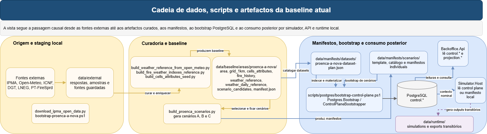

*Figura: cadeia de dados, scripts e artefactos da baseline atual. Fonte editável: [implementation-data-and-scripts-flow.drawio](diagrams/implementation-data-and-scripts-flow.drawio).*

### O que esta secção explica

Esta vista mostra a cadeia causal do sistema antes do runtime:

1. fontes externas e sua cópia local em `data/external/`;
2. scripts de curadoria e enriquecimento em `scripts/data/`;
3. baseline curada em `data/baseline/areas/proenca-a-nova/`;
4. manifestos em `data/manifests/`;
5. bootstrap PostgreSQL;
6. runtime nominal e alternativa standalone;
7. a zona de outputs transitórios em `data/runtime/`.

### Como ler a figura

É importante separar quatro coisas que no repositório aparecem próximas, mas não são iguais:

- `data/external/`: cópia local de fontes ou amostras brutas;
- `data/baseline/`: artefactos já harmonizados para a área piloto;
- `data/manifests/`: descrição operacional e administrativa do que existe e de como o runtime deve arrancar;
- `data/runtime/`: diretórios reservados para saídas transitórias e exportações operacionais.

### Fonte de verdade no repositório

Os pontos mais importantes desta cadeia estão em:

- [scripts/data/bootstrap-proenca-a-nova.ps1](../../scripts/data/bootstrap-proenca-a-nova.ps1)
- [scripts/data/curate_proenca_from_caop.py](../../scripts/data/curate_proenca_from_caop.py)
- [scripts/data/download_ipma_open_data.py](../../scripts/data/download_ipma_open_data.py)
- [scripts/data/build_ipma_nearby_stations.py](../../scripts/data/build_ipma_nearby_stations.py)
- [scripts/data/build_weather_reference_from_open_meteo.py](../../scripts/data/build_weather_reference_from_open_meteo.py)
- [scripts/data/build_weather_daily_reference.py](../../scripts/data/build_weather_daily_reference.py)
- [scripts/data/build_fire_weather_indexes_reference.py](../../scripts/data/build_fire_weather_indexes_reference.py)
- [scripts/data/build_cells_attributes_seed.py](../../scripts/data/build_cells_attributes_seed.py)
- [scripts/data/apply_cos2018_land_cover.py](../../scripts/data/apply_cos2018_land_cover.py)
- [scripts/data/apply_structural_hazard_2020_2030.py](../../scripts/data/apply_structural_hazard_2020_2030.py)
- [scripts/data/extract_pt_firesprd_metadata.py](../../scripts/data/extract_pt_firesprd_metadata.py)
- [scripts/data/build_scenario_candidates_seed_from_pt_firesprd.py](../../scripts/data/build_scenario_candidates_seed_from_pt_firesprd.py)
- [scripts/data/enrich_scenario_candidates_from_daily_weather.py](../../scripts/data/enrich_scenario_candidates_from_daily_weather.py)
- [scripts/data/enrich_scenario_candidates_from_fire_weather_indexes.py](../../scripts/data/enrich_scenario_candidates_from_fire_weather_indexes.py)
- [scripts/data/build_proenca_scenarios.py](../../scripts/data/build_proenca_scenarios.py)
- [scripts/postgres/bootstrap-control-plane.ps1](../../scripts/postgres/bootstrap-control-plane.ps1)

### Scripts por função

Ler `scripts/data/` como um conjunto homogéneo também pode confundir. Na prática, a pasta já está organizada por intenção operacional:

- download e recolha local: [download_ipma_open_data.py](../../scripts/data/download_ipma_open_data.py), descargas manuais de DGT, COS e PT-FireSprd;
- curadoria espacial da área piloto: [curate_proenca_from_caop.py](../../scripts/data/curate_proenca_from_caop.py);
- enriquecimento meteorológico: [build_ipma_nearby_stations.py](../../scripts/data/build_ipma_nearby_stations.py), [build_weather_reference_from_open_meteo.py](../../scripts/data/build_weather_reference_from_open_meteo.py), [build_weather_daily_reference.py](../../scripts/data/build_weather_daily_reference.py), [build_fire_weather_indexes_reference.py](../../scripts/data/build_fire_weather_indexes_reference.py);
- enriquecimento territorial por célula: [build_cells_attributes_seed.py](../../scripts/data/build_cells_attributes_seed.py), [apply_cos2018_land_cover.py](../../scripts/data/apply_cos2018_land_cover.py), [apply_structural_hazard_2020_2030.py](../../scripts/data/apply_structural_hazard_2020_2030.py);
- preparação e enriquecimento de candidatos a cenário: [extract_pt_firesprd_metadata.py](../../scripts/data/extract_pt_firesprd_metadata.py), [build_scenario_candidates_seed_from_pt_firesprd.py](../../scripts/data/build_scenario_candidates_seed_from_pt_firesprd.py), [enrich_scenario_candidates_from_daily_weather.py](../../scripts/data/enrich_scenario_candidates_from_daily_weather.py), [enrich_scenario_candidates_from_fire_weather_indexes.py](../../scripts/data/enrich_scenario_candidates_from_fire_weather_indexes.py);
- geração de cenários executáveis: [build_proenca_scenarios.py](../../scripts/data/build_proenca_scenarios.py);
- bootstrap operacional: [bootstrap-proenca-a-nova.ps1](../../scripts/data/bootstrap-proenca-a-nova.ps1) e [bootstrap-control-plane.ps1](../../scripts/postgres/bootstrap-control-plane.ps1).

### Fluxo factual

O arranque operacional dos dados costuma começar por [bootstrap-proenca-a-nova.ps1](../../scripts/data/bootstrap-proenca-a-nova.ps1), que cria a árvore `data/external/`, `data/baseline/`, `data/manifests/` e `data/runtime/`. Este script prepara a estrutura, mas não produz a baseline tratada por si só.

Depois entram os scripts de download e curadoria:

- [download_ipma_open_data.py](../../scripts/data/download_ipma_open_data.py) descarrega `stations.json`, `observations.json` e `obs-surface.geojson` para `data/external/ipma/api-samples/`.
- [curate_proenca_from_caop.py](../../scripts/data/curate_proenca_from_caop.py) recorta a área piloto a partir da CAOP e gera a malha base da área.
- [build_ipma_nearby_stations.py](../../scripts/data/build_ipma_nearby_stations.py) usa a geometria da área para construir `ipma_nearby_stations.csv`.
- [build_weather_reference_from_open_meteo.py](../../scripts/data/build_weather_reference_from_open_meteo.py) usa a estação IPMA mais próxima para pedir ao Open-Meteo uma série histórica horária e grava `weather_reference.parquet` e `weather_reference.csv`.
- [build_weather_daily_reference.py](../../scripts/data/build_weather_daily_reference.py) agrega a série horária para `weather_daily_reference.parquet` e `weather_daily_reference.csv`.
- [build_fire_weather_indexes_reference.py](../../scripts/data/build_fire_weather_indexes_reference.py) enriquece a referência diária com FWI, KBDI e classificações contextuais.
- [build_cells_attributes_seed.py](../../scripts/data/build_cells_attributes_seed.py) cria a semente de `cells_attributes`.
- [apply_cos2018_land_cover.py](../../scripts/data/apply_cos2018_land_cover.py) e [apply_structural_hazard_2020_2030.py](../../scripts/data/apply_structural_hazard_2020_2030.py) enriquecem `cells_attributes` com uso do solo e perigosidade estrutural.
- [extract_pt_firesprd_metadata.py](../../scripts/data/extract_pt_firesprd_metadata.py) extrai o metadata de `PT-FireSprd_v2.0`.
- [build_scenario_candidates_seed_from_pt_firesprd.py](../../scripts/data/build_scenario_candidates_seed_from_pt_firesprd.py) cria a semente de `scenario_candidates`.
- [enrich_scenario_candidates_from_daily_weather.py](../../scripts/data/enrich_scenario_candidates_from_daily_weather.py) e [enrich_scenario_candidates_from_fire_weather_indexes.py](../../scripts/data/enrich_scenario_candidates_from_fire_weather_indexes.py) acrescentam contexto meteorológico e de índices aos candidatos.
- [build_proenca_scenarios.py](../../scripts/data/build_proenca_scenarios.py) consome `weather_daily_reference.parquet` e `scenario_candidates.parquet` para gerar o catálogo A/B/C e os manifestos individuais.

### Cadeia factual de artefactos

| Etapa | Produtor principal | Artefactos observáveis | Consumidor seguinte | Papel factual |
| --- | --- | --- | --- | --- |
| Preparação da árvore local | `bootstrap-proenca-a-nova.ps1` | `data/external/`, `data/baseline/`, `data/manifests/`, `data/runtime/` | scripts de dados seguintes | garante estrutura mínima do repositório |
| Fontes brutas locais | `download_ipma_open_data.py`, descargas externas e zips manuais | `data/external/ipma/api-samples/*.json`, `data/external/dgt/*`, `data/external/pt-firesprd/*`, `data/external/open-meteo/proenca-a-nova/*.json` | scripts de curadoria | cópia local de inputs externos |
| Curadoria espacial | `curate_proenca_from_caop.py` | `area.gpkg`, `area.geojson`, `grid_1km.geojson` em `data/baseline/areas/proenca-a-nova/` | `build_ipma_nearby_stations.py`, `build_cells_attributes_seed.py`, bootstrap | geometria e grelha da área piloto |
| Semente de atributos por célula | `build_cells_attributes_seed.py` | `cells_attributes.parquet` e `cells_attributes.csv` | `apply_cos2018_land_cover.py`, `apply_structural_hazard_2020_2030.py` | estrutura inicial da grelha com colunas operacionais |
| Enriquecimento de atributos | `apply_cos2018_land_cover.py`, `apply_structural_hazard_2020_2030.py` | `cells_attributes.*` já com `land_cover_*` e `structural_hazard` | bootstrap | contexto territorial que o control plane vai materializar |
| Referência meteorológica horária | `build_ipma_nearby_stations.py`, `build_weather_reference_from_open_meteo.py` | `ipma_nearby_stations.csv`, `weather_reference.parquet`, `weather_reference.csv` | `build_weather_daily_reference.py` | série base temporal da área |
| Referência meteorológica diária | `build_weather_daily_reference.py`, `build_fire_weather_indexes_reference.py` | `weather_daily_reference.parquet`, `weather_daily_reference.csv` | enriquecimento de candidatos e geração de cenários | contexto diário consolidado |
| Candidatos históricos | `extract_pt_firesprd_metadata.py`, `build_scenario_candidates_seed_from_pt_firesprd.py`, `enrich_*scenario_candidates*` | `scenario_candidates.parquet`, `scenario_candidates.csv` | `build_proenca_scenarios.py` | conjunto factual de dias e eventos candidatos |
| Manifestos e catálogos | `build_proenca_scenarios.py` | `proenca-a-nova-scenarios.generated.json`, `scenario_a.base.json`, `scenario_b.high-risk.json`, `scenario_c.degraded-pipeline.json` | bootstrap ou standalone | material operativo do simulador |
| Bootstrap e runtime | `bootstrap-control-plane.ps1`, `ControlPlaneBootstrapper`, `Simulator.Host` | dados em PostgreSQL e runtime em broker/DB | API e Prevention.Host | ponte entre ficheiros versionados e runtime |

### Bifurcações relevantes

- O caminho nominal atual usa a baseline e os manifestos para povoar PostgreSQL e depois consome contexto a partir do control plane.
- O caminho standalone continua a existir, mas só entra em jogo quando `Simulator:ControlPlaneEnabled = false` e o simulador passa a ler diretamente `ScenarioManifestPath` e `Sensors`.
- `data/runtime/` não é hoje uma fonte de verdade do sistema. É uma área reservada para saídas transitórias e exportações, mas os hosts atuais persistem no broker e em bases de dados, não em ficheiros dessa pasta.

### Estatuto atual de `data/runtime`

`data/runtime/` merece leitura própria porque o nome pode induzir expectativas erradas. Hoje, a pasta existe como destino preparado para:

- exportações operacionais;
- artefactos transitórios de execução;
- evidência que se queira recolher fora de PostgreSQL e InfluxDB.

No snapshot atual do repositório, porém, o que existe é apenas:

- [data/runtime/exports/.gitkeep](../../data/runtime/exports/.gitkeep);
- [data/runtime/simulations/.gitkeep](../../data/runtime/simulations/.gitkeep).

Estado atual verificado: não foi encontrado nesta leitura um writer ativo no código que grave automaticamente ficheiros versionados em `data/runtime/`. A evidência operacional atual vive antes em RabbitMQ, PostgreSQL, InfluxDB e logs aplicacionais.

### Notas de compreensão ou armadilhas

- O sistema não lê dados externos em tempo real no caminho nominal. Lê artefactos já preparados e versionados no repositório.
- `data/manifests/` não é o mesmo que `data/baseline/`. Os manifestos descrevem datasets e cenários; a baseline contém o material tratado.
- `data/runtime/` sugere saídas operacionais, mas o snapshot atual do repositório mostra apenas `exports/.gitkeep` e `simulations/.gitkeep`. Não foi encontrado writer ativo no código atual que alimente essa pasta.

### Ficheiros, classes e métodos principais

- [scripts/data/bootstrap-proenca-a-nova.ps1](../../scripts/data/bootstrap-proenca-a-nova.ps1)
- [scripts/data/curate_proenca_from_caop.py](../../scripts/data/curate_proenca_from_caop.py)
- [scripts/data/download_ipma_open_data.py](../../scripts/data/download_ipma_open_data.py)
- [scripts/data/build_ipma_nearby_stations.py](../../scripts/data/build_ipma_nearby_stations.py)
- [scripts/data/build_weather_reference_from_open_meteo.py](../../scripts/data/build_weather_reference_from_open_meteo.py)
- [scripts/data/build_weather_daily_reference.py](../../scripts/data/build_weather_daily_reference.py)
- [scripts/data/build_fire_weather_indexes_reference.py](../../scripts/data/build_fire_weather_indexes_reference.py)
- [scripts/data/build_cells_attributes_seed.py](../../scripts/data/build_cells_attributes_seed.py)
- [scripts/data/build_scenario_candidates_seed_from_pt_firesprd.py](../../scripts/data/build_scenario_candidates_seed_from_pt_firesprd.py)
- [scripts/data/enrich_scenario_candidates_from_daily_weather.py](../../scripts/data/enrich_scenario_candidates_from_daily_weather.py)
- [scripts/data/enrich_scenario_candidates_from_fire_weather_indexes.py](../../scripts/data/enrich_scenario_candidates_from_fire_weather_indexes.py)
- [scripts/data/build_proenca_scenarios.py](../../scripts/data/build_proenca_scenarios.py)
- [data/baseline/areas/proenca-a-nova/manifest.json](../../data/baseline/areas/proenca-a-nova/manifest.json)
- [data/manifests/datasets/proenca-a-nova-dataset-plan.json](../../data/manifests/datasets/proenca-a-nova-dataset-plan.json)

### Estado atual 

- a baseline atual contém já os artefactos necessários para bootstrap piloto;
- a cadeia de scripts para Proença-a-Nova está materializada no repositório;
- `data/runtime/` existe como zona transitória, mas o snapshot atual do repositório mostra apenas diretórios vazios com `.gitkeep`.

## 7. Cenários e manifestos

Os cenários A/B/C são o ponto em que a baseline deixa de ser apenas contexto preparado e passa a ser material executável pelo simulador. Esta vista foi desenhada para deixar clara a diferença entre template, inputs curados, script gerador, catálogo gerado, manifestos individuais, bootstrap do control plane e caminho alternativo standalone.

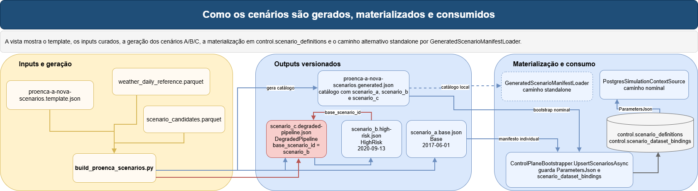

*Figura: como os cenários são gerados, materializados e consumidos. Fonte editável: [implementation-scenarios-and-manifests.drawio](diagrams/implementation-scenarios-and-manifests.drawio).*

### O que esta secção explica

Esta vista trata cinco etapas diferentes:

1. origem dos cenários;
2. artefactos gerados;
3. entrada no control plane;
4. leitura pelo simulador;
5. diferença entre caminho nominal e standalone.

### Como ler a figura

O ponto de partida é o template [proenca-a-nova-scenarios.template.json](../../data/manifests/scenarios/proenca-a-nova-scenarios.template.json). Esse ficheiro não representa uma execução por si só; funciona como molde para a geração dos manifestos finais. Os inputs principais são [weather_daily_reference.parquet](../../data/baseline/areas/proenca-a-nova/weather_daily_reference.parquet) e [scenario_candidates.parquet](../../data/baseline/areas/proenca-a-nova/scenario_candidates.parquet). O script [build_proenca_scenarios.py](../../scripts/data/build_proenca_scenarios.py) usa esses inputs para materializar três cenários.

### Fonte de verdade no repositório

- [data/manifests/scenarios/proenca-a-nova-scenarios.template.json](../../data/manifests/scenarios/proenca-a-nova-scenarios.template.json)
- [data/manifests/scenarios/proenca-a-nova-scenarios.generated.json](../../data/manifests/scenarios/proenca-a-nova-scenarios.generated.json)
- [data/manifests/scenarios/proenca-a-nova/scenario_a.base.json](../../data/manifests/scenarios/proenca-a-nova/scenario_a.base.json)
- [data/manifests/scenarios/proenca-a-nova/scenario_b.high-risk.json](../../data/manifests/scenarios/proenca-a-nova/scenario_b.high-risk.json)
- [data/manifests/scenarios/proenca-a-nova/scenario_c.degraded-pipeline.json](../../data/manifests/scenarios/proenca-a-nova/scenario_c.degraded-pipeline.json)
- [scripts/data/build_proenca_scenarios.py](../../scripts/data/build_proenca_scenarios.py)
- [src/NatureProtector.Infrastructure.Postgres/Bootstrap/ControlPlaneBootstrapper.cs](../../src/NatureProtector.Infrastructure.Postgres/Bootstrap/ControlPlaneBootstrapper.cs)
- [src/NatureProtector.Simulator.Host/Configuration/GeneratedScenarioManifestLoader.cs](../../src/NatureProtector.Simulator.Host/Configuration/GeneratedScenarioManifestLoader.cs)
- [src/NatureProtector.Simulator.Host/Services/PostgresSimulationContextSource.cs](../../src/NatureProtector.Simulator.Host/Services/PostgresSimulationContextSource.cs)

### Fluxo factual

O catálogo gerado em [proenca-a-nova-scenarios.generated.json](../../data/manifests/scenarios/proenca-a-nova-scenarios.generated.json) agrega `scenario_a`, `scenario_b` e `scenario_c`. Depois, cada cenário fica também fixado num manifesto individual. Isto evita misturar duas coisas diferentes: o catálogo agregado, que é útil para seleção e bootstrap, e os manifestos individuais, que são artefactos concretos e legíveis por cenário.

`scenario_a` representa o cenário base. `scenario_b` representa o cenário de maior risco. `scenario_c` representa o cenário degradado e deriva explicitamente de `scenario_b` por `base_scenario_id`. Esta relação é importante para onboarding porque mostra que o degradado não é um cenário físico completamente novo; é uma variação operacional sobre um cenário base já escolhido.

No caminho nominal atual, os manifestos não são lidos diretamente pelo simulador. Em vez disso, [ControlPlaneBootstrapper.UpsertScenariosAsync](../../src/NatureProtector.Infrastructure.Postgres/Bootstrap/ControlPlaneBootstrapper.cs) grava o conteúdo integral do cenário em `control.scenario_definitions.ParametersJson` e cria os respetivos bindings em `control.scenario_dataset_bindings`. Depois, [PostgresSimulationContextSource.CreateAsync](../../src/NatureProtector.Simulator.Host/Services/PostgresSimulationContextSource.cs) reconstrói o `Scenario` a partir desse JSON armazenado.

### Geração, materialização e consumo

É útil separar estes três momentos porque a palavra "cenário" aparece no repositório com papéis diferentes:

- geração: [build_proenca_scenarios.py](../../scripts/data/build_proenca_scenarios.py) escolhe candidatos, aplica o template e produz catálogo agregado mais manifestos individuais;
- materialização: [ControlPlaneBootstrapper.UpsertScenariosAsync](../../src/NatureProtector.Infrastructure.Postgres/Bootstrap/ControlPlaneBootstrapper.cs) lê o catálogo gerado e persiste `ScenarioDefinitionRecord` e `ScenarioDatasetBindingRecord`;
- consumo: [PostgresSimulationContextSource.CreateAsync](../../src/NatureProtector.Simulator.Host/Services/PostgresSimulationContextSource.cs) lê `ParametersJson` e [GeneratedScenarioManifestLoader.ApplyIfConfigured](../../src/NatureProtector.Simulator.Host/Configuration/GeneratedScenarioManifestLoader.cs) só entra no caminho standalone.

Esta divisão ajuda a evitar uma leitura errada muito comum: assumir que o simulador lê sempre o mesmo ficheiro que o bootstrap leu. No caminho nominal atual, isso já não é verdade.

### Precedência da origem do cenário

| Modo | Como o cenário é identificado | De onde vêm os parâmetros operacionais | O que fica ignorado |
| --- | --- | --- | --- |
| Nominal com control plane | `AreaId` ou `ControlPlaneAreaCode`, depois `ScenarioId` ou `ControlPlaneScenarioCode` em [PostgresSimulationContextSource](../../src/NatureProtector.Simulator.Host/Services/PostgresSimulationContextSource.cs) | `control.scenario_definitions.ParametersJson` materializado por `ControlPlaneBootstrapper.UpsertScenariosAsync` | `ScenarioManifestPath`, `ScenarioManifestScenarioKey`, lista local de `Sensors` e quase todos os parâmetros do cenário em `appsettings` |
| Standalone com catálogo gerado | `ScenarioManifestPath` + `ScenarioManifestScenarioKey` em [GeneratedScenarioManifestLoader.ApplyIfConfigured](../../src/NatureProtector.Simulator.Host/Configuration/GeneratedScenarioManifestLoader.cs) | bloco `simulator_options` da entrada escolhida do catálogo | `ParametersJson` do control plane |
| Standalone com manifesto individual | `ScenarioManifestPath` sem catálogo | bloco `simulator_options` do manifesto individual | `ParametersJson` do control plane |
| Standalone puro | `appsettings.json` | `SimulatorOptions` já bound no host | manifesto e control plane |

### Bifurcações relevantes

O caminho alternativo standalone continua a existir. Nele, [GeneratedScenarioManifestLoader.ApplyIfConfigured](../../src/NatureProtector.Simulator.Host/Configuration/GeneratedScenarioManifestLoader.cs) pode aplicar um manifesto individual ou selecionar uma entrada dentro de um catálogo. Mas este não é o caminho dominante da branch atual, porque `Simulator:ControlPlaneEnabled = true` no simulador.

Há também uma nuance importante de precedência:

- o catálogo gerado atual para `scenario_b` contém `IntervalSeconds = 30` e `NumberOfCycles = 20`;
- o manifesto individual [scenario_b.high-risk.json](../../data/manifests/scenarios/proenca-a-nova/scenario_b.high-risk.json) contém `IntervalSeconds = 5` e `NumberOfCycles = 288`;
- o [appsettings.json do simulador](../../src/NatureProtector.Simulator.Host/appsettings.json) contém `IntervalSeconds = 5` e `NumberOfCycles = 20`.

Isto significa que a pergunta “qual é o intervalo real de `scenario_b`?” só pode ser respondida olhando primeiro para o modo de execução:

- no caminho nominal via control plane, prevalece o `ParametersJson` materializado pelo bootstrap a partir do catálogo gerado;
- no caminho standalone com o manifesto individual, prevalecem `5` segundos e `288` ciclos;
- os valores de `appsettings` só controlam o cenário standalone quando não há manifesto e ficam subordinados ao `ParametersJson` no modo control plane.

### Notas de compreensão ou armadilhas

- `ScenarioManifestPath` pode sugerir que o simulador lê sempre manifestos, mas o validador proíbe esse caminho quando `ControlPlaneEnabled = true`.
- O catálogo gerado e os manifestos individuais não são sinónimos. O bootstrap usa o catálogo; o standalone pode usar o catálogo ou um manifesto individual.

### Ficheiros, classes e métodos principais

- [data/manifests/scenarios/proenca-a-nova-scenarios.template.json](../../data/manifests/scenarios/proenca-a-nova-scenarios.template.json)
- [data/manifests/scenarios/proenca-a-nova-scenarios.generated.json](../../data/manifests/scenarios/proenca-a-nova-scenarios.generated.json)
- [data/manifests/scenarios/proenca-a-nova/scenario_a.base.json](../../data/manifests/scenarios/proenca-a-nova/scenario_a.base.json)
- [data/manifests/scenarios/proenca-a-nova/scenario_b.high-risk.json](../../data/manifests/scenarios/proenca-a-nova/scenario_b.high-risk.json)
- [data/manifests/scenarios/proenca-a-nova/scenario_c.degraded-pipeline.json](../../data/manifests/scenarios/proenca-a-nova/scenario_c.degraded-pipeline.json)
- [scripts/data/build_proenca_scenarios.py](../../scripts/data/build_proenca_scenarios.py)
- [src/NatureProtector.Infrastructure.Postgres/Bootstrap/ControlPlaneBootstrapper.cs](../../src/NatureProtector.Infrastructure.Postgres/Bootstrap/ControlPlaneBootstrapper.cs)
- [src/NatureProtector.Simulator.Host/Configuration/GeneratedScenarioManifestLoader.cs](../../src/NatureProtector.Simulator.Host/Configuration/GeneratedScenarioManifestLoader.cs)
- [src/NatureProtector.Simulator.Host/Services/PostgresSimulationContextSource.cs](../../src/NatureProtector.Simulator.Host/Services/PostgresSimulationContextSource.cs)

### Estado atual

- o catálogo gerado contém três cenários;
- `scenario_c` deriva explicitamente de `scenario_b`;
- o caminho nominal do runtime usa `control.scenario_definitions`, não o manifesto local diretamente.

## 8. Configuração e seleção de implementações

Esta vista responde a uma pergunta prática de onboarding: onde é que o comportamento muda quando uma opção muda. Em vez de listar DI abstrata, mostra os pontos reais de decisão nos três hosts principais.

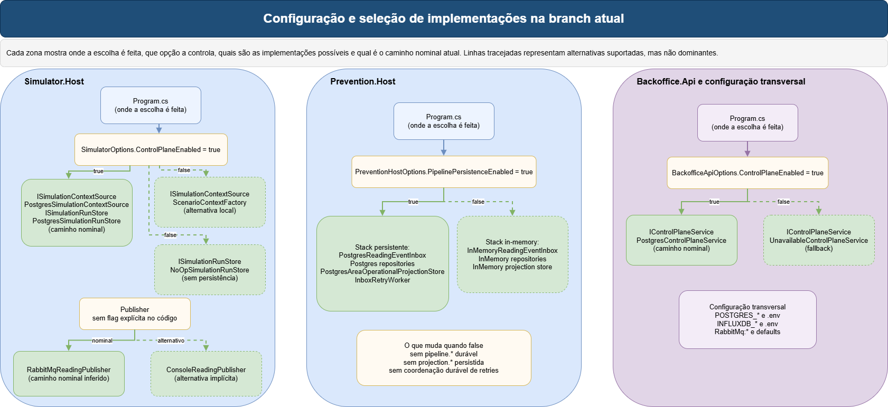

*Figura: configuração e seleção de implementações na branch atual. Fonte editável: [implementation-configuration-and-selection.drawio](diagrams/implementation-configuration-and-selection.drawio).*

### O que esta secção explica

Esta secção fecha três temas:

1. seleção por host;
2. origem e precedência dos valores;
3. caminho nominal atual.

### Como ler a figura

Começar pelos três `Program.cs` e só depois olhar para os serviços concretos. É nos pontos de composição dos hosts que se fecha:

- a origem do contexto do simulador;
- a existência ou não de run store durável;
- o publisher que recebe os envelopes;
- a stack persistente ou in-memory da prevenção;
- o serviço real da API.

### Fonte de verdade no repositório

- [src/NatureProtector.Simulator.Host/Program.cs](../../src/NatureProtector.Simulator.Host/Program.cs)
- [src/NatureProtector.Simulator.Host/appsettings.json](../../src/NatureProtector.Simulator.Host/appsettings.json)
- [src/NatureProtector.Simulator.Host/Configuration/GeneratedScenarioManifestLoader.cs](../../src/NatureProtector.Simulator.Host/Configuration/GeneratedScenarioManifestLoader.cs)
- [src/NatureProtector.Simulator.Host/Configuration/SimulatorOptionsValidator.cs](../../src/NatureProtector.Simulator.Host/Configuration/SimulatorOptionsValidator.cs)
- [src/NatureProtector.Prevention.Host/Program.cs](../../src/NatureProtector.Prevention.Host/Program.cs)
- [src/NatureProtector.Prevention.Host/appsettings.json](../../src/NatureProtector.Prevention.Host/appsettings.json)
- [src/NatureProtector.Backoffice.Api/Program.cs](../../src/NatureProtector.Backoffice.Api/Program.cs)
- [src/NatureProtector.Backoffice.Api/appsettings.json](../../src/NatureProtector.Backoffice.Api/appsettings.json)
- [src/NatureProtector.Infrastructure.Postgres/Configuration/PostgresConnectionSettingsLoader.cs](../../src/NatureProtector.Infrastructure.Postgres/Configuration/PostgresConnectionSettingsLoader.cs)
- [src/NatureProtector.Infrastructure.Influx/Configuration/InfluxDbSettingsLoader.cs](../../src/NatureProtector.Infrastructure.Influx/Configuration/InfluxDbSettingsLoader.cs)

### Seleção por host

| Host | Onde a escolha é feita | Opção ou condição | Implementações possíveis | Caminho nominal atual |
| --- | --- | --- | --- | --- |
| `Simulator.Host` contexto | [Program.cs](../../src/NatureProtector.Simulator.Host/Program.cs) no registo de `ISimulationContextSource` | `SimulatorOptions.ControlPlaneEnabled` | `PostgresSimulationContextSource` ou `ScenarioContextFactory` | `PostgresSimulationContextSource` |
| `Simulator.Host` run store | [Program.cs](../../src/NatureProtector.Simulator.Host/Program.cs) no registo de `ISimulationRunStore` | `SimulatorOptions.ControlPlaneEnabled` | `PostgresSimulationRunStore` ou `NoOpSimulationRunStore` | `PostgresSimulationRunStore` |
| `Simulator.Host` publisher | [Program.cs](../../src/NatureProtector.Simulator.Host/Program.cs) no registo de `IReadingPublisher` | sem flag explícita; resolução do container para serviço único | `ConsoleReadingPublisher` ou `RabbitMqReadingPublisher` | `RabbitMqReadingPublisher` |
| `Prevention.Host` inbox | [Program.cs](../../src/NatureProtector.Prevention.Host/Program.cs) | `PreventionHostOptions.PipelinePersistenceEnabled` | `PostgresReadingEventInbox` ou `InMemoryReadingEventInbox` | `PostgresReadingEventInbox` |
| `Prevention.Host` repositórios e projeções | [Program.cs](../../src/NatureProtector.Prevention.Host/Program.cs) | `PipelinePersistenceEnabled` | `PostgresAreaOperationalProjectionStore`, `PostgresAcceptedReadingRepository`, `PostgresRiskAssessmentRepository`, `PostgresAreaRiskSnapshotRepository` ou `InMemoryAreaOperationalProjectionStore`, `InMemoryAcceptedReadingRepository`, `InMemoryRiskAssessmentRepository`, `InMemoryAreaRiskSnapshotRepository` | stack persistente |
| `Prevention.Host` retries | [Program.cs](../../src/NatureProtector.Prevention.Host/Program.cs) | `PipelinePersistenceEnabled` | `InboxRetryWorker` existe só no modo persistente | ativo |
| `Prevention.Host` validação semântica | [Program.cs](../../src/NatureProtector.Prevention.Host/Program.cs) | `PreventionHostOptions.PipelinePersistenceEnabled` | `ReadingSemanticValidator` ou `PassThroughReadingSemanticValidator` | `ReadingSemanticValidator` |
| `Prevention.Host` escrita InfluxDB | [ServiceCollectionExtensions.cs](../../src/NatureProtector.Infrastructure.Influx/DependencyInjection/ServiceCollectionExtensions.cs) | `InfluxDb:Enabled` e opções de escrita | `SafeInfluxWriteService`, `NoOpInfluxWriteService` e writer real | `NoOpInfluxWriteService` no default local atual, se `Enabled=false` |
| `Backoffice.Api` | [Program.cs](../../src/NatureProtector.Backoffice.Api/Program.cs) | `BackofficeApiOptions.ControlPlaneEnabled` | `PostgresControlPlaneService` ou `UnavailableControlPlaneService` | `PostgresControlPlaneService` |

### Detalhe da stack da prevenção

No caminho persistente, [Program.cs](../../src/NatureProtector.Prevention.Host/Program.cs) regista explicitamente:

- `AddNatureProtectorControlPlanePostgres(...)` para disponibilizar `NatureProtectorControlDbContext` e acesso relacional;
- `IReadingEventInbox -> PostgresReadingEventInbox`;
- `IAreaOperationalProjectionStore -> PostgresAreaOperationalProjectionStore`;
- `IAcceptedReadingRepository -> PostgresAcceptedReadingRepository`;
- `IRiskAssessmentRepository -> PostgresRiskAssessmentRepository`;
- `IAreaRiskSnapshotRepository -> PostgresAreaRiskSnapshotRepository`;
- `InboxRetryWorker` como hosted service adicional.

No caminho em memória, o mesmo ficheiro troca essas implementações por:

- `InMemoryReadingEventInbox`;
- `InMemoryAreaOperationalProjectionStore`;
- `InMemoryAcceptedReadingRepository`;
- `InMemoryRiskAssessmentRepository`;
- `InMemoryAreaRiskSnapshotRepository`.

Isto é importante para onboarding porque o modo in-memory preserva a lógica de pipeline, mas retira inbox durável, retry worker persistente e projeções guardadas em PostgreSQL.

A stack persistente da prevenção inclui também validação semântica contra o plano de controlo. No modo persistente, `ReadingSemanticValidator` confirma que o `sensor_id` do payload existe, está ativo e pertence ao `area_id` do envelope. No modo in-memory, em que não há plano de controlo relacional carregado, é usado `PassThroughReadingSemanticValidator`, preservando o comportamento de execução local sem PostgreSQL.

A escrita para InfluxDB também é selecionada por configuração. Quando `InfluxDb:Enabled=false`, o host usa `NoOpInfluxWriteService`. Quando `InfluxDb:Enabled=true`, a escrita passa pela camada segura de Influx, que aplica a política de falha e as flags por measurement. Esta decisão mantém PostgreSQL como estado operacional durável e trata InfluxDB como observabilidade temporal.

### Origem dos valores e precedência

| Valor | Pode vir de | Modo nominal com control plane | Standalone com manifesto | Standalone puro | O que fica ignorado ou subordinado |
| --- | --- | --- | --- | --- | --- |
| ligação PostgreSQL | ambiente, `.env`, defaults em [PostgresConnectionSettingsLoader](../../src/NatureProtector.Infrastructure.Postgres/Configuration/PostgresConnectionSettingsLoader.cs) | ambiente > `.env` > defaults do loader | igual | igual | `appsettings` dos hosts não participa nesta resolução |
| ligação InfluxDB | `appsettings`, ambiente, `.env` em [InfluxDbSettingsLoader](../../src/NatureProtector.Infrastructure.Influx/Configuration/InfluxDbSettingsLoader.cs) | `appsettings` primeiro; campos vazios recorrem a ambiente e `.env` | igual | igual | valores já preenchidos em `appsettings` não são substituídos |
| RabbitMQ | `appsettings` do host | `appsettings` | `appsettings` | `appsettings` | manifesto e `ParametersJson` não mexem no broker |
| identidade da área e do cenário no simulador | `AreaId`, `ScenarioId`, `ControlPlaneAreaCode`, `ControlPlaneScenarioCode`, manifesto | `PostgresSimulationContextSource.CreateAsync` tenta `AreaId`/`ScenarioId` e, se não encontrar, cai para os códigos | `GeneratedScenarioManifestLoader` pode preencher `AreaId`, `ScenarioId`, `ScenarioName` | `SimulatorOptions` locais | manifesto local é proibido quando `ControlPlaneEnabled = true` |
| parâmetros operacionais do cenário no simulador | `appsettings`, manifesto, `ParametersJson` | `ParametersJson` lido por [PostgresSimulationContextSource.CreateAsync](../../src/NatureProtector.Simulator.Host/Services/PostgresSimulationContextSource.cs) | manifesto via [GeneratedScenarioManifestLoader.ApplyIfConfigured](../../src/NatureProtector.Simulator.Host/Configuration/GeneratedScenarioManifestLoader.cs) | `appsettings` já bound em `SimulatorOptions` | no modo control plane, manifesto e valores locais de cenário deixam de ser a verdade final |
| sensores do simulador | `control.sensor_nodes` ou `SimulatorOptions.Sensors` | `control.sensor_nodes` ativos | `SimulatorOptions.Sensors` eventualmente enriquecidos pelo manifesto | `SimulatorOptions.Sensors` | sensores locais ficam sem efeito no modo control plane |
| persistência da prevenção | `PreventionHostOptions.PipelinePersistenceEnabled` em `appsettings` | stack PostgreSQL + `InboxRetryWorker` | n/a | stack in-memory se a flag estiver a `false` | não há manifesto nem `ParametersJson` nesta decisão |
| retries e polling da prevenção | `appsettings` de `PreventionHost` | `MaxProcessingAttempts`, `RetryDelaySeconds`, `RetryPollingIntervalSeconds` | igual | igual | não dependem do cenário |
| control plane da API | `BackofficeApiOptions.ControlPlaneEnabled` em `appsettings` | `PostgresControlPlaneService` | igual | `UnavailableControlPlaneService` quando `false` | a disponibilidade do control plane não vem de manifesto |

### Exemplo factual de precedência

Exemplo concreto de conflito já observável no repositório:

- [appsettings do simulador](../../src/NatureProtector.Simulator.Host/appsettings.json) define `IntervalSeconds = 5`;
- o catálogo [proenca-a-nova-scenarios.generated.json](../../data/manifests/scenarios/proenca-a-nova-scenarios.generated.json) traz `scenario_b.simulator_options.IntervalSeconds = 30`;
- [PostgresSimulationContextSource.CreateAsync](../../src/NatureProtector.Simulator.Host/Services/PostgresSimulationContextSource.cs) lê `IntervalSeconds` do `ParametersJson` armazenado no control plane.

Logo, no caminho nominal com control plane, o intervalo operacional do cenário vem do `ParametersJson` e não do `appsettings`.

### Caminho nominal atual

Os valores nominais hoje observáveis na branch são:

- `Simulator:ControlPlaneEnabled = true`;
- `PreventionHost:PipelinePersistenceEnabled = true`;
- `BackofficeApi:ControlPlaneEnabled = true`;
- `Simulator:ControlPlaneAreaCode = proenca-a-nova`;
- `Simulator:ControlPlaneScenarioCode = scenario_b`;
- `PreventionHost:MaxProcessingAttempts = 3`;
- `PreventionHost:RetryDelaySeconds = [5, 30]`;
- `InfluxDb:Bucket = np_telemetry`.

### Bifurcações relevantes

- No simulador, `GeneratedScenarioManifestLoader` só é útil no standalone. O validador falha cedo se for configurado juntamente com `ControlPlaneEnabled = true`.
- Na prevenção, a existência de `InboxRetryWorker` é um bom indicador do caminho persistente. Se `PipelinePersistenceEnabled = false`, o worker desaparece e o fluxo perde retries duráveis.
- Na API, o host pode arrancar mesmo com o control plane desligado. O que muda é a implementação de `IControlPlaneService`, não a existência da aplicação.

### Notas de compreensão ou armadilhas

- `AreaId` e `ScenarioId` no simulador têm defaults não vazios em `SimulatorOptions`. No caminho nominal atual, esses GUIDs não correspondem ao bootstrap, por isso a resolução cai depois para `ControlPlaneAreaCode` e `ControlPlaneScenarioCode`. Isto pode confundir um leitor novo porque o código parece começar por IDs, mas a resolução efetiva costuma acabar nos códigos.
- O publisher nominal do simulador não é controlado por uma flag. Ele decorre do facto de [Program.cs](../../src/NatureProtector.Simulator.Host/Program.cs) registar dois `IReadingPublisher` e `SimulationRunner` consumir um único serviço, ficando com a última implementação registada.

### Ficheiros, classes e métodos principais

- [src/NatureProtector.Simulator.Host/Program.cs](../../src/NatureProtector.Simulator.Host/Program.cs)
- [src/NatureProtector.Simulator.Host/appsettings.json](../../src/NatureProtector.Simulator.Host/appsettings.json)
- [src/NatureProtector.Simulator.Host/Configuration/GeneratedScenarioManifestLoader.cs](../../src/NatureProtector.Simulator.Host/Configuration/GeneratedScenarioManifestLoader.cs)
- [src/NatureProtector.Simulator.Host/Configuration/SimulatorOptionsValidator.cs](../../src/NatureProtector.Simulator.Host/Configuration/SimulatorOptionsValidator.cs)
- [src/NatureProtector.Prevention.Host/Program.cs](../../src/NatureProtector.Prevention.Host/Program.cs)
- [src/NatureProtector.Prevention.Host/appsettings.json](../../src/NatureProtector.Prevention.Host/appsettings.json)
- [src/NatureProtector.Backoffice.Api/Program.cs](../../src/NatureProtector.Backoffice.Api/Program.cs)
- [src/NatureProtector.Backoffice.Api/appsettings.json](../../src/NatureProtector.Backoffice.Api/appsettings.json)
- [src/NatureProtector.Infrastructure.Postgres/Configuration/PostgresConnectionSettingsLoader.cs](../../src/NatureProtector.Infrastructure.Postgres/Configuration/PostgresConnectionSettingsLoader.cs)
- [src/NatureProtector.Infrastructure.Influx/Configuration/InfluxDbSettingsLoader.cs](../../src/NatureProtector.Infrastructure.Influx/Configuration/InfluxDbSettingsLoader.cs)

### Estado atual

- `Simulator:ControlPlaneEnabled = true`;
- `PreventionHost:PipelinePersistenceEnabled = true`;
- `BackofficeApi:ControlPlaneEnabled = true`;
- a precedência do cenário muda mesmo consoante o modo e afeta diretamente `IntervalSeconds` e `NumberOfCycles`;
- no simulador, `RabbitMqReadingPublisher` é o publisher nominal por composição efetiva do host e não por uma flag dedicada.

## 9. Bootstrap e control plane

O bootstrap é a fronteira mais importante entre preparação de artefactos e runtime real. Esta vista foi reforçada para mostrar inputs concretos, script PowerShell, `Program.cs`, `ControlPlaneBootstrapper`, os métodos `Upsert*` e os consumidores posteriores.

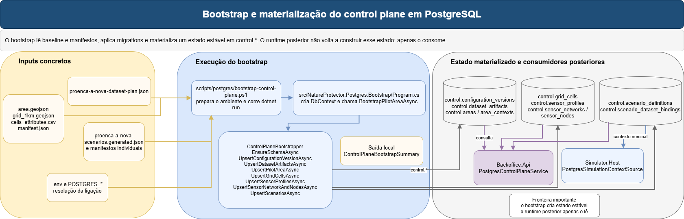

*Figura: bootstrap e materialização do control plane em PostgreSQL. Fonte editável: [implementation-bootstrap-control-plane.drawio](diagrams/implementation-bootstrap-control-plane.drawio).*

### O que esta secção explica

Esta secção explica:

1. o que entra no bootstrap;
2. o que é criado ou atualizado;
3. o que o bootstrap não faz;
4. como o estado materializado passa a ser lido por simulador e API.

### Como ler a figura

O ponto de entrada operacional é [scripts/postgres/bootstrap-control-plane.ps1](../../scripts/postgres/bootstrap-control-plane.ps1). Esse script não faz apenas um `dotnet run`. Primeiro prepara o ambiente de execução do repositório, verifica a solução, confirma que PostgreSQL está acessível e só depois arranca [src/NatureProtector.Postgres.Bootstrap/Program.cs](../../src/NatureProtector.Postgres.Bootstrap/Program.cs).

No `Program.cs`, a ordem factual é simples: resolver a raiz do repositório, carregar a configuração PostgreSQL, criar `NatureProtectorControlDbContext`, instanciar `ControlPlaneBootstrapper` e chamar `BootstrapPilotAreaAsync`. A parte mais importante está dentro de [ControlPlaneBootstrapper](../../src/NatureProtector.Infrastructure.Postgres/Bootstrap/ControlPlaneBootstrapper.cs).

### Fonte de verdade no repositório

- [scripts/postgres/bootstrap-control-plane.ps1](../../scripts/postgres/bootstrap-control-plane.ps1)
- [src/NatureProtector.Postgres.Bootstrap/Program.cs](../../src/NatureProtector.Postgres.Bootstrap/Program.cs)
- [src/NatureProtector.Infrastructure.Postgres/Bootstrap/ControlPlaneBootstrapper.cs](../../src/NatureProtector.Infrastructure.Postgres/Bootstrap/ControlPlaneBootstrapper.cs)
- [src/NatureProtector.Infrastructure.Postgres/Persistence/NatureProtectorControlDbContext.cs](../../src/NatureProtector.Infrastructure.Postgres/Persistence/NatureProtectorControlDbContext.cs)
- [src/NatureProtector.Infrastructure.Postgres/Migrations/](../../src/NatureProtector.Infrastructure.Postgres/Migrations/)

### Fluxo factual

Em `BootstrapPilotAreaAsync`, a sequência observável é esta:

1. `EnsureSchemaAsync`
2. `UpsertConfigurationVersionAsync`
3. `UpsertDatasetArtifactsAsync`
4. `UpsertPilotAreaAsync`
5. `UpsertGridCellsAsync`
6. `UpsertSensorProfilesAsync`
7. `UpsertSensorNetworkAndNodesAsync`
8. `UpsertScenariosAsync`
9. contagem final para `ControlPlaneBootstrapSummary`

Esta ordem importa. Primeiro garante-se o suporte relacional. Depois cataloga-se a configuração e os datasets. Só depois são materializados área, grelha, perfis, rede de sensores e cenários. O resultado vai para `control.*`, com destaque para `configuration_versions`, `dataset_artifacts`, `areas`, `area_contexts`, `grid_cells`, `sensor_profiles`, `sensor_networks`, `sensor_nodes`, `scenario_definitions` e `scenario_dataset_bindings`.

### `Upsert*` e consumidores posteriores

| Método do bootstrapper | O que cria ou atualiza | Quem usa depois |
| --- | --- | --- |
| `EnsureSchemaAsync` | migrations ou `EnsureCreated` | todos os writers PostgreSQL |
| `UpsertConfigurationVersionAsync` | `control.configuration_versions` | API, bootstrap posterior, simulação via `ConfigurationVersionId` |
| `UpsertDatasetArtifactsAsync` | `control.dataset_artifacts` | API indireta e bindings de cenários |
| `UpsertPilotAreaAsync` | `control.areas`, `control.area_contexts` | simulador, API |
| `UpsertGridCellsAsync` | `control.grid_cells` | API, seleção de sensores, projeções |
| `UpsertSensorProfilesAsync` | `control.sensor_profiles` | simulador via `PostgresSimulationContextSource` |
| `UpsertSensorNetworkAndNodesAsync` | `control.sensor_networks`, `control.sensor_nodes` | simulador, API, projeções da prevenção |
| `UpsertScenariosAsync` | `control.scenario_definitions`, `control.scenario_dataset_bindings` | simulador, API |

### Relação bootstrap -> API

O bootstrap e a API estão mais acoplados do que uma leitura superficial pode sugerir:

- a API depende diretamente de `control.configuration_versions`, `control.areas`, `control.area_contexts`, `control.grid_cells`, `control.sensor_nodes`, `control.scenario_definitions`, `control.scenario_dataset_bindings` e `control.simulation_runs`;
- `simulation_runs` só aparecem depois de o runtime do simulador correr;
- `projection.area_operational_state`, `projection.cell_operational_state` e `projection.alert_state` só ganham conteúdo depois de o runtime da prevenção correr.

Isto significa que há dois grupos de respostas na API:

- respostas que dependem do bootstrap, mesmo sem runtime ativo, como configurações, áreas, grelha, sensores e cenários;
- respostas que dependem de bootstrap mais runtime, como runs, estado operacional e alertas.

### O que o bootstrap não faz

O bootstrap não:

- arranca hosts;
- publica eventos;
- calcula risco;
- escreve telemetria em InfluxDB;
- preenche `projection.*`;
- processa mensagens em `pipeline.*`.

O papel do bootstrap é materializar estado estável. O runtime posterior consome esse estado.

### Notas de compreensão ou armadilhas

- O bootstrap está fortemente parametrizado para `Proença-a-Nova`. O nome pode sugerir uma generalidade maior do que a implementação atual oferece.
- `EnsureSchemaAsync` usa migrations quando existem e só cai para `EnsureCreatedAsync` se não houver migrations. Na branch atual há migrations formais, por isso o caminho esperado é `Database.MigrateAsync`.

### Ficheiros, classes e métodos principais

- [scripts/postgres/bootstrap-control-plane.ps1](../../scripts/postgres/bootstrap-control-plane.ps1)
- [src/NatureProtector.Postgres.Bootstrap/Program.cs](../../src/NatureProtector.Postgres.Bootstrap/Program.cs)
- [src/NatureProtector.Infrastructure.Postgres/Bootstrap/ControlPlaneBootstrapper.cs](../../src/NatureProtector.Infrastructure.Postgres/Bootstrap/ControlPlaneBootstrapper.cs)
- [src/NatureProtector.Infrastructure.Postgres/Persistence/NatureProtectorControlDbContext.cs](../../src/NatureProtector.Infrastructure.Postgres/Persistence/NatureProtectorControlDbContext.cs)
- [src/NatureProtector.Infrastructure.Postgres/Migrations/](../../src/NatureProtector.Infrastructure.Postgres/Migrations/)

### Estado atual

- o bootstrap materializa configuração, datasets, área, grelha, sensores, cenários e bindings;
- API e simulador são consumidores posteriores desse estado;
- `Program.cs` do bootstrap imprime um resumo textual da importação realizada.

## 10. Simulador nominal

O simulador atual já não é apenas um gerador genérico de leituras. A implementação liga configuração, validação, control plane, persistência de run e publicação de eventos. Esta vista deixa explícita a ordem real do fluxo.

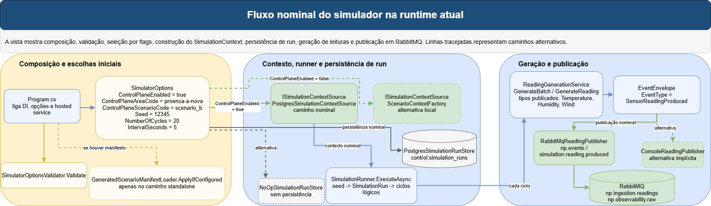

*Figura: fluxo nominal do simulador na runtime atual. Fonte editável: [implementation-simulator-nominal-flow.drawio](diagrams/implementation-simulator-nominal-flow.drawio).*

### O que esta secção explica

Esta secção responde à pergunta “como sai de configuração e chega a envelopes publicados?”.

### Como ler a figura

No [Program.cs](../../src/NatureProtector.Simulator.Host/Program.cs), o host liga `RabbitMqOptions` e `SimulatorOptions`, adiciona `SimulatorOptionsValidator`, aplica `GeneratedScenarioManifestLoader.ApplyIfConfigured` em `PostConfigure<SimulatorOptions>`, regista PostgreSQL, regista as duas origens de contexto e os dois run stores, escolhe as implementações em função de `ControlPlaneEnabled`, regista os publishers e arranca `SimulationRunner`.

### Fonte de verdade no repositório

- [src/NatureProtector.Simulator.Host/Program.cs](../../src/NatureProtector.Simulator.Host/Program.cs)
- [src/NatureProtector.Simulator.Host/appsettings.json](../../src/NatureProtector.Simulator.Host/appsettings.json)
- [src/NatureProtector.Simulator.Host/Configuration/SimulatorOptions.cs](../../src/NatureProtector.Simulator.Host/Configuration/SimulatorOptions.cs)
- [src/NatureProtector.Simulator.Host/Configuration/SimulatorOptionsValidator.cs](../../src/NatureProtector.Simulator.Host/Configuration/SimulatorOptionsValidator.cs)
- [src/NatureProtector.Simulator.Host/Configuration/GeneratedScenarioManifestLoader.cs](../../src/NatureProtector.Simulator.Host/Configuration/GeneratedScenarioManifestLoader.cs)
- [src/NatureProtector.Simulator.Host/Services/PostgresSimulationContextSource.cs](../../src/NatureProtector.Simulator.Host/Services/PostgresSimulationContextSource.cs)
- [src/NatureProtector.Simulator.Host/Context/ScenarioContextFactory.cs](../../src/NatureProtector.Simulator.Host/Context/ScenarioContextFactory.cs)
- [src/NatureProtector.Simulator.Host/Services/SimulationRunner.cs](../../src/NatureProtector.Simulator.Host/Services/SimulationRunner.cs)
- [src/NatureProtector.Simulator.Host/Services/ReadingGenerationService.cs](../../src/NatureProtector.Simulator.Host/Services/ReadingGenerationService.cs)
- [src/NatureProtector.Simulator.Host/Services/PostgresSimulationRunStore.cs](../../src/NatureProtector.Simulator.Host/Services/PostgresSimulationRunStore.cs)
- [src/NatureProtector.Simulator.Host/Publishing/ConsoleReadingPublisher.cs](../../src/NatureProtector.Simulator.Host/Publishing/ConsoleReadingPublisher.cs)
- [src/NatureProtector.Simulator.Host/Publishing/RabbitMqReadingPublisher.cs](../../src/NatureProtector.Simulator.Host/Publishing/RabbitMqReadingPublisher.cs)
- [src/NatureProtector.Shared/Contracts/Readings/SensorReadingProducedPayload.cs](../../src/NatureProtector.Shared/Contracts/Readings/SensorReadingProducedPayload.cs)

### Fluxo factual

No caminho nominal atual, os valores observáveis em [appsettings.json](../../src/NatureProtector.Simulator.Host/appsettings.json) são estes: `ControlPlaneEnabled = true`, `ControlPlaneAreaCode = proenca-a-nova`, `ControlPlaneScenarioCode = scenario_b`, `Seed = 12345`, `NumberOfCycles = 20` e `IntervalSeconds = 5`.

[SimulatorOptionsValidator.Validate](../../src/NatureProtector.Simulator.Host/Configuration/SimulatorOptionsValidator.cs) separa de forma muito clara os dois modos. Com `ControlPlaneEnabled = true`, exige códigos do control plane e proíbe manifesto local. Com `ControlPlaneEnabled = false`, exige metadados locais mínimos do cenário e pelo menos um sensor. Isto explica porque o caminho standalone não é apenas um “switch” de publisher, mas uma mudança de fonte de verdade do contexto.

Quando o caminho nominal arranca, [PostgresSimulationContextSource.CreateAsync](../../src/NatureProtector.Simulator.Host/Services/PostgresSimulationContextSource.cs) resolve área, cenário e sensores ativos. Usa `ParametersJson` do cenário materializado no control plane para reconstruir o domínio `Scenario`. Resolve `StartTimestamp`, `IntervalSeconds` e `NumberOfCycles` a partir desse JSON e devolve `SimulationContext` com `ConfigurationVersionId`. Se faltar área, cenário ou sensores ativos, a criação do contexto falha.

[SimulationRunner.ExecuteAsync](../../src/NatureProtector.Simulator.Host/Services/SimulationRunner.cs) faz o resto do trabalho operacional. Pede o contexto, resolve a seed com `SeedProvider`, cria `SimulationRun`, persiste `Ready` e `Running`, executa `NumberOfCycles` ciclos, calcula o `eventTime` lógico de cada ciclo, chama `ReadingGenerationService.GenerateBatch`, publica cada envelope por `IReadingPublisher.PublishAsync` e persiste o estado final da run.

[ReadingGenerationService](../../src/NatureProtector.Simulator.Host/Services/ReadingGenerationService.cs) é a fronteira entre contexto e emissão de eventos. Em `GenerateBatch`, percorre sensores. Em `GenerateReading`, produz um `EventEnvelope<SensorReadingProducedPayload>`. Hoje, os tipos efetivamente suportados para publicação são `Temperature`, `Humidity` e `Wind`. `Composite` continua a falhar explicitamente.

No fim do fluxo, o publisher dominante envia para RabbitMQ. A topologia em [NatureProtectorRabbitMqTopology.cs](../../src/NatureProtector.Shared/Messaging/NatureProtectorRabbitMqTopology.cs) fixa `np.events`, `np.ingestion.readings`, `np.observability.raw` e `simulation.reading.produced`.

### Tempo lógico e tempo real

O simulador trabalha hoje com duas linhas temporais diferentes e complementares:

- `EventEnvelope.EventTime` representa o tempo lógico do cenário e é calculado em `SimulationRunner.ExecuteAsync` a partir de `context.StartTimestamp + context.Interval * cycleIndex`;
- `SimulationRun.StartedAt` e `SimulationRun.EndedAt` representam o tempo real em que a execução correu no host;
- [PostgresSimulationRunStore.UpsertAsync](../../src/NatureProtector.Simulator.Host/Services/PostgresSimulationRunStore.cs) persiste `LogicalStartTimestamp` separadamente em `control.simulation_runs`.

Isto evita misturar o relógio do cenário com o relógio da máquina quando a run é consultada depois pela API.

### Bifurcações relevantes

- `PostgresSimulationContextSource` vs `ScenarioContextFactory`: a escolha é feita em [Program.cs](../../src/NatureProtector.Simulator.Host/Program.cs) e muda a fonte do contexto inteiro.
- `PostgresSimulationRunStore` vs `NoOpSimulationRunStore`: a escolha também é feita em `Program.cs` e só permite registo em `control.simulation_runs` quando há `ConfigurationVersionId`.
- `RabbitMqReadingPublisher` vs `ConsoleReadingPublisher`: ambas as implementações são registadas, mas `SimulationRunner` recebe um único `IReadingPublisher`, ficando com a última implementação registada, que é `RabbitMqReadingPublisher`.

É por isso que `RabbitMqReadingPublisher` é o publisher nominal hoje: não por uma flag explícita, mas pela composição concreta do host.

### Notas de compreensão ou armadilhas

- Os valores `NumberOfCycles` e `IntervalSeconds` em `appsettings` não são a verdade final no modo control plane. A verdade final vem do `ParametersJson` do cenário bootstrapado.
- `GeneratedScenarioManifestLoader` continua no pipeline de configuração, mas está funcionalmente bloqueado quando o modo nominal usa control plane.

### Ficheiros, classes e métodos principais

- [src/NatureProtector.Simulator.Host/Program.cs](../../src/NatureProtector.Simulator.Host/Program.cs)
- [src/NatureProtector.Simulator.Host/appsettings.json](../../src/NatureProtector.Simulator.Host/appsettings.json)
- [src/NatureProtector.Simulator.Host/Configuration/SimulatorOptions.cs](../../src/NatureProtector.Simulator.Host/Configuration/SimulatorOptions.cs)
- [src/NatureProtector.Simulator.Host/Configuration/SimulatorOptionsValidator.cs](../../src/NatureProtector.Simulator.Host/Configuration/SimulatorOptionsValidator.cs)
- [src/NatureProtector.Simulator.Host/Configuration/GeneratedScenarioManifestLoader.cs](../../src/NatureProtector.Simulator.Host/Configuration/GeneratedScenarioManifestLoader.cs)
- [src/NatureProtector.Simulator.Host/Services/PostgresSimulationContextSource.cs](../../src/NatureProtector.Simulator.Host/Services/PostgresSimulationContextSource.cs)
- [src/NatureProtector.Simulator.Host/Context/ScenarioContextFactory.cs](../../src/NatureProtector.Simulator.Host/Context/ScenarioContextFactory.cs)
- [src/NatureProtector.Simulator.Host/Services/SimulationRunner.cs](../../src/NatureProtector.Simulator.Host/Services/SimulationRunner.cs)
- [src/NatureProtector.Simulator.Host/Services/ReadingGenerationService.cs](../../src/NatureProtector.Simulator.Host/Services/ReadingGenerationService.cs)
- [src/NatureProtector.Simulator.Host/Services/PostgresSimulationRunStore.cs](../../src/NatureProtector.Simulator.Host/Services/PostgresSimulationRunStore.cs)
- [src/NatureProtector.Simulator.Host/Publishing/RabbitMqReadingPublisher.cs](../../src/NatureProtector.Simulator.Host/Publishing/RabbitMqReadingPublisher.cs)

### Estado atual

- o caminho nominal usa control plane e persistência de run em PostgreSQL;
- os tipos publicados hoje são `Temperature`, `Humidity` e `Wind`;
- o simulador usa `scenario_b` como cenário nominal no `appsettings` atual;
- a resolução do contexto e do intervalo lógico depende do `ParametersJson` materializado pelo bootstrap.

## 11. Prevenção nominal

Esta é a vista mais importante para entender o sistema real em operação. A ordem factual do fluxo é decisiva: receção RabbitMQ, validação, inbox, `ack`, processamento, projeções e telemetria. Qualquer inversão mental desta ordem leva a leituras erradas sobre durabilidade e recuperação.

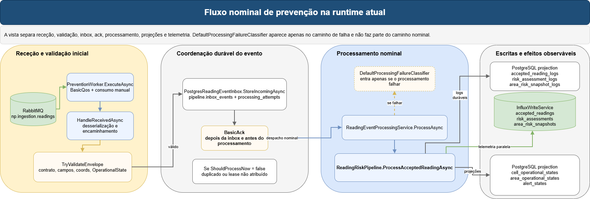

*Figura: fluxo nominal de prevenção na runtime atual. Fonte editável: [implementation-prevention-nominal-flow.drawio](diagrams/implementation-prevention-nominal-flow.drawio).*

### O que esta secção explica

Esta secção separa três fronteiras:

1. transporte e receção;
2. inbox e durabilidade mínima;
3. pipeline nominal de risco, projeções e telemetria.

### Como ler a figura

No [Program.cs da prevenção](../../src/NatureProtector.Prevention.Host/Program.cs), o host liga opções, adiciona Influx, decide se a stack será persistente ou in-memory, regista `DefaultProcessingFailureClassifier`, serviços de risco, pipeline, processamento e worker principal. No caminho atual, `PipelinePersistenceEnabled = true`, logo a stack nominal é a persistente.

### Fonte de verdade no repositório

- [src/NatureProtector.Prevention.Host/Program.cs](../../src/NatureProtector.Prevention.Host/Program.cs)
- [src/NatureProtector.Prevention.Host/appsettings.json](../../src/NatureProtector.Prevention.Host/appsettings.json)
- [src/NatureProtector.Prevention.Host/PreventionWorker.cs](../../src/NatureProtector.Prevention.Host/PreventionWorker.cs)
- [src/NatureProtector.Prevention.Host/Processing/PostgresReadingEventInbox.cs](../../src/NatureProtector.Prevention.Host/Processing/PostgresReadingEventInbox.cs)
- [src/NatureProtector.Prevention.Host/Processing/ReadingEventProcessingService.cs](../../src/NatureProtector.Prevention.Host/Processing/ReadingEventProcessingService.cs)
- [src/NatureProtector.Prevention.Host/Processing/ReadingRiskPipeline.cs](../../src/NatureProtector.Prevention.Host/Processing/ReadingRiskPipeline.cs)
- [src/NatureProtector.Prevention.Host/Persistence/PostgresAcceptedReadingRepository.cs](../../src/NatureProtector.Prevention.Host/Persistence/PostgresAcceptedReadingRepository.cs)
- [src/NatureProtector.Prevention.Host/Persistence/PostgresRiskAssessmentRepository.cs](../../src/NatureProtector.Prevention.Host/Persistence/PostgresRiskAssessmentRepository.cs)
- [src/NatureProtector.Prevention.Host/Persistence/PostgresAreaRiskSnapshotRepository.cs](../../src/NatureProtector.Prevention.Host/Persistence/PostgresAreaRiskSnapshotRepository.cs)
- [src/NatureProtector.Prevention.Host/Projection/PostgresAreaOperationalProjectionStore.cs](../../src/NatureProtector.Prevention.Host/Projection/PostgresAreaOperationalProjectionStore.cs)
- [src/NatureProtector.Infrastructure.Influx/Services/InfluxWriteService.cs](../../src/NatureProtector.Infrastructure.Influx/Services/InfluxWriteService.cs)

### Fluxo factual

[PreventionWorker.ExecuteAsync](../../src/NatureProtector.Prevention.Host/PreventionWorker.cs) abre conexão RabbitMQ, declara topologia, aplica `BasicQos` com `ConsumerPrefetchCount` e consome com `autoAck = false`. O ponto de entrada crítico é `HandleReceivedAsync`.

Em `HandleReceivedAsync`, a ordem factual é esta:

1. desserializar o JSON bruto;
2. validar o envelope em `TryValidateEnvelope`;
3. se o evento for válido, chamar `StoreIncomingAsync`;
4. só depois fazer `BasicAck`;
5. decidir se o evento deve ser processado já ou se é duplicado/adiado;
6. se houver lease e `ShouldProcessNow`, chamar `ReadingEventProcessingService.ProcessAsync`.

O broker só é confirmado depois de o evento ficar materializado na inbox. Isto significa que a recuperação posterior deixa de depender do RabbitMQ e passa a depender da inbox em PostgreSQL.

O orquestrador do caminho nominal é [ReadingEventProcessingService.ProcessAsync](../../src/NatureProtector.Prevention.Host/Processing/ReadingEventProcessingService.cs). Antes de chamar a pipeline de risco, este serviço valida semanticamente o evento contra o plano de controlo através de `IReadingSemanticValidator`. No modo persistente, essa validação confirma que o sensor existe, está ativo e pertence à área declarada no envelope. Se a validação falhar, o evento é colocado em quarentena com motivo explícito e não chega à `ReadingRiskPipeline`.

Quando a validação semântica passa, o serviço chama [ReadingRiskPipeline.ProcessAcceptedReadingAsync](../../src/NatureProtector.Prevention.Host/Processing/ReadingRiskPipeline.cs) e depois marca o evento como concluído na inbox. `DefaultProcessingFailureClassifier` não faz parte do caminho nominal: só entra quando uma exceção operacional é lançada durante o processamento.

Dentro de `ReadingRiskPipeline.ProcessAcceptedReadingAsync`, a ordem factual atual é esta:

1. construir `NormalizedReading` a partir do envelope validado;
2. persistir a leitura aceite em `PostgresAcceptedReadingRepository.AddAsync`;
3. avaliar elegibilidade através de `IRiskEligibilityService`;
4. se a leitura não for elegível, terminar o processamento com sucesso sem score, sem `RiskAssessment`, sem `AreaRiskSnapshot` e sem atualização de projeções de risco;
5. se a leitura for elegível, construir `RiskInput`;
6. calcular `RiskAssessment` através de `IRiskScoringService`;
7. persistir o assessment em `PostgresRiskAssessmentRepository.AddAsync`;
8. atualizar projeção operacional da célula em `PostgresAreaOperationalProjectionStore.SaveCellAsync`;
9. obter as avaliações mais recentes da área através de `PostgresRiskAssessmentRepository.GetLatestByAreaAsync`;
10. construir o snapshot agregado com `AreaRiskSnapshotService.BuildSnapshot`;
11. persistir o snapshot em `PostgresAreaRiskSnapshotRepository.SaveAsync`;
12. atualizar a projeção operacional agregada da área em `PostgresAreaOperationalProjectionStore.SaveAsync`;
13. emitir telemetria InfluxDB conforme a configuração ativa, usando writer real, writer seguro ou writer no-op.

A fronteira interna atual fica, portanto:

`EventEnvelope<SensorReadingProducedPayload> -> NormalizedReading -> RiskEligibilityResult -> RiskInput -> IRiskScoringService -> RiskAssessment`.

O motor de risco continua a ser a baseline simples por thresholds, mas já não recebe diretamente o envelope bruto como input principal.

### Etapas do caminho nominal

| Etapa | Classe | Método | Papel factual |
| --- | --- | --- | --- |
| Receção do broker | `PreventionWorker` | `ExecuteAsync` | abre canal, aplica `prefetch` e consome `np.ingestion.readings` |
| Validação técnica | `PreventionWorker` | `HandleReceivedAsync`, `TryValidateEnvelope` | rejeita JSON inválido, envelope nulo, contrato inválido e `OperationalState.Invalid` antes da inbox |
| Validação semântica | `ReadingEventProcessingService` + `IReadingSemanticValidator` | `ProcessAsync`, `ValidateAsync` | confirma sensor existente, ativo e pertencente à área no modo persistente; invalidez semântica vai para quarentena |
| Materialização mínima | `PostgresReadingEventInbox` | `StoreIncomingAsync` | cria `pipeline.event_inbox` e a primeira linha em `pipeline.processing_attempts` |
| `ack` do broker | `PreventionWorker` | `HandleReceivedAsync` | acontece depois da inbox e antes do processamento |
| Orquestração transacional | `ReadingEventProcessingService` | `ProcessAsync` | completa, reage a falhas, agenda retry ou quarentena |
| Pipeline nominal | `ReadingRiskPipeline` | `ProcessAcceptedReadingAsync` | normaliza leitura, avalia elegibilidade, constrói `RiskInput`, calcula risco quando aplicável, escreve PostgreSQL, projeções e telemetria configurada |

### Bifurcações relevantes

- se `StoreIncomingAsync` devolver `ShouldProcessNow = false` ou `Lease = null`, o evento fica registado mas não é processado nessa receção;
- se `ReadingRiskPipeline` falhar, a decisão entre retry e quarentena já não acontece no `PreventionWorker`, mas em `ReadingEventProcessingService`;
- `InboxRetryWorker` só existe no caminho persistente, o que reforça a ligação entre retry durável e PostgreSQL.

### Notas de compreensão ou armadilhas

- O nome `PreventionWorker` pode sugerir que todo o trabalho acontece ali. No código atual, ele trata transporte, validação de entrada e despacho; a lógica de retry/quarentena está distribuída por `ReadingEventProcessingService`, `PostgresReadingEventInbox` e `InboxRetryWorker`.
- `DefaultProcessingFailureClassifier` não faz parte do caminho nominal. Só entra depois de uma exceção já ter sido lançada pelo pipeline.

### Ficheiros, classes e métodos principais

- [src/NatureProtector.Prevention.Host/Program.cs](../../src/NatureProtector.Prevention.Host/Program.cs)
- [src/NatureProtector.Prevention.Host/appsettings.json](../../src/NatureProtector.Prevention.Host/appsettings.json)
- [src/NatureProtector.Prevention.Host/PreventionWorker.cs](../../src/NatureProtector.Prevention.Host/PreventionWorker.cs)
- [src/NatureProtector.Prevention.Host/Processing/PostgresReadingEventInbox.cs](../../src/NatureProtector.Prevention.Host/Processing/PostgresReadingEventInbox.cs)
- [src/NatureProtector.Prevention.Host/Processing/ReadingEventProcessingService.cs](../../src/NatureProtector.Prevention.Host/Processing/ReadingEventProcessingService.cs)
- [src/NatureProtector.Prevention.Host/Processing/ReadingRiskPipeline.cs](../../src/NatureProtector.Prevention.Host/Processing/ReadingRiskPipeline.cs)
- [src/NatureProtector.Prevention.Host/Persistence/PostgresAcceptedReadingRepository.cs](../../src/NatureProtector.Prevention.Host/Persistence/PostgresAcceptedReadingRepository.cs)
- [src/NatureProtector.Prevention.Host/Persistence/PostgresRiskAssessmentRepository.cs](../../src/NatureProtector.Prevention.Host/Persistence/PostgresRiskAssessmentRepository.cs)
- [src/NatureProtector.Prevention.Host/Persistence/PostgresAreaRiskSnapshotRepository.cs](../../src/NatureProtector.Prevention.Host/Persistence/PostgresAreaRiskSnapshotRepository.cs)
- [src/NatureProtector.Prevention.Host/Projection/PostgresAreaOperationalProjectionStore.cs](../../src/NatureProtector.Prevention.Host/Projection/PostgresAreaOperationalProjectionStore.cs)
- [src/NatureProtector.Infrastructure.Influx/Services/InfluxWriteService.cs](../../src/NatureProtector.Infrastructure.Influx/Services/InfluxWriteService.cs)

### Estado atual

- o `ack` nominal acontece depois da inbox e antes do processamento;
- o processamento nominal escreve estado durável em PostgreSQL e escreve telemetria em InfluxDB apenas quando a configuração ativa o permite;
- a pipeline já distingue leitura aceite, leitura elegível para risco e leitura efetivamente avaliada;
- `DefaultProcessingFailureClassifier` é apenas caminho de falha.

## 12. Rejeição, retry e quarentena

O objetivo desta vista é desambiguar aquilo que mais facilmente confunde uma leitura nova: a diferença entre rejeição pré-inbox, duplicado, retry, retry retomado e quarentena.

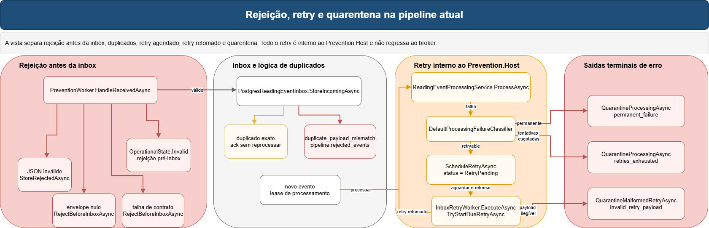

*Figura: rejeição, retry e quarentena na pipeline atual. Fonte editável: [implementation-rejection-retry-quarantine.drawio](diagrams/implementation-rejection-retry-quarantine.drawio).*

### O que esta secção explica

Esta secção fecha três coisas:

1. mapa de casos;
2. fluxo mecânico de chamadas no caminho de falha;
3. estado persistido e efeito operacional.

### Como ler a figura

Primeiro separar o que nunca entra na inbox do que já ficou materializado em `pipeline.event_inbox`. Depois separar o que apenas fica registado do que recebe lease para processamento. Por fim, separar retry de quarentena: ambos nascem na inbox, mas o retry reentra no pipeline e a quarentena é terminal.

### Fonte de verdade no repositório

- [src/NatureProtector.Prevention.Host/PreventionWorker.cs](../../src/NatureProtector.Prevention.Host/PreventionWorker.cs)
- [src/NatureProtector.Prevention.Host/Processing/PostgresReadingEventInbox.cs](../../src/NatureProtector.Prevention.Host/Processing/PostgresReadingEventInbox.cs)
- [src/NatureProtector.Prevention.Host/Processing/ReadingEventProcessingService.cs](../../src/NatureProtector.Prevention.Host/Processing/ReadingEventProcessingService.cs)
- [src/NatureProtector.Prevention.Host/Processing/DefaultProcessingFailureClassifier.cs](../../src/NatureProtector.Prevention.Host/Processing/DefaultProcessingFailureClassifier.cs)
- [src/NatureProtector.Prevention.Host/Processing/InboxRetryWorker.cs](../../src/NatureProtector.Prevention.Host/Processing/InboxRetryWorker.cs)
- [tests/NatureProtector.Prevention.Host.Tests/Processing/PreventionWorkerTests.cs](../../tests/NatureProtector.Prevention.Host.Tests/Processing/PreventionWorkerTests.cs)
- [tests/NatureProtector.Prevention.Host.Tests/Processing/ReadingEventProcessingServiceTests.cs](../../tests/NatureProtector.Prevention.Host.Tests/Processing/ReadingEventProcessingServiceTests.cs)
- [tests/NatureProtector.Prevention.Host.Tests/Processing/InboxRetryWorkerTests.cs](../../tests/NatureProtector.Prevention.Host.Tests/Processing/InboxRetryWorkerTests.cs)

### Mapa de casos

| Caso | Onde nasce | Método que decide | Persistência tocada | Efeito operacional |
| --- | --- | --- | --- | --- |
| JSON inválido | `PreventionWorker` | `HandleReceivedAsync` no `catch` da desserialização | `pipeline.rejected_events` por `StoreRejectedAsync` | `ack`, nunca entra na inbox |
| Envelope nulo | `PreventionWorker` | `HandleReceivedAsync` + `RejectBeforeInboxAsync` | `pipeline.rejected_events` | `ack`, nunca entra na inbox |
| Falha de contrato ou schema | `PreventionWorker` | `TryValidateEnvelope` + `RejectBeforeInboxAsync` | `pipeline.rejected_events` | `ack`, nunca entra na inbox |
| `OperationalState.Invalid` | `PreventionWorker` | `TryValidateEnvelope` | `pipeline.rejected_events` | `ack`, nunca entra na inbox |
| Sensor inexistente | `ReadingEventProcessingService` | `IReadingSemanticValidator.ValidateAsync` | `pipeline.event_inbox`, `pipeline.processing_attempts`, `pipeline.quarantined_events` | tecnicamente válido, mas semanticamente inválido; vai para quarentena com `sensor_not_found` |
| Sensor inativo | `ReadingEventProcessingService` | `IReadingSemanticValidator.ValidateAsync` | `pipeline.event_inbox`, `pipeline.processing_attempts`, `pipeline.quarantined_events` | tecnicamente válido, mas não processável; vai para quarentena com `sensor_inactive` |
| Sensor pertence a outra área | `ReadingEventProcessingService` | `IReadingSemanticValidator.ValidateAsync` | `pipeline.event_inbox`, `pipeline.processing_attempts`, `pipeline.quarantined_events` | tecnicamente válido, mas incompatível com o `area_id`; vai para quarentena com `sensor_area_mismatch` |
| Leitura aceite mas não elegível para risco | `ReadingRiskPipeline` | `IRiskEligibilityService.EvaluateAsync` | `projection.accepted_reading_log`; sem assessment, snapshot ou projeção de risco | processamento concluído com sucesso; não é rejeição, retry nem quarentena |
| Duplicado exato | `PostgresReadingEventInbox` | `StoreIncomingAsync` | consulta `pipeline.event_inbox`; sem nova tentativa | `ack`, não reprocessa |
| Duplicado com payload diferente | `PostgresReadingEventInbox` | `StoreIncomingAsync` | `pipeline.rejected_events` ligado ao evento já existente | `ack`, não reprocessa |
| Falha transitória ou desconhecida com tentativas restantes | `ReadingEventProcessingService` | `DefaultProcessingFailureClassifier.Classify` + `ShouldRetry` + `ScheduleRetryAsync` | atualização de `pipeline.event_inbox` e `pipeline.processing_attempts` | fica em `RetryPending` |
| Retry devido | `InboxRetryWorker` | `ExecuteAsync` + `TryStartDueRetryAsync` | atualização de `pipeline.event_inbox` e nova linha em `pipeline.processing_attempts` | recebe novo lease e volta a `ProcessAsync` |
| Falha permanente | `ReadingEventProcessingService` | `DefaultProcessingFailureClassifier.Classify` + `QuarantineProcessingAsync` | atualização de `pipeline.event_inbox`, `pipeline.processing_attempts` e inserção em `pipeline.quarantined_events` | terminal |
| Tentativas esgotadas | `ReadingEventProcessingService` | `DefaultProcessingFailureClassifier.Classify` + `ShouldRetry` devolve `false` | idem | terminal |
| Retry com envelope ilegível | `PostgresReadingEventInbox` | `TryStartDueRetryAsync` + `QuarantineMalformedRetryAsync` | atualização de `pipeline.event_inbox`, nova tentativa e `pipeline.quarantined_events` | terminal com `invalid_retry_payload` |

### Quem chama quem no caminho de falha

1. `PreventionWorker.HandleReceivedAsync`
2. `TryValidateEnvelope`
3. `StoreIncomingAsync` ou rejeição pré-inbox
4. `ReadingEventProcessingService.ProcessAsync`
5. `DefaultProcessingFailureClassifier.Classify`
6. `ScheduleRetryAsync` ou `QuarantineProcessingAsync`
7. `InboxRetryWorker.ExecuteAsync`
8. `TryStartDueRetryAsync`
9. novo `ProcessAsync` ou `QuarantineMalformedRetryAsync`

### Fluxo factual do caminho de falha

O ponto exato onde a exceção de negócio é apanhada é [ReadingEventProcessingService.ProcessAsync](../../src/NatureProtector.Prevention.Host/Processing/ReadingEventProcessingService.cs). O método envolve `readingRiskPipeline.ProcessAcceptedReadingAsync` num `try/catch`. Quando uma exceção entra no `catch (Exception ex)`, o primeiro passo é `failureClassifier.Classify(ex)`. A decisão de retry ou quarentena não acontece no worker RabbitMQ; acontece ali.

`ShouldRetry` decide nova tentativa com duas condições:

- `classification.IsRetryable` tem de ser `true`;
- `attemptNumber` tem de ser menor do que `PreventionHostOptions.MaxProcessingAttempts`.

Se ambas forem verdadeiras, `ProcessAsync` chama `readingEventInbox.ScheduleRetryAsync`. Se não forem, chama `readingEventInbox.QuarantineProcessingAsync`.

No caminho do retry, [InboxRetryWorker.ExecuteAsync](../../src/NatureProtector.Prevention.Host/Processing/InboxRetryWorker.cs) faz polling do inbox e chama `TryStartDueRetryAsync("reading_risk_pipeline", ...)`. Este método é o ponto exato onde a inbox deixa de apenas registar e volta a conceder lease: muda o evento para `Processing`, incrementa `AttemptCount`, cria uma nova linha em `processing_attempts` e devolve `InboxRetryWorkItem` com envelope e lease.

Se o envelope persistido já não puder ser desserializado, a decisão terminal não passa por `ReadingEventProcessingService`: acontece dentro de `TryStartDueRetryAsync`, que chama `QuarantineMalformedRetryAsync` e cria diretamente a quarentena `invalid_retry_payload`.

A validação semântica sensor-área fica depois da inbox e antes da pipeline de risco. Isto é intencional: o evento é tecnicamente válido e deve ficar auditável na inbox, mas não deve contaminar accepted readings, assessments, snapshots ou projeções se o sensor não existir, estiver inativo ou pertencer a outra área.

A inelegibilidade de risco é diferente. Uma leitura pode ser aceite e persistida para auditoria, mas não produzir cálculo de risco. Nesse caso, a pipeline termina com sucesso e o evento é marcado como processado. Não há retry nem quarentena, porque não ocorreu falha operacional nem inconsistência semântica do deployment.

### Quando a inbox apenas regista e quando também concede lease

- `StoreIncomingAsync` apenas regista quando encontra um duplicado. Nesse caso devolve `ShouldProcessNow = false` e `Lease = null`.
- `StoreIncomingAsync` regista e concede lease quando recebe um evento novo. Nesse caso cria `pipeline.event_inbox`, a primeira linha de `pipeline.processing_attempts` e devolve `InboxProcessingLease`.
- `TryStartDueRetryAsync` concede novo lease quando encontra um evento `RetryPending` cujo `NextAttemptNotBefore` já expirou e o envelope persistido ainda é legível.

### Estado persistido e efeito operacional

- `pipeline.rejected_events`: regista tudo o que falha antes da inbox e o caso `duplicate_payload_mismatch`.
- `pipeline.event_inbox`: guarda o estado principal do evento (`Processing`, `RetryPending`, `Processed`, `Quarantined`) e campos como `AttemptCount`, `NextAttemptNotBefore`, `LastErrorCode`, `LastErrorMessage`.
- `pipeline.processing_attempts`: guarda cada tentativa separadamente, incluindo `Started`, `RetryScheduled`, `Succeeded` e `Quarantined`.
- `pipeline.quarantined_events`: materializa falhas permanentes, tentativas esgotadas e `invalid_retry_payload`.

Isto responde diretamente às perguntas operacionais:

- algo vai para `rejected_events` e nunca entra na inbox quando falha antes de `StoreIncomingAsync`;
- algo entra na inbox mas não é processado quando `StoreIncomingAsync` o reconhece como duplicado exato ou quando fica em `RetryPending` à espera de nova tentativa;
- algo vai para retry quando `ProcessAsync` apanha a exceção, a classifica como retryable e `ShouldRetry` ainda devolve `true`;
- quem retoma o retry é `InboxRetryWorker`;
- quem decide quarentena é `ReadingEventProcessingService` para falhas do pipeline e `PostgresReadingEventInbox` para `invalid_retry_payload`;
- `invalid_retry_payload` é diferente de quarentena permanente porque não representa uma falha do pipeline de risco, mas uma falha ao reconstruir o envelope previamente persistido.

### Notas de compreensão ou armadilhas

- O caminho de falha pré-inbox tem um detalhe importante: o `catch` exterior de `HandleReceivedAsync` faz `BasicNack(..., requeue: false)` se o `ack` ainda não foi enviado. Logo, uma falha antes do `ack` e antes de persistência bem-sucedida não entra no circuito de retry interno. Fica apenas logada como falha de consumo.
- `ProcessingFailureKind.Unknown` continua a ser retryable porque `ProcessingFailureClassification.IsRetryable` só devolve `false` para `Permanent`.

### Ficheiros, classes e métodos principais

- [src/NatureProtector.Prevention.Host/PreventionWorker.cs](../../src/NatureProtector.Prevention.Host/PreventionWorker.cs)
- [src/NatureProtector.Prevention.Host/Processing/PostgresReadingEventInbox.cs](../../src/NatureProtector.Prevention.Host/Processing/PostgresReadingEventInbox.cs)
- [src/NatureProtector.Prevention.Host/Processing/ReadingEventProcessingService.cs](../../src/NatureProtector.Prevention.Host/Processing/ReadingEventProcessingService.cs)
- [src/NatureProtector.Prevention.Host/Processing/DefaultProcessingFailureClassifier.cs](../../src/NatureProtector.Prevention.Host/Processing/DefaultProcessingFailureClassifier.cs)
- [src/NatureProtector.Prevention.Host/Processing/InboxRetryWorker.cs](../../src/NatureProtector.Prevention.Host/Processing/InboxRetryWorker.cs)
- [tests/NatureProtector.Prevention.Host.Tests/Processing/PreventionWorkerTests.cs](../../tests/NatureProtector.Prevention.Host.Tests/Processing/PreventionWorkerTests.cs)
- [tests/NatureProtector.Prevention.Host.Tests/Processing/ReadingEventProcessingServiceTests.cs](../../tests/NatureProtector.Prevention.Host.Tests/Processing/ReadingEventProcessingServiceTests.cs)
- [tests/NatureProtector.Prevention.Host.Tests/Processing/InboxRetryWorkerTests.cs](../../tests/NatureProtector.Prevention.Host.Tests/Processing/InboxRetryWorkerTests.cs)

### Estado atual

- `OperationalState.Invalid` continua a ser rejeitado antes da inbox;
- retry e quarentena são mecanismos internos ao `Prevention.Host`;
- `invalid_retry_payload` é um caso terminal próprio;
- a inbox tanto materializa eventos novos como concede leases, mas só o faz quando o caso não é duplicado e quando o retry está devido.

## 13. Persistência relacional e temporal

Esta vista trata a persistência como mapa de responsabilidades: quem escreve, em que fase do fluxo escreve e onde essa escrita fica materializada.

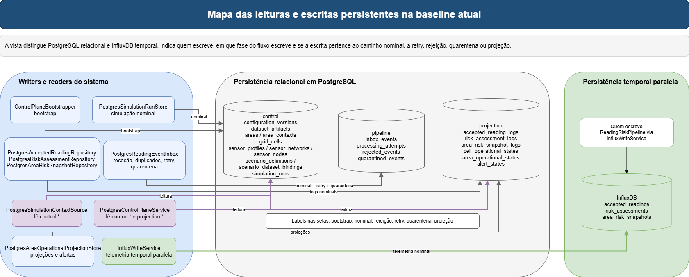

*Figura: mapa das leituras e escritas persistentes na baseline atual. Fonte editável: [implementation-persistence-map.drawio](diagrams/implementation-persistence-map.drawio).*

### O que esta secção explica

Esta secção oferece duas vistas:

1. por schema;
2. por writer.

### Como ler a figura

No centro está [NatureProtectorControlDbContext](../../src/NatureProtector.Infrastructure.Postgres/Persistence/NatureProtectorControlDbContext.cs), que estrutura o PostgreSQL em três zonas: `control`, `pipeline` e `projection`. Estas zonas não são decorativas; mapeiam três responsabilidades diferentes do sistema.

### Fonte de verdade no repositório

- [src/NatureProtector.Infrastructure.Postgres/Persistence/NatureProtectorControlDbContext.cs](../../src/NatureProtector.Infrastructure.Postgres/Persistence/NatureProtectorControlDbContext.cs)
- [src/NatureProtector.Infrastructure.Postgres/Migrations/](../../src/NatureProtector.Infrastructure.Postgres/Migrations/)
- [src/NatureProtector.Prevention.Host/Processing/PostgresReadingEventInbox.cs](../../src/NatureProtector.Prevention.Host/Processing/PostgresReadingEventInbox.cs)
- [src/NatureProtector.Prevention.Host/Persistence/PostgresAcceptedReadingRepository.cs](../../src/NatureProtector.Prevention.Host/Persistence/PostgresAcceptedReadingRepository.cs)
- [src/NatureProtector.Prevention.Host/Persistence/PostgresRiskAssessmentRepository.cs](../../src/NatureProtector.Prevention.Host/Persistence/PostgresRiskAssessmentRepository.cs)
- [src/NatureProtector.Prevention.Host/Persistence/PostgresAreaRiskSnapshotRepository.cs](../../src/NatureProtector.Prevention.Host/Persistence/PostgresAreaRiskSnapshotRepository.cs)
- [src/NatureProtector.Prevention.Host/Projection/PostgresAreaOperationalProjectionStore.cs](../../src/NatureProtector.Prevention.Host/Projection/PostgresAreaOperationalProjectionStore.cs)
- [src/NatureProtector.Simulator.Host/Services/PostgresSimulationRunStore.cs](../../src/NatureProtector.Simulator.Host/Services/PostgresSimulationRunStore.cs)
- [src/NatureProtector.Infrastructure.Influx/Services/InfluxWriteService.cs](../../src/NatureProtector.Infrastructure.Influx/Services/InfluxWriteService.cs)

### Vista por schema

| Schema | Tabelas reais do código atual | Papel factual |
| --- | --- | --- |
| `control` | `configuration_versions`, `areas`, `area_contexts`, `grid_cells`, `sensor_profiles`, `sensor_networks`, `sensor_nodes`, `scenario_definitions`, `simulation_runs`, `rule_set_versions`, `dataset_artifacts`, `scenario_dataset_bindings` | estado estável bootstrapado e depois lido por simulador e API |
| `pipeline` | `event_inbox`, `processing_attempts`, `rejected_events`, `quarantined_events` | ciclo de vida durável do evento operacional |
| `projection` | `accepted_reading_log`, `risk_assessment_log`, `area_risk_snapshot_log`, `cell_operational_state`, `area_operational_state`, `alert_state` | logs operacionais e estado pronto a consultar |

É importante usar os nomes reais do código. Nesta branch, as tabelas não se chamam `inbox_events`, `accepted_reading_logs` ou `alert_states`; os nomes materiais no `DbContext` são `event_inbox`, `accepted_reading_log`, `area_operational_state` e `alert_state`.

### Writers relevantes por fluxo

| Writer | Método principal | Tabelas ou séries tocadas | Momento do fluxo |
| --- | --- | --- | --- |
| `ControlPlaneBootstrapper` | `BootstrapPilotAreaAsync` e métodos `Upsert*` | `control.configuration_versions`, `dataset_artifacts`, `areas`, `area_contexts`, `grid_cells`, `sensor_profiles`, `sensor_networks`, `sensor_nodes`, `scenario_definitions`, `scenario_dataset_bindings` | bootstrap |
| `PostgresSimulationRunStore` | `UpsertAsync` | `control.simulation_runs` | arranque, transição para `Running`, fim, cancelamento ou falha da run |
| `PostgresReadingEventInbox` | `StoreIncomingAsync` | `pipeline.event_inbox`, `pipeline.processing_attempts` | entrada nominal aceite |
| `PostgresReadingEventInbox` | `StoreRejectedAsync` | `pipeline.rejected_events` | rejeição pré-inbox |
| `PostgresReadingEventInbox` | `ScheduleRetryAsync` | atualização de `pipeline.event_inbox` e `pipeline.processing_attempts` | falha retryable |
| `PostgresReadingEventInbox` | `TryStartDueRetryAsync` | atualização de `pipeline.event_inbox` e nova linha em `pipeline.processing_attempts` | retoma de retry |
| `PostgresReadingEventInbox` | `QuarantineProcessingAsync` | atualização de `pipeline.event_inbox`, `pipeline.processing_attempts`, `pipeline.quarantined_events` | falha permanente ou retries esgotados |
| `PostgresReadingEventInbox` | `QuarantineMalformedRetryAsync` | atualização de `pipeline.event_inbox`, `pipeline.processing_attempts`, `pipeline.quarantined_events` | envelope persistido ilegível no retry |
| `PostgresAcceptedReadingRepository` | `AddAsync` | `projection.accepted_reading_log` | início do pipeline nominal |
| `PostgresRiskAssessmentRepository` | `AddAsync` | `projection.risk_assessment_log` | após scoring |
| `PostgresAreaRiskSnapshotRepository` | `SaveAsync` | `projection.area_risk_snapshot_log` | após agregação da área |
| `PostgresAreaOperationalProjectionStore` | `SaveCellAsync` | `projection.cell_operational_state` | projeção por célula |
| `PostgresAreaOperationalProjectionStore` | `SaveAsync` | `projection.area_operational_state`, `projection.alert_state` | projeção agregada e alertas |
| `IInfluxWriteService` | métodos de escrita temporal da interface | `accepted_readings`, `risk_assessments`, `area_risk_snapshots`, conforme configuração | telemetria temporal derivada do processamento, quando InfluxDB está ativo |
| `NoOpInfluxWriteService` | implementação no-op da interface | nenhuma série | modo local ou execução sem telemetria temporal |
| `SafeInfluxWriteService` | wrapper de política de escrita | séries permitidas por configuração | aplica tolerância a falhas e flags por measurement |

### Ligação entre migrations, `DbContext`, records e writers

- [NatureProtectorControlDbContext](../../src/NatureProtector.Infrastructure.Postgres/Persistence/NatureProtectorControlDbContext.cs) é o ponto único onde os nomes materiais das tabelas, índices e relações ficam fechados.
- As migrations em [src/NatureProtector.Infrastructure.Postgres/Migrations/](../../src/NatureProtector.Infrastructure.Postgres/Migrations/) dão corpo físico a esse modelo.
- Os writers dos hosts trabalham sempre por cima de `IDbContextFactory<NatureProtectorControlDbContext>` e dos records mapeados em `Infrastructure.Postgres.Control`, `Infrastructure.Postgres.Pipeline` e `Infrastructure.Postgres.Projection`.

A persistência da pipeline foi endurecida para tratar duplicados concorrentes esperados como resultados idempotentes. A inbox usa `EventId` como chave lógica de deduplicação. `accepted_reading_log` usa o evento de origem para evitar duplicação lógica de leituras aceites, e `risk_assessment_log` usa o evento de origem para evitar duplicação de assessments. O snapshot de área derivado de uma leitura passou a usar identidade estável baseada no `EventId`, evitando duplicados lógicos em retries ou reentregas do mesmo evento.

### Papel de Influx face a PostgreSQL

InfluxDB entra como eixo temporal paralelo e configurável. A diferença entre PostgreSQL e InfluxDB é intencional:

- PostgreSQL é o estado durável relacional, auditável e consultável pela API;
- InfluxDB é telemetria temporal para observabilidade, séries e dashboards;
- nenhum componente do runtime atual lê de InfluxDB para decidir negócio;
- a pipeline pode correr com InfluxDB desligado através de `NoOpInfluxWriteService`.

Quando uma leitura é aceite mas não é elegível para risco, apenas a leitura aceite deve permanecer como artefacto operacional. Nessa situação não existem `RiskAssessment` nem `AreaRiskSnapshot`, logo também não deve existir telemetria derivada desses artefactos.

### Notas de compreensão ou armadilhas

- A nomenclatura intuitiva “logs” e “states” nem sempre coincide com os nomes reais das tabelas. Para onboarding técnico, deve-se seguir primeiro o `DbContext`.
- `control.simulation_runs` é a única tabela `control.*` escrita em runtime contínuo; o resto de `control.*` nasce no bootstrap.

### Ficheiros, classes e métodos principais

- [src/NatureProtector.Infrastructure.Postgres/Persistence/NatureProtectorControlDbContext.cs](../../src/NatureProtector.Infrastructure.Postgres/Persistence/NatureProtectorControlDbContext.cs)
- [src/NatureProtector.Infrastructure.Postgres/Migrations/](../../src/NatureProtector.Infrastructure.Postgres/Migrations/)
- [src/NatureProtector.Prevention.Host/Processing/PostgresReadingEventInbox.cs](../../src/NatureProtector.Prevention.Host/Processing/PostgresReadingEventInbox.cs)
- [src/NatureProtector.Prevention.Host/Persistence/PostgresAcceptedReadingRepository.cs](../../src/NatureProtector.Prevention.Host/Persistence/PostgresAcceptedReadingRepository.cs)
- [src/NatureProtector.Prevention.Host/Persistence/PostgresRiskAssessmentRepository.cs](../../src/NatureProtector.Prevention.Host/Persistence/PostgresRiskAssessmentRepository.cs)
- [src/NatureProtector.Prevention.Host/Persistence/PostgresAreaRiskSnapshotRepository.cs](../../src/NatureProtector.Prevention.Host/Persistence/PostgresAreaRiskSnapshotRepository.cs)
- [src/NatureProtector.Prevention.Host/Projection/PostgresAreaOperationalProjectionStore.cs](../../src/NatureProtector.Prevention.Host/Projection/PostgresAreaOperationalProjectionStore.cs)
- [src/NatureProtector.Simulator.Host/Services/PostgresSimulationRunStore.cs](../../src/NatureProtector.Simulator.Host/Services/PostgresSimulationRunStore.cs)
- [src/NatureProtector.Infrastructure.Influx/Services/InfluxWriteService.cs](../../src/NatureProtector.Infrastructure.Influx/Services/InfluxWriteService.cs)

### Estado atual verificado

- o mapa relacional distingue claramente `control`, `pipeline` e `projection`;
- a telemetria temporal não substitui nenhuma dessas zonas;
- os nomes reais das tabelas no código atual já não coincidem com algumas designações intuitivas mais genéricas.

## 14. Observabilidade atual

Esta secção trata a observabilidade como uma camada factual do sistema e não como nota lateral. No estado atual, há quatro peças concretas: logs por host, telemetria temporal em InfluxDB, Grafana como apoio externo e a topologia RabbitMQ que duplica publicações para `np.observability.raw`, embora sem consumidor operacional confirmado nesta leitura.

### O que esta secção explica

Esta secção distingue explicitamente:

- runtime real: logs aplicacionais e `InfluxWriteService`;
- apoio externo: Grafana e guias de exploração.

### Fonte de verdade no repositório

- [src/NatureProtector.Simulator.Host/Services/SimulationRunner.cs](../../src/NatureProtector.Simulator.Host/Services/SimulationRunner.cs)
- [src/NatureProtector.Simulator.Host/Publishing/RabbitMqReadingPublisher.cs](../../src/NatureProtector.Simulator.Host/Publishing/RabbitMqReadingPublisher.cs)
- [src/NatureProtector.Prevention.Host/PreventionWorker.cs](../../src/NatureProtector.Prevention.Host/PreventionWorker.cs)
- [src/NatureProtector.Prevention.Host/Processing/ReadingEventProcessingService.cs](../../src/NatureProtector.Prevention.Host/Processing/ReadingEventProcessingService.cs)
- [src/NatureProtector.Prevention.Host/Processing/InboxRetryWorker.cs](../../src/NatureProtector.Prevention.Host/Processing/InboxRetryWorker.cs)
- [src/NatureProtector.Prevention.Host/Processing/ReadingRiskPipeline.cs](../../src/NatureProtector.Prevention.Host/Processing/ReadingRiskPipeline.cs)
- [src/NatureProtector.Prevention.Host/Projection/PostgresAreaOperationalProjectionStore.cs](../../src/NatureProtector.Prevention.Host/Projection/PostgresAreaOperationalProjectionStore.cs)
- [src/NatureProtector.Infrastructure.Influx/Services/InfluxWriteService.cs](../../src/NatureProtector.Infrastructure.Influx/Services/InfluxWriteService.cs)
- [src/NatureProtector.Infrastructure.Influx/DependencyInjection/ServiceCollectionExtensions.cs](../../src/NatureProtector.Infrastructure.Influx/DependencyInjection/ServiceCollectionExtensions.cs)
- [src/NatureProtector.Infrastructure.Influx/Configuration/InfluxDbSettingsLoader.cs](../../src/NatureProtector.Infrastructure.Influx/Configuration/InfluxDbSettingsLoader.cs)
- [src/NatureProtector.Backoffice.Api/Program.cs](../../src/NatureProtector.Backoffice.Api/Program.cs)
- [infra/grafana/provisioning/datasources/influxdb.yml](../../infra/grafana/provisioning/datasources/influxdb.yml)
- [infra/grafana/dashboards/natureprotector-overview.json](../../infra/grafana/dashboards/natureprotector-overview.json)
- [docs/architecture/grafana-influx-dashboard-guide.md](grafana-influx-dashboard-guide.md)

### Fluxo factual

No estado atual, a observabilidade nasce dentro do runtime e só depois pode ser explorada externamente. A sequência factual é esta:

1. `Simulator.Host`, `Prevention.Host` e `Backoffice.Api` emitem logs aplicacionais do próprio processo;
2. `Prevention.Host` escreve telemetria temporal em InfluxDB através de `InfluxWriteService`;
3. Grafana, quando configurado e com dados já presentes no bucket, lê InfluxDB através do datasource provisionado;
4. a leitura visual em Grafana é, por isso, consequência do runtime já ter produzido dados e não uma fonte autónoma de estado.

### Logs por host

`Simulator.Host`:

- [SimulationRunner.ExecuteAsync](../../src/NatureProtector.Simulator.Host/Services/SimulationRunner.cs) regista arranque do runner, resolução do contexto já devolvido por `CreateAsync`, seed, criação da run, início de cada ciclo, sucesso e cancelamento; em caso de falha, o método marca a run como `Failed` e relança a exceção, mas não emite uma mensagem de log terminal dedicada;
- [PostgresSimulationRunStore.UpsertAsync](../../src/NatureProtector.Simulator.Host/Services/PostgresSimulationRunStore.cs) não emite logs próprios, mas os seus efeitos ficam visíveis no estado da run persistida;
- [RabbitMqReadingPublisher.EnsureChannel](../../src/NatureProtector.Simulator.Host/Publishing/RabbitMqReadingPublisher.cs) regista a ligação ao broker;
- [RabbitMqReadingPublisher.PublishAsync](../../src/NatureProtector.Simulator.Host/Publishing/RabbitMqReadingPublisher.cs) regista a publicação de cada envelope.

`Prevention.Host`:

- [PreventionWorker.ExecuteAsync](../../src/NatureProtector.Prevention.Host/PreventionWorker.cs) regista arranque do worker e topologia do consumidor;
- [PreventionWorker.HandleReceivedAsync](../../src/NatureProtector.Prevention.Host/PreventionWorker.cs) regista JSON inválido, rejeição pré-inbox, envelope aceite, duplicados ignorados, `ack` tardio e falhas inesperadas;
- [ReadingEventProcessingService.ProcessAsync](../../src/NatureProtector.Prevention.Host/Processing/ReadingEventProcessingService.cs) regista `processing_total_ms` e o `Outcome` final de cada tentativa (`completed`, `cancelled`, `retry_scheduled`, `quarantined`);
- [InboxRetryWorker.ExecuteAsync](../../src/NatureProtector.Prevention.Host/Processing/InboxRetryWorker.cs) regista a retoma de retries devidos e problemas no polling;
- [ReadingRiskPipeline.ProcessAcceptedReadingAsync](../../src/NatureProtector.Prevention.Host/Processing/ReadingRiskPipeline.cs) regista timings por etapa do pipeline nominal;
- [PostgresAreaOperationalProjectionStore.SaveCellAsync](../../src/NatureProtector.Prevention.Host/Projection/PostgresAreaOperationalProjectionStore.cs) e `SaveAsync` registam problemas de mapeamento e atualização de projeções.

`Backoffice.Api`:

- [Program.cs](../../src/NatureProtector.Backoffice.Api/Program.cs) entrega logs standard de arranque do ASP.NET Core;
- a disponibilidade do control plane aparece operacionalmente em dois sítios: na escolha entre `PostgresControlPlaneService` e `UnavailableControlPlaneService`, e nas respostas 503 devolvidas por [ControlPlaneControllerBase.EnsureControlPlaneAvailable](../../src/NatureProtector.Backoffice.Api/Controllers/ControlPlaneControllerBase.cs);
- não foi confirmada nesta leitura uma camada própria de logs de domínio nos controllers nem em [PostgresControlPlaneService](../../src/NatureProtector.Backoffice.Api/ControlPlane/Services/PostgresControlPlaneService.cs), porque essas classes não injetam `ILogger`.

### Telemetria em Influx

A fronteira de escrita temporal é `IInfluxWriteService`, registada por [AddInfluxPersistence](../../src/NatureProtector.Infrastructure.Influx/DependencyInjection/ServiceCollectionExtensions.cs) e usada exclusivamente pelo `Prevention.Host`.

Consoante a configuração, essa interface pode resolver para escrita real, escrita segura com política de falha ou implementação no-op. Quando `InfluxDb:Enabled=false`, o host usa `NoOpInfluxWriteService` e não tenta escrever séries temporais. Quando `InfluxDb:Enabled=true`, a escrita passa pela política configurada, incluindo tolerância a falhas e ativação/desativação por measurement.

### Quem escreve em Influx, quando e para quê

| Measurement | Origem lógica | Quando pode ser emitida | Papel factual |
| --- | --- | --- | --- |
| `accepted_readings` | leitura aceite | depois da persistência da accepted reading, se a measurement estiver ativa | evidência temporal da leitura aceite |
| `risk_assessments` | avaliação de risco | apenas quando a leitura é elegível e produz `RiskAssessment` | série temporal do risco calculado |
| `area_risk_snapshots` | snapshot agregado da área | apenas quando existe snapshot derivado de uma avaliação de risco | série temporal do estado agregado por área |

Em leituras aceites mas não elegíveis para risco, não há `risk_assessments` nem `area_risk_snapshots`, porque esses artefactos não existem nesse fluxo.

O bucket nominal vem de [src/NatureProtector.Prevention.Host/appsettings.json](../../src/NatureProtector.Prevention.Host/appsettings.json): `InfluxDb:Bucket = np_telemetry`. [InfluxDbSettingsLoader](../../src/NatureProtector.Infrastructure.Influx/Configuration/InfluxDbSettingsLoader.cs) completa `Url`, `Token`, `Organization` e `Bucket` com ambiente e `.env` quando necessário.

### Grafana e dashboards

O Grafana atual é apoio externo, não parte da lógica do runtime. Os elementos provisionados encontrados nesta branch são:

- um datasource em [infra/grafana/provisioning/datasources/influxdb.yml](../../infra/grafana/provisioning/datasources/influxdb.yml), chamado `NatureProtectorInfinityJson`, do tipo `yesoreyeram-infinity-datasource`;
- um dashboard em [infra/grafana/dashboards/natureprotector-overview.json](../../infra/grafana/dashboards/natureprotector-overview.json), com título `NatureProtector Overview` e um único painel do tipo `text`.

O papel factual deste dashboard hoje é mais de checklist e guia de configuração do que de observabilidade final. O painel explica como consultar `/api/v3/query_sql`, recomenda começar por `SHOW TABLES` e remete para [grafana-influx-dashboard-guide.md](grafana-influx-dashboard-guide.md).

Isto significa que o Grafana atual depende de duas coisas:

- InfluxDB estar acessível com `INFLUXDB_URL` e `INFLUXDB_TOKEN`;
- o bucket já estar a receber dados das séries `accepted_readings`, `risk_assessments` e `area_risk_snapshots`.

Sem dados em Influx, o Grafana arranca, mas não fornece evidência operacional útil por si só.

### Camadas de observabilidade

| Camada | Onde vive | Quem escreve ou lê | Métodos ou pontos principais | Papel factual hoje |
| --- | --- | --- | --- | --- |
| logs do simulador | `Simulator.Host` | `SimulationRunner`, `RabbitMqReadingPublisher` | `ExecuteAsync`, `EnsureChannel`, `PublishAsync` | arranque, resolução de contexto, criação de run, ciclos, publicação; falhas ficam visíveis sobretudo pela atualização da run e pela exceção relançada |
| logs da prevenção | `Prevention.Host` | `PreventionWorker`, `ReadingEventProcessingService`, `InboxRetryWorker`, `ReadingRiskPipeline`, `PostgresAreaOperationalProjectionStore` | `HandleReceivedAsync`, `ProcessAsync`, `ExecuteAsync`, `ProcessAcceptedReadingAsync`, `SaveCellAsync`, `SaveAsync` | receção, rejeição, inbox, `ack`, retry, quarentena, pipeline e projeções |
| logs da API | `Backoffice.Api` | hosting ASP.NET Core e respostas 503 do controller base | `Program.cs`, `EnsureControlPlaneAvailable` | arranque do host e indisponibilidade do control plane |
| telemetria temporal | InfluxDB | `IInfluxWriteService` | writer real, writer seguro ou writer no-op conforme configuração | séries temporais paralelas ao estado relacional, quando ativas |
| dashboarding | Grafana | datasource `NatureProtectorInfinityJson` e dashboard `natureprotector-overview` | provisioning + painel textual | apoio externo à exploração de Influx, não lógica de runtime |

### Distinção entre observabilidade interna e apoio externo

- observabilidade interna do runtime: logs aplicacionais emitidos pelos hosts e `IInfluxWriteService`;
- apoio externo: Grafana, dashboards e guia de exploração;

### Notas de compreensão ou armadilhas

- O nome do datasource `NatureProtectorInfinityJson` pode induzir que Grafana fala com Influx por um plugin nativo, mas o provisionamento atual usa o plugin Infinity sobre a API SQL/HTTP do Influx.
- A API é parte do sistema vivo, mas não tem hoje a mesma profundidade de logs de domínio que o simulador e a prevenção.
- A existência de Grafana não significa que a observabilidade esteja “pronta” sem runtime ativo; o dashboard atual precisa que o `Prevention.Host` já tenha escrito séries reais.

### Estado atual

- os três hosts têm pelo menos logs de arranque e operação básica;
- a escrita temporal confirmada no runtime atual passa pela fronteira `IInfluxWriteService`, chamada pelo `Prevention.Host` e configurável como real, segura ou no-op;
- Grafana funciona como apoio externo à leitura de Influx e não como componente da lógica operacional;
- a existência de `np.observability.raw` foi confirmada na topologia, mas não o seu consumo por um componente vivo desta branch.

## 15. API e caminhos de leitura

Esta vista foi reforçada para mostrar melhor a composição real da API atual, o caminho alternativo quando o control plane está desligado, os grupos de leitura em PostgreSQL e aquilo que ainda não existe.

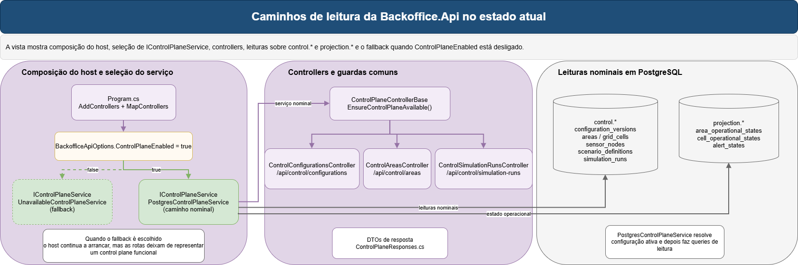

*Figura: caminhos de leitura da Backoffice.Api no estado atual. Fonte editável: [implementation-api-read-paths.drawio](diagrams/implementation-api-read-paths.drawio).*

### O que esta secção explica

Esta secção organiza a API em:

1. papel real;
2. composição do host;
3. serviço de leitura;
4. controllers;
5. contratos de resposta;
6. limites atuais.

### Como ler a figura

[Program.cs da API](../../src/NatureProtector.Backoffice.Api/Program.cs) regista controllers, OpenAPI em desenvolvimento e escolhe a implementação de `IControlPlaneService`. Esta escolha depende de `BackofficeApiOptions.ControlPlaneEnabled`.

Quando a opção está a `true`, o host usa [PostgresControlPlaneService](../../src/NatureProtector.Backoffice.Api/ControlPlane/Services/PostgresControlPlaneService.cs). Quando está a `false`, usa [UnavailableControlPlaneService](../../src/NatureProtector.Backoffice.Api/ControlPlane/Services/UnavailableControlPlaneService.cs). Isto é importante para onboarding porque a API pode estar viva e ainda assim não representar um control plane funcional.

### Fonte de verdade no repositório

- [src/NatureProtector.Backoffice.Api/Program.cs](../../src/NatureProtector.Backoffice.Api/Program.cs)
- [src/NatureProtector.Backoffice.Api/Configuration/BackofficeApiOptions.cs](../../src/NatureProtector.Backoffice.Api/Configuration/BackofficeApiOptions.cs)
- [src/NatureProtector.Backoffice.Api/Controllers/ControlPlaneControllerBase.cs](../../src/NatureProtector.Backoffice.Api/Controllers/ControlPlaneControllerBase.cs)
- [src/NatureProtector.Backoffice.Api/Controllers/ControlConfigurationsController.cs](../../src/NatureProtector.Backoffice.Api/Controllers/ControlConfigurationsController.cs)
- [src/NatureProtector.Backoffice.Api/Controllers/ControlAreasController.cs](../../src/NatureProtector.Backoffice.Api/Controllers/ControlAreasController.cs)
- [src/NatureProtector.Backoffice.Api/Controllers/ControlSimulationRunsController.cs](../../src/NatureProtector.Backoffice.Api/Controllers/ControlSimulationRunsController.cs)
- [src/NatureProtector.Backoffice.Api/ControlPlane/Services/IControlPlaneService.cs](../../src/NatureProtector.Backoffice.Api/ControlPlane/Services/IControlPlaneService.cs)
- [src/NatureProtector.Backoffice.Api/ControlPlane/Services/PostgresControlPlaneService.cs](../../src/NatureProtector.Backoffice.Api/ControlPlane/Services/PostgresControlPlaneService.cs)
- [src/NatureProtector.Backoffice.Api/ControlPlane/Services/UnavailableControlPlaneService.cs](../../src/NatureProtector.Backoffice.Api/ControlPlane/Services/UnavailableControlPlaneService.cs)
- [src/NatureProtector.Backoffice.Api/ControlPlane/Contracts/ControlPlaneResponses.cs](../../src/NatureProtector.Backoffice.Api/ControlPlane/Contracts/ControlPlaneResponses.cs)

### Fluxo factual

[ControlPlaneControllerBase](../../src/NatureProtector.Backoffice.Api/Controllers/ControlPlaneControllerBase.cs) centraliza a verificação de disponibilidade. Os controllers reais são [ControlConfigurationsController](../../src/NatureProtector.Backoffice.Api/Controllers/ControlConfigurationsController.cs), [ControlAreasController](../../src/NatureProtector.Backoffice.Api/Controllers/ControlAreasController.cs) e [ControlSimulationRunsController](../../src/NatureProtector.Backoffice.Api/Controllers/ControlSimulationRunsController.cs).

No caminho nominal, `PostgresControlPlaneService` lê:

- `control.configuration_versions` em `ListConfigurationsAsync`, `GetActiveConfigurationAsync` e `ActivateConfigurationAsync`;
- `control.areas`, `control.area_contexts`, `control.grid_cells`, `control.sensor_nodes` e `control.scenario_definitions` nos métodos de área e topologia;
- `control.simulation_runs` nos métodos de runs;
- `projection.area_operational_state`, `projection.cell_operational_state` e `projection.alert_state` nos métodos operacionais.

As respostas concretas são fechadas por [ControlPlaneResponses.cs](../../src/NatureProtector.Backoffice.Api/ControlPlane/Contracts/ControlPlaneResponses.cs). Isso ajuda a ligar a vista HTTP à forma como o sistema já materializa informação em `control.*` e `projection.*`.

### Controller -> serviço -> fonte de dados

| Controller | Serviço e métodos | Fonte de dados principal |
| --- | --- | --- |
| `ControlConfigurationsController` | `ListConfigurationsAsync`, `GetActiveConfigurationAsync`, `ActivateConfigurationAsync` | `control.configuration_versions` e contadores sobre `areas`, `grid_cells`, `sensor_nodes`, `scenario_definitions`, `simulation_runs` |
| `ControlAreasController` | `ListAreasAsync`, `GetAreaAsync`, `ListGridCellsAsync`, `ListSensorNodesAsync`, `ListScenariosAsync` | `control.areas`, `area_contexts`, `grid_cells`, `sensor_nodes`, `scenario_definitions`, `scenario_dataset_bindings` |
| `ControlAreasController` | `GetAreaOperationalStateAsync`, `ListCellOperationalStatesAsync`, `ListActiveAlertsAsync` | `projection.area_operational_state`, `cell_operational_state`, `alert_state` |
| `ControlSimulationRunsController` | `ListSimulationRunsAsync`, `GetSimulationRunAsync` | `control.simulation_runs` |

### Relação bootstrap -> API

A API atual depende diretamente do bootstrap para:

- configuração ativa;
- áreas e contexto territorial;
- grelha;
- perfis e nós de sensores;
- cenários e bindings.

Depende do runtime já ter corrido para:

- `control.simulation_runs`;
- `projection.area_operational_state`;
- `projection.cell_operational_state`;
- `projection.alert_state`.

### O que a API ainda não faz

No estado atual, a API:

- não cria áreas, sensores, cenários ou datasets;
- não escreve na pipeline (`event_inbox`, `rejected_events`, `quarantined_events`);
- não cria runs;
- não recalcula projeções;
- não expõe comandos para replay de quarentena, retry manual ou manutenção da inbox;
- não substitui o bootstrap nem o acesso direto à base para operações de materialização.

Há uma exceção importante: existe uma escrita mínima em `POST /api/control/configurations/{versionNumber}/activate`, que chama `ActivateConfigurationAsync` e alterna `IsActive` em `control.configuration_versions`. Fora isso, a API é essencialmente uma superfície de leitura.

### Notas de compreensão ou armadilhas

- O nome `Backoffice.Api` sugere uma superfície de gestão mais ampla do que a que existe hoje. Na prática, a branch atual expõe leitura rica e apenas uma escrita mínima de ativação de configuração.
- `ControlPlaneResponses.cs` é importante para onboarding porque torna visíveis os DTOs reais que os controllers devolvem. Muitas vezes é mais rápido começar por esse ficheiro do que pelas queries.

### Ficheiros, classes e métodos principais

- [src/NatureProtector.Backoffice.Api/Program.cs](../../src/NatureProtector.Backoffice.Api/Program.cs)
- [src/NatureProtector.Backoffice.Api/Configuration/BackofficeApiOptions.cs](../../src/NatureProtector.Backoffice.Api/Configuration/BackofficeApiOptions.cs)
- [src/NatureProtector.Backoffice.Api/Controllers/ControlPlaneControllerBase.cs](../../src/NatureProtector.Backoffice.Api/Controllers/ControlPlaneControllerBase.cs)
- [src/NatureProtector.Backoffice.Api/Controllers/ControlConfigurationsController.cs](../../src/NatureProtector.Backoffice.Api/Controllers/ControlConfigurationsController.cs)
- [src/NatureProtector.Backoffice.Api/Controllers/ControlAreasController.cs](../../src/NatureProtector.Backoffice.Api/Controllers/ControlAreasController.cs)
- [src/NatureProtector.Backoffice.Api/Controllers/ControlSimulationRunsController.cs](../../src/NatureProtector.Backoffice.Api/Controllers/ControlSimulationRunsController.cs)
- [src/NatureProtector.Backoffice.Api/ControlPlane/Services/PostgresControlPlaneService.cs](../../src/NatureProtector.Backoffice.Api/ControlPlane/Services/PostgresControlPlaneService.cs)
- [src/NatureProtector.Backoffice.Api/ControlPlane/Services/UnavailableControlPlaneService.cs](../../src/NatureProtector.Backoffice.Api/ControlPlane/Services/UnavailableControlPlaneService.cs)
- [src/NatureProtector.Backoffice.Api/ControlPlane/Contracts/ControlPlaneResponses.cs](../../src/NatureProtector.Backoffice.Api/ControlPlane/Contracts/ControlPlaneResponses.cs)

### Estado atual verificado

- a API atual já é um componente vivo da baseline;
- o caminho alternativo `UnavailableControlPlaneService` continua explícito no código;
- a maior parte da superfície é de leitura;
- o único write confirmado é a ativação de configuração.

## 16. Testes como especificação executável

Nesta camada de documentação, os testes não devem aparecer como apêndice organizacional. Devem aparecer como evidência de comportamento, contratos, bifurcações e limites do sistema real.

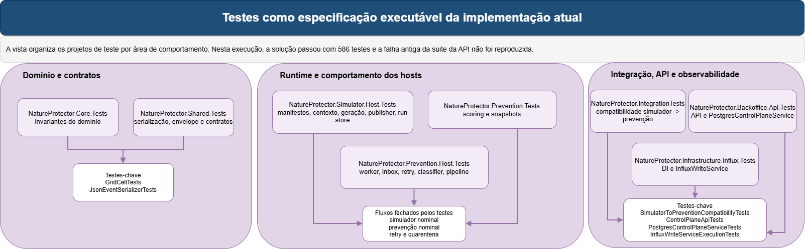

*Figura: testes como especificação executável da implementação atual. Fonte editável: [implementation-tests-map.drawio](diagrams/implementation-tests-map.drawio).*

### O que esta secção explica

Esta secção trata os testes como camada documental própria em quatro blocos:

1. famílias de testes;
2. testes que explicam melhor do que o código;
3. que semântica cada família fecha;
4. estado factual atual da bateria.

### Como ler a figura

Os testes não servem todos o mesmo propósito. Alguns fecham regras de domínio, outros fecham contratos de transporte, outros explicam bifurcações do runtime melhor do que o próprio código porque as tornam explícitas em cenários mínimos e repetíveis.

### Fonte de verdade no repositório

- [tests/NatureProtector.Core.Tests](../../tests/NatureProtector.Core.Tests)
- [tests/NatureProtector.Shared.Tests](../../tests/NatureProtector.Shared.Tests)
- [tests/NatureProtector.Simulator.Host.Tests](../../tests/NatureProtector.Simulator.Host.Tests)
- [tests/NatureProtector.Prevention.Tests](../../tests/NatureProtector.Prevention.Tests)
- [tests/NatureProtector.Prevention.Host.Tests](../../tests/NatureProtector.Prevention.Host.Tests)
- [tests/NatureProtector.Backoffice.Api.Tests](../../tests/NatureProtector.Backoffice.Api.Tests)
- [tests/NatureProtector.Infrastructure.Influx.Tests](../../tests/NatureProtector.Infrastructure.Influx.Tests)
- [tests/NatureProtector.IntegrationTests](../../tests/NatureProtector.IntegrationTests)
- [scripts/dotnet/Use-RepoDotnetEnvironment.ps1](../../scripts/dotnet/Use-RepoDotnetEnvironment.ps1)

### Famílias de testes

| Família | Projeto | Alvo principal | Tipo de valor documental |
| --- | --- | --- | --- |
| Domínio base | `NatureProtector.Core.Tests` | áreas, grelha, sensores, risco, cenários, runs e primitivas | invariantes e semântica de domínio |
| Contratos partilhados | `NatureProtector.Shared.Tests` | envelope, serialização, constantes de mensagens e opções RabbitMQ | compatibilidade entre produtor, consumidor e testes |
| Simulação | `NatureProtector.Simulator.Host.Tests` | validação de opções, contexto, publishers, geração, run store e runner | explicação do caminho do simulador e das bifurcações de contexto |
| Domínio de prevenção | `NatureProtector.Prevention.Tests` | scoring simples, normalização, `RiskInput`, elegibilidade de risco, snapshot service e repositórios in-memory | semântica do risco antes do host |
| Host de prevenção | `NatureProtector.Prevention.Host.Tests` | worker, inbox, idempotência concorrente, validação semântica, classifier, retry worker, pipeline, elegibilidade operacional e persistência host-specific | comportamento de receção, falha e projeções |
| API | `NatureProtector.Backoffice.Api.Tests` | serviço PostgreSQL e endpoints HTTP | ponte entre `control.*`, `projection.*` e contratos de resposta |
| Influx | `NatureProtector.Infrastructure.Influx.Tests` | opções, DI e tentativas de escrita remota | semântica da fronteira temporal e requisitos de configuração |
| Integração | `NatureProtector.IntegrationTests` | compatibilidade entre envelopes do simulador e pipeline de prevenção | prova curta de encadeamento end-to-end sem broker real |

### Semântica que cada família fecha

- `Core.Tests` fecha invariantes do domínio, como `RiskLevel`, `Severity`, `Scenario`, `SimulationRun`, `Area`, `GridCell` e sensores.
- `Shared.Tests` fecha o contrato serializado comum entre simulador, prevenção e persistência textual.
- `Simulator.Host.Tests` fecha a diferença entre contexto local e control plane, a geração de envelopes e o comportamento do runner.
- `Prevention.Tests` fecha o scoring e o snapshot sem ruído de broker, inbox ou DB.
- `Prevention.Host.Tests` fecha aquilo que está mais distribuído no runtime: receção, `ack`, duplicados, retries, quarentena e pipeline.
- `Backoffice.Api.Tests` fecha a correspondência entre PostgreSQL e respostas HTTP.
- `Infrastructure.Influx.Tests` fecha a configuração e a intenção de escrita em Influx, não a disponibilidade de um cluster externo.
- `IntegrationTests` fecha a compatibilidade do contrato entre produtor e consumidor.

### Testes que explicam melhor do que o código

- [SimulatorToPreventionCompatibilityTests.cs](../../tests/NatureProtector.IntegrationTests/Flow/SimulatorToPreventionCompatibilityTests.cs)
  Fecha a compatibilidade do envelope do simulador com a pipeline de prevenção sem depender de RabbitMQ. É um bom ponto de entrada porque mostra em poucas linhas a cadeia `ScenarioContextFactory -> ReadingGenerationService -> ReadingRiskPipeline`.
- [PreventionWorkerTests.cs](../../tests/NatureProtector.Prevention.Host.Tests/Processing/PreventionWorkerTests.cs)
  Explica melhor do que o próprio `PreventionWorker` onde acontece o `ack`, quando há rejeição pré-inbox, como o duplicado é ignorado e como um erro transitório vira `RetryPending`.
- [ReadingEventProcessingServiceTests.cs](../../tests/NatureProtector.Prevention.Host.Tests/Processing/ReadingEventProcessingServiceTests.cs)
  Fecha a lógica de retry e quarentena de forma mais direta do que a leitura do código distribuído por `ProcessAsync`, `ShouldRetry` e o inbox.
- [ReadingRiskPipelineTests.cs](../../tests/NatureProtector.Prevention.Host.Tests/Processing/ReadingRiskPipelineTests.cs)
  Mostra a ordem útil do pipeline nominal: accepted reading, assessment, snapshot, projeções e escrita em Influx. Para onboarding, este ficheiro é mais rápido do que saltar logo entre cinco repositórios concretos.
- [DefaultProcessingFailureClassifierTests.cs](../../tests/NatureProtector.Prevention.Host.Tests/Processing/DefaultProcessingFailureClassifierTests.cs)
  É a melhor forma de perceber como SQLSTATEs concretos viram falha transitória ou permanente e onde termina a semântica do classificador.
- [ReadingSemanticValidatorTests.cs](../../tests/NatureProtector.Prevention.Host.Tests/Processing/ReadingSemanticValidatorTests.cs)
  Mostra a nova fronteira semântica entre inbox e pipeline de risco: sensor válido, sensor inexistente, sensor inativo e sensor pertencente a outra área.
- [NormalizedReadingTests.cs](../../tests/NatureProtector.Prevention.Tests/Readings/NormalizedReadingTests.cs)
  Mostra como o envelope validado é convertido numa leitura interna normalizada sem mudar o contrato RabbitMQ.
- [RiskInputTests.cs](../../tests/NatureProtector.Prevention.Tests/Risk/RiskInputTests.cs)
  Mostra a fronteira mínima que o motor de risco consome atualmente.
- [RiskEligibilityServiceTests.cs](../../tests/NatureProtector.Prevention.Tests/Risk/RiskEligibilityServiceTests.cs)
  Mostra que a elegibilidade default continua permissiva e que já existe resultado explícito para leituras não elegíveis.
- [PostgresSimulationContextSourceTests.cs](../../tests/NatureProtector.Simulator.Host.Tests/Services/PostgresSimulationContextSourceTests.cs)
  Explica melhor do que o serviço como `ParametersJson`, perfis de sensor e mecanismos de recurso de perfil são convertidos em `SimulationContext`.
- [SimulationRunnerTests.cs](../../tests/NatureProtector.Simulator.Host.Tests/Services/SimulationRunnerTests.cs)
  Fecha tempo lógico, número de envelopes, cancelamento e separação entre tempo real e tempo lógico.
- [JsonEventSerializerTests.cs](../../tests/NatureProtector.Shared.Tests/Messaging/JsonEventSerializerTests.cs)
  É a forma mais rápida de perceber o formato JSON real do envelope e a semântica de camelCase, nulos omitidos e enums em texto.
- [ControlPlaneApiTests.cs](../../tests/NatureProtector.Backoffice.Api.Tests/ControlPlaneApiTests.cs)
  Mostra a superfície HTTP viva com exemplos reais de payloads e rotas úteis de backoffice.
- [PostgresControlPlaneServiceTests.cs](../../tests/NatureProtector.Backoffice.Api.Tests/PostgresControlPlaneServiceTests.cs)
  Explica melhor do que o serviço quais queries leem `control.*`, quais leem `projection.*` e como a ativação de configuração funciona.
- [InfluxWriteServiceExecutionTests.cs](../../tests/NatureProtector.Infrastructure.Influx.Tests/Services/InfluxWriteServiceExecutionTests.cs)
  Não provam escrita real bem-sucedida num Influx vivo; provam antes que os métodos tentam escrever e exigem configuração válida. Isto é útil para perceber que a camada Influx é uma fronteira de I/O externo.

### Estado factual atual da bateria

Na execução de validação mais recente desta branch, a suite completa passou com `647` testes através de:

`dotnet test .\NatureProtector.sln --nologo -v minimal -m:1 --no-restore`

A suite `NatureProtector.Prevention.Host.Tests` passou com `78` testes e a suite `NatureProtector.Prevention.Tests` passou com `37` testes. Estes números são relevantes porque cobrem agora, além do fluxo anterior, idempotência concorrente, validação semântica sensor-área, `NormalizedReading`, `RiskInput`, elegibilidade de risco e o caminho de leitura aceite mas não elegível para risco.

### Porque esta camada é melhor ponto de entrada do que muita leitura dispersa de código

Para onboarding técnico, há três padrões úteis:

- testes de domínio e contratos ajudam a estabilizar vocabulário e formatos antes de entrar nos hosts;
- testes de host condensam call flows longos em cenários pequenos com mocks e asserções observáveis;
- testes de integração e API mostram melhor os contratos visíveis do que uma leitura dispersa de `Program.cs`, DI e queries.

### Notas de compreensão ou armadilhas

- Para onboarding, vários testes são melhor ponto de entrada do que o código porque condensam o comportamento em cenários mínimos controlados.
- A suite de Influx não substitui validação com um Influx real; documenta sobretudo a fronteira de configuração e chamada externa.
- A suite completa confirma o comportamento atual da branch, mas não substitui a necessidade de ler `Program.cs` e `DbContext` para perceber composição e persistência.

### Ficheiros, classes e métodos principais

- [tests/NatureProtector.Core.Tests](../../tests/NatureProtector.Core.Tests)
- [tests/NatureProtector.Shared.Tests](../../tests/NatureProtector.Shared.Tests)
- [tests/NatureProtector.Simulator.Host.Tests](../../tests/NatureProtector.Simulator.Host.Tests)
- [tests/NatureProtector.Prevention.Tests](../../tests/NatureProtector.Prevention.Tests)
- [tests/NatureProtector.Prevention.Host.Tests](../../tests/NatureProtector.Prevention.Host.Tests)
- [tests/NatureProtector.IntegrationTests](../../tests/NatureProtector.IntegrationTests)
- [tests/NatureProtector.Backoffice.Api.Tests](../../tests/NatureProtector.Backoffice.Api.Tests)
- [tests/NatureProtector.Infrastructure.Influx.Tests](../../tests/NatureProtector.Infrastructure.Influx.Tests)
- [scripts/dotnet/Use-RepoDotnetEnvironment.ps1](../../scripts/dotnet/Use-RepoDotnetEnvironment.ps1)

### Estado atual verificado

- `dotnet build .\NatureProtector.sln --nologo --no-restore -m:1` passou;
- `dotnet test .\NatureProtector.sln --nologo -v minimal -m:1 --no-restore` passou com `647` testes;
- `NatureProtector.Prevention.Tests` passou com `37` testes;
- `NatureProtector.Prevention.Host.Tests` passou com `78` testes.

## 17. Pontos de confusão, dívida e riscos de compreensão

Há vários pontos que continuam a justificar atenção especial. Aqui a ordem é deliberada: primeiro os que mais podem induzir erro de leitura, depois os que representam dívida de explicitação.

### Nomes que sugerem mais generalidade do que a implementação real

- `Backoffice.Api`
  O nome sugere uma superfície de gestão mais ampla, mas a implementação atual é sobretudo de leitura e só confirma uma escrita mínima de ativação de configuração.
- `ControlPlaneEnabled`
  O nome sugere uma escolha absoluta entre modo local e control plane, mas no simulador a resolução efetiva ainda tenta `AreaId` e `ScenarioId` locais antes de cair para `ControlPlaneAreaCode` e `ControlPlaneScenarioCode`.
- `ScenarioContextFactory`
  O nome é conceptualmente bom, mas operacionalmente representa o caminho standalone concreto do simulador e não uma fábrica transversal a todos os modos.

### Nomes que escondem defaults ou composição implícita

- `IReadingPublisher`
  O contrato é simples, mas o caminho nominal fica implícito na ordem de registo do container, não numa flag explícita.
- `data/runtime`
  O nome sugere artefactos operacionais vivos, mas o snapshot atual do repositório contém apenas diretórios vazios com `.gitkeep`.
- `NatureProtectorInfinityJson`
  O nome do datasource do Grafana sugere um conector mais “nativo” do que o que existe; na prática, o provisionamento usa o plugin Infinity sobre a API SQL/HTTP do Influx.

### Pontos onde a semântica real está distribuída

- o ciclo de vida do evento na prevenção está repartido por `PreventionWorker`, `PostgresReadingEventInbox`, `ReadingEventProcessingService`, `InboxRetryWorker` e `DefaultProcessingFailureClassifier`;
- a precedência do cenário está dividida entre `appsettings`, `GeneratedScenarioManifestLoader` e `PostgresSimulationContextSource`;
- a ponte bootstrap -> API só fica totalmente clara quando se lê `ControlPlaneBootstrapper`, `NatureProtectorControlDbContext` e `PostgresControlPlaneService` em conjunto;
- a semântica atual do risco está distribuída por `NormalizedReading`, `IRiskEligibilityService`, `RiskInput`, `IRiskScoringService`, `ReadingRiskPipeline` e pelos repositórios de persistência;
- a política de observabilidade temporal está distribuída por `InfluxDbOptions`, `AddInfluxPersistence`, `NoOpInfluxWriteService`, `SafeInfluxWriteService` e o writer real.

### Riscos de compreensão para alguém novo

- assumir que o simulador lê sempre manifestos locais, quando o caminho nominal atual reconstrói o cenário a partir de `ParametersJson` em PostgreSQL;
- assumir que o `ack` do broker acontece depois do pipeline completo, quando na prática acontece depois da inbox e antes do processamento;
- assumir que Grafana prova o estado do sistema por si só, quando hoje depende de Influx já estar a receber séries reais;
- assumir que a API consegue materializar control plane, quando isso continua dependente do bootstrap e de acesso à base;
- assumir que toda a invalidez de evento é rejeitada antes da inbox, quando agora a distinção é mais fina: invalidez técnica é rejeitada antes da inbox; incompatibilidade semântica com o plano de controlo é materializada e depois enviada para quarentena;
- assumir que uma leitura aceite produz sempre score, quando agora existe uma fronteira explícita de elegibilidade. Uma leitura pode ser aceite para auditoria e terminar sem `RiskAssessment`;
- assumir que InfluxDB é obrigatório para a pipeline funcionar, quando a baseline local pode correr com `InfluxDb:Enabled=false` e manter PostgreSQL como estado durável.

### Documentação auxiliar que pode induzir atraso de leitura

- [tests/README.md](../../tests/README.md) ainda não reflete totalmente o estado factual atual da suite;
- alguns nomes antigos ou mais editoriais em docs anteriores continuam mais abstratos do que a implementação real desta branch.

## 18. Dúvidas que ficaram abertas nesta leitura

### Confirmado diretamente

- o documento continua a funcionar como guia de leitura e não como substituto do código;
- a cadeia bootstrap -> control plane -> simulador/API está materializada no código atual;
- o `Prevention.Host` implementa rejeição pré-inbox, retry, quarentena e projeções duráveis;
- InfluxDB é escrita paralela pelo `Prevention.Host` e não fonte de decisão de negócio.

### Melhorias possíveis

- Não ficou fechada nesta execução uma demonstração integral com bootstrap novo e os três hosts ativos ao mesmo tempo.
- Não foi feita validação visual de Grafana durante uma run viva, apesar de a baseline local e a escrita para InfluxDB estarem suportadas pelo código e pelos testes.
- Ficou preparada internamente a fronteira para evolução do motor de risco, mas ainda não foi implementado nenhum índice real como FWI, KBDI ou Haines.
