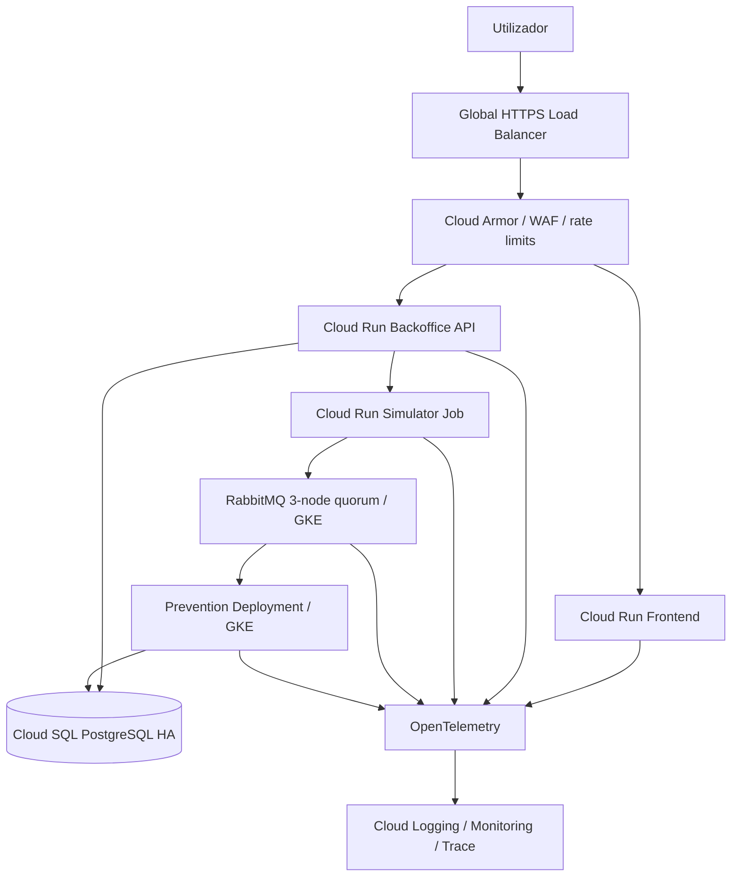

# G8.1 — Cloud Production Architecture and CD Hardening

## Objetivo

G8.1 transforma o trabalho cloud acumulado num desenho coerente de produção antes da correção da evidence G8. A fase implementa código, IaC, políticas, workflows e runbooks, mas não cria projetos nem recursos GCP.

## Estado

```text
G8_1_PRODUCTION_ARCHITECTURE_AND_CD_IMPLEMENTED_STATICALLY
RUNTIME_TARGETS_NOT_MEASURED
CLOUD_NOT_PROVISIONED
PRODUCTION_NO_GO
```

## Arquitetura



### Projetos

- `platform`: identidade federada, registry, Cloud Deploy, release/evidence;
- `staging`: ambiente representativo e automático;
- `production`: ambiente aprovado e progressivo.

Todos os roots Terraform têm criação desativada por omissão e exigem a confirmação literal `OWNER_APPROVES_NEW_NON_CN_GCP_PROJECTS_AFTER_G10`.

O bootstrap não depende de infraestrutura já existente e é executado por fases no mesmo modelo canónico:

1. `g8-1-state-bootstrap` cria o bucket de state e migra o state local inicial;
2. `g8-1-platform` cria registry, identities e control plane básico;
3. os dois roots `g8-1-environment` criam staging e production;
4. uma segunda aplicação do root platform materializa targets e pipelines Cloud Deploy com os outputs reais dos ambientes.

Esta sequência elimina o ciclo platform → environment → platform sem criar arquiteturas alternativas.

## Alterações ao produto

A Backoffice API ganhou um limiter global particionado, configurado por `RateLimiting`:

- `anonymous-read`;
- `authenticated-read`;
- `authentication`;
- `mutation`;
- `simulation-launch`;
- `expensive-read`;
- `administration`;
- `technical`.

A rejeição devolve `429`, `Retry-After`, `X-RateLimit-Policy` e `application/problem+json`. Health checks são excluídos para não transformar proteção de tráfego num falso restart loop.

Os limites são candidatos. Cloud Armor fornece proteção global por IP no edge; o limiter ASP.NET protege cada instância e identidade; quotas de domínio continuam necessárias para runs, payloads e operações caras.

## IaC platform

`infra/gcp/terraform/g8-1-platform` contém:

- APIs e Artifact Registry com tags imutáveis;
- evidence bucket versionado, PAP enforced e retenção;
- quatro identidades WIF específicas de workflow;
- targets Cloud Deploy Cloud Run e GKE para staging/production;
- pipelines separados para API, frontend e Prevention;
- approval no target de produção;
- canary 5/25/50/stable para API e frontend Cloud Run;
- rollout gradual verificado para Prevention, sem executar versões concorrentes sobre a mesma fila AMQP;
- automação de avanço apenas após fase verificada com sucesso;
- nenhuma service-account key.

## IaC por ambiente

`infra/gcp/terraform/g8-1-environment` contém:

- VPC, subnet, flow logs e Private Services Access;
- GKE Autopilot regional com private nodes, DNS endpoint, WIF, Secret Manager add-on, Binary Authorization e security posture;
- Cloud SQL PostgreSQL 16, regional HA, private IP, TLS, backup e PITR;
- contentores Secret Manager e versões write-only para credenciais geradas;
- utilizadores PostgreSQL `np_migration` e `np_app` criados com passwords write-only;
- material TLS/CA owner-managed mantido fora do Terraform e referenciado por versões explícitas;
- Cloud Armor, serverless NEGs, backends, URL map, certificado e HTTPS load balancer;
- regras de login, lançamento de simulação, API geral, SQLi e XSS.

O runtime PostgreSQL usa o contrato `POSTGRES_*` com `POSTGRES_REQUIRE_EXPLICIT=true`,
`POSTGRES_SSL_MODE=VerifyCA` e `POSTGRES_ROOT_CERTIFICATE` apontado para o CA
montado a partir de Secret Manager. A implementação Npgsql constrói um
`NpgsqlDataSource` e carrega esse CA explicitamente como certificado público,
preservando a verificação TLS em Cloud SQL sem depender de trust stores globais
do container.

A criação do edge é faseada porque os serverless NEGs só podem apontar para serviços Cloud Run já existentes. A primeira release usa `services-only-bootstrap`, que cria os serviços e rollouts mas produz `staging_verified=false`/`production_verified=false`. Depois de ativar o edge, a mesma release é repetida idempotentemente em modo `verified`; só então o smoke usa o hostname HTTPS protegido e a evidence pode ficar verde. URLs `run.app` são rejeitadas pelo smoke.

## Kubernetes

`infra/gcp/kubernetes/g8-1` implementa:

- namespaces staging/production;
- Pod Security restricted;
- quotas e limites;
- Prevention non-root, read-only e sem capabilities;
- probes distintas, shutdown de 90 segundos e topology spread;
- KEDA `ScaledObject` 3→9 em staging e 3→18 em produção;
- triggers por CPU e profundidade da fila RabbitMQ sobre AMQPS/TLS, com fallback seguro de três réplicas;
- PDB mínimo 2;
- RabbitMQ TLS-only, três réplicas, quorum queues e overflow `reject-publish`;
- NetworkPolicy default-deny e egress explícito.

## Pipeline CD

### Pull request e push

`gcp-g8-1-production-policy.yml` valida:

- policy G8.1;
- JSON Schema;
- HCL, YAML e JSON;
- `terraform fmt/init -backend=false/validate`;
- ausência de IDs CN no scope G8.1;
- actions fixadas por SHA.

Os testes backend/frontend continuam nos workflows Engineering Foundations e Security.

### Build imutável

`gcp-g8-1-release.yml`:

1. liga-se a um SHA exato de `master`;
2. aguarda Engineering e Security e exige, sem race entre workflows, os três gates verdes no mesmo SHA e default branch;
3. autentica por WIF;
4. constrói onze imagens uma única vez;
5. produz SBOM e provenance;
6. rejeita HIGH/CRITICAL;
7. assina e verifica por Cosign keyless;
8. gera e valida `release-manifest.json`;
9. produz attestation do manifesto;
10. preserva evidence durante 365 dias.

### Staging automático

`gcp-g8-1-deploy-staging.yml`:

- valida que o artifact veio do workflow autorizado e verifica a attestation do manifesto;
- faz checkout do SHA registado no manifesto;
- executa migrations;
- executa bootstrap duas vezes;
- cria ou reutiliza idempotentemente releases Cloud Deploy para API, frontend e Prevention;
- usa os mesmos digests do manifesto;
- suporta apenas um bootstrap técnico explícito antes do edge, sem declarar staging verificado;
- em modo normal exige edge protegido, smoke funcional e verificação em staging;
- preserva releases, rollouts e checksums e cria attestation para a evidence selada.

### Produção

`gcp-g8-1-promote-production.yml`:

- é manual e protegido pelo environment `production`;
- verifica a origem do staging e o manifesto;
- promove a release já testada, sem rebuild;
- cria ou reutiliza rollouts nos targets que exigem aprovação;
- aprova apenas após confirmação literal;
- permite um bootstrap técnico inicial sem edge, mas marca-o como não verificado;
- depois do edge, repete a mesma release e exige smoke funcional pelo hostname protegido;
- deixa o avanço canary a automações que só atuam após sucesso e cooling period;
- verifica a attestation dos checksums de staging e cria attestation dos checksums de produção;
- preserva evidence.

A autorização de produto/risco continua separada. Aprovar deployment técnico não equivale ao G8 signed production authorization.

## Lifecycle de uma semana

O desenho suporta:

- Dia 0: bootstrap e staging;
- Dia 1: produção inicial;
- Dias 1–3: load/recovery/security drills;
- Dias 2–5: soak mínimo de 72 h;
- Dias 5–7: releases adicionais, rollback e segundo operador;
- Dia 7: exportação, restore verification e teardown.

O teardown exige evidence mínima, confirmação específica, Terraform com criação desativada e pesquisa de recursos residuais.

## O que não foi provado

- compilação .NET e testes de rate limiting neste ambiente;
- `terraform validate` real com providers;
- build Docker das imagens;
- WIF, Artifact Registry ou Cloud Deploy reais;
- Cloud Armor, GKE, Cloud SQL e RabbitMQ em runtime;
- tuning de limites e capacidade;
- canary, rollback e teardown reais.

Estas limitações impedem qualquer claim de produção. G8.2, G9, G10 e a execução pós-integração continuam obrigatórios.

## Scaling orientado a eventos e dependências do cluster

O protótipo de HPA por métrica externa foi removido porque tratava a profundidade de uma fila RabbitMQ como uma métrica externa Google sem contrato de adapter válido. Prevention passa a ser controlado por um único KEDA `ScaledObject`, com triggers de profundidade da fila e CPU, fallback seguro de três réplicas, scale-out limitado e janela de estabilização de dez minutos no scale-down. O trigger RabbitMQ usa AMQPS, referências a username/password e a CA privada provenientes de Kubernetes Secrets sincronizados; não incorpora credenciais nos manifests.

KEDA, cert-manager e os dois operadores RabbitMQ são dependências cluster-scoped. `Install-G81ClusterDependencies.ps1` resolve assets de releases GitHub com tags exatas a partir de `operator-lock.json`, exige o digest SHA-256 publicado pela API de releases, verifica os bytes descarregados, aplica-os por server-side apply, aguarda todos os controller rollouts e sela versões e hashes resolvidos na evidence de deployment. Os workflows de staging e produção executam este gate antes de criar jobs runtime ou releases Cloud Deploy.

Prevention não usa canary percentual: duas versões a consumir a mesma fila não permitem controlar deterministamente que eventos chegam à versão candidata. API e frontend conservam canary progressivo; Prevention usa rollout gradual verificado, PDB, KEDA, readiness e rollback para a revisão anterior.
