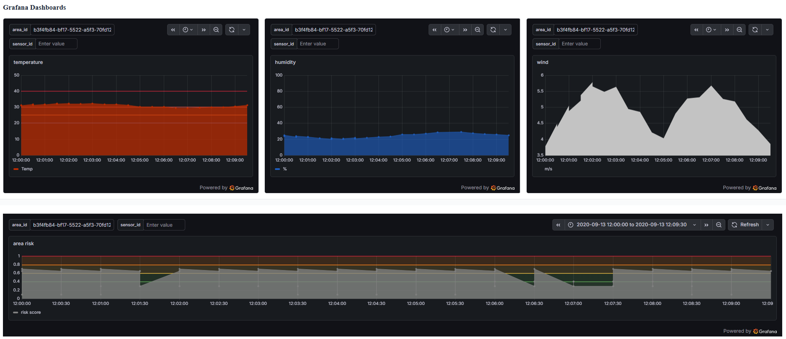
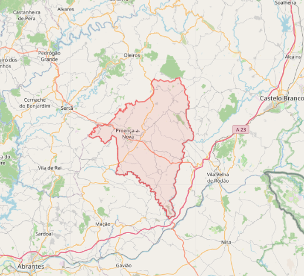
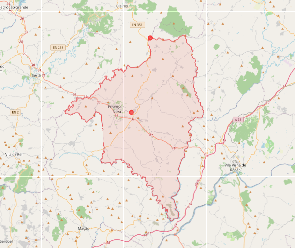

# Diário Técnico de Gabriel Mano

## Recapitulação Quinzenal 1

### Período

24 de março a 7 de abril de 2026

### Objetivo desta entrada

Arquivar de forma simples a pesquisa feita em preparação para começar o projeto.

## Índice

- [Diário Técnico de Gabriel Mano](#diário-técnico-de-gabriel-mano)
  - [Recapitulação Quinzenal 1](#recapitulação-quinzenal-1)
    - [Período](#período)
    - [Objetivo desta entrada](#objetivo-desta-entrada)
  - [Índice](#índice)
  - [Resumo Estruturado](#resumo-estruturado)
    - [O que foi feito](#o-que-foi-feito)
  - [1. Tipos de sensores](#1-tipos-de-sensores)
  - [2. Sistemas de Informação](#2-sistemas-de-informação)
  - [3. Distanciamento entre sensores](#3-distanciamento-entre-sensores)
  - [4. Preçagem](#4-preçagem)
  - [5. Como simular os dados de eventos](#5-como-simular-os-dados-de-eventos)
  - [6. Áreas](#6-áreas)
  - [7. Dificuldades na Pesquisa](#7-dificuldades-na-pesquisa)
  - [8. Mockup](#8-mockup)
- [Recapitulação Quinzenal 2](#recapitulação-quinzenal-2)
  - [Período](#período-1)
  - [Resumo Estruturado 2](#resumo-estruturado-2)
    - [O que foi feito](#o-que-foi-feito-1)
  - [1. Funcionamento das Dashboards](#1-funcionamento-das-dashboards)
  - [2. Implementação WebUI](#2-implementação-webui)
  - [3. Futuras implementações na WebUI](#3-futuras-implementações-na-webui)
- [Recapitulação Quinzenal 3](#recapitulação-quinzenal-3)
  - [Período](#período-2)
  - [Resumo Estruturado 3](#resumo-estruturado-3)
    - [O que foi feito](#o-que-foi-feito-2)
  - [0. Interrupção do progresso](#0-interrupção-do-progresso)
  - [1. Continuação da implmentação WebUI](#1-continuação-da-implmentação-webui)
  - [2. Descoberta de um problema na implementação da InfluxDB](#2-descoberta-de-um-problema-na-implementação-da-influxdb)
- [Recapitulação Quinzenal 4](#recapitulação-quinzenal-4)
  - [Período](#período-3)
  - [Resumo Estruturado 4](#resumo-estruturado-4)
    - [O que foi feito](#o-que-foi-feito-3)
  - [1. Implementação da webUI](#1-implementação-da-webui)
  - [2. Pesquisa sobre implementação de Role-based-Authorization (RBA) para a API](#2-pesquisa-sobre-implementação-de-role-based-authorization-rba-para-a-api)
  - [3. Início da implementação](#3-início-da-implementação)
  - [4. Pesquisa e tentativa de correção do bootstrap de InfluxDB](#4-pesquisa-e-tentativa-de-correção-do-bootstrap-de-influxdb)
  - [5. Preparação final da Apresentação de Progresso](#5-preparação-final-da-apresentação-de-progresso)
  
## Resumo Estruturado

### O que foi feito

1. Pesquisa foi feita sobre:
   1. que sensores deveriam ser utilizados para o projeto, tanto na área de Prevenção como Deteção de incêndios.
   2. que tipos de sistemas de informação deveriam ser utilizados na implementação física dos módulos a produzir no projeto.
   3. quais as distâncias mais eficientes entre os diversos tipos de sensores a utilizar, para um melhor aproveitamento do espaço a proteger.
   4. a preçagem de vários sensores.
   5. como simular valores dos diversos sensores, e se já existe software relativo a essa simulação.
   6. documentos de pesquisa publicados relativamente aos temas previamente indicados.
   7. que áreas seriam as mais indicadas a simular, adicionalmente quais os parâmetros a ter em conta quando se escolhe uma área a simular.
2. Foi definido o escopo do projeto deste semestre.
3. Foi feito o mockup da WebUI a usar como base na implementação da User Interface online.

## 1. Tipos de sensores

Pelo fim da pesquisa, os tipos de sensores pertinentes à prevenção e deteção de incêndios foram os seguintes:

* **Temperatura e Humidade:** Utilizáveis para tanto Deteção quanto Prevenção;
  - Sensores de Temperatura são extremamente úteis no cálculo de risco de Incêndio, tendo em conta que mesmo distânciados por uma larga margem, se o sistema onde se enquadram for o mesmo, pode-se simular os valores de temperatura intermédia entre cada sensor (interpolação), mas infelizmente não são capazes de deteção de incêncios fora de curtas distâncias (os valores detetados são apenas delegados aos locais onde os sensores se encontram, logo se ocorrer um incêndio entre sensores, provavelmente não será detetado até ao momento em que se tiver alastrado até à vicinidade de um dos sensores).
  - Sensores de Humidade, tal como os de Temperatura, podem ser afastados consideravelmente sem perda de informação devido à capacidade de interpolação de valores, logo têm alta utilidade para calcular risco de incêndio. No que toca à deteção de incêndios, demonstra o mesmo problema de alcance que os sensores de Temperatura.
* **Pressão atmosférica:** Pode ser útil para prever tempestades e outros eventos atmosféricos q causem um aumento no risco de incêndio, mas foi definido como não adicionando informação substancial ao cálculo de risco.
* **Humidade no combustível:** Utilizado apenas em prevenção. Sente a humidade em matéria combustível na vicinidade (folhas, plantas mortas, árvores, etc, dependendo no modelo). Quanto mais humidade na matéria combustível, menor o risco de incêndio.
* **Gases/Partículas:** Focados na "Deteção Precoce" (smoldering). Uso de sensores de partículas e narizes eletrónicos sensíveis a CO, H2 e VOCs podem descobrir incêndios em formação antes de se alastrarem demasiado.
* **Satélite:** Incorporação de fontes externas (como o ERA5-Land ou FIRMS) para macro-observação e validação histórica, complementando a rede de solo. Apenas útil para deteção de incêndios já a ocorrer.

Embora a pesquisa inicial tenha abrangido um espetro alargado de sensores, o escopo do projeto foi delimitado para o módulo de prevenção. Consequentemente, a prioridade técnica recaiu sobre sensores de Temperatura, Humidade e Vento. Sensores de pressão, gases e satélite, apesar de validados na fase de investigação como complementares, foram colocados em standby para futuras iterações.

## 2. Sistemas de Informação

Para a comunicação de dados numa floresta, as redes tradicionais (Wi-Fi/Celular) não são viáveis.

* **Protocolo Base:** **LoRaWAN**. Fundamental devido à capacidade das ondas de rádio de longo alcance de penetrarem folhagem densa.
* **Arquitetura Mesh:** Sensores recolhem dados e enviam pacotes curtos a intervalos regulares (ex: 15 minutos) para Gateways (que podem estar a 2-10km de distância).
* **Microcontroladores:** Uso de placas low-power com rádio integrado.

Esta pesquisa foi mantida à superficie pois a implementação física dos módulos ainda está por ser avaliada. Apenas se verificou os possíveis sistemas a utilizar para passar os dados dos sensores à API central.

## 3. Distanciamento entre sensores

A pesquisa sobre o distânciamento mais eficiente provou-se mais complexa do que o esperado, sendo que foi:
  - Difícil encontrar papeis de pesquisa disponíveis com valores concretos acerca do distanciamento entre sensores para cobertura total da área a proteger;
  - Difícil encontrar informações vindas de projetos pre-existentes com soluções ao mesmo problema.
  - Muitos dos valores encontrados pareciam ou contradizer-se uns aos outros, ou serem muito específicos e situacionais.

Mesmo assim, certos valores foram aproveitados como ideia base para uma próxima pesquisa mais aprofundada:

* **Temperatura e Humidade:**
  * Base preditiva segura (Interpolação por Semivariograma): **90 a 100 metros**.
  * Limite máximo antes de perda total de correlação entre sensores: **200 a 250 metros**.
  * Zonas de risco ou transição (limites de floresta/clareiras): **15 a 30 metros**, já que o sistema em que os sensores se enquadram se altera de um lado da zona para o outro.
* **Vento:** Devido à turbulência dos troncos, o vento é caótico. 
Recomenda-se colocar os sensores de vento acima das copas das árvores, obtendo a informação mais importante (direção do vento no local onde mais pode afetar o alastro do incêndio), distanciando-os por cerca de **100-200m**.

## 4. Preçagem

Uma das ideias iniciais deste projeto foi procurar possíveis sensores existentes que pudessem ser usados para este projeto. Por mais que a ideia tenho sido abandonada de momento, sendo que apenas temos foco em simular valores com base em dados de sensores pré existentes, aqui estão alguns dos preços obtidos na pesquisa antes do foco mudar.

| Componente | Função | Custo Estimado (Unitário) |
| --- | --- | --- |
| **Sensor (SHT40/SHT45)** | Temperatura e Humidade | ~6,00 € |
| **Sensor (DHT22 / AM2302)** | Temperatura e Humidade | ~3,00 € a ~5,00 € (Low-cost) |
| **Sensor/Anemómetro (WS-2080)** | Velocidade e Medição de Vento | Integrado na AWS Low-cost |
| **Anemómetro Ultrassónico** | Velocidade e direção do vento | ~200,00 € - 450,00 € |
| **Sensor (BME280/BME688)** | Pressão Atmosférica, Gases e VOCs | ~5,00 € |
| **Célula de Carga (HX711)** | Medição de peso (Humidade de Combustível 10h) | ~4,00 € |
| **Sensor de Partículas (SPS30)** | Deteção de fumo (PM2.5 / PM10) | ~35,00 € - 50,00 € |
| **Narizes Eletrónicos (Gás)** | Deteção de smoldering (CO, H2) | ~15,00 € |

## 5. Como simular os dados de eventos

A simulação deixou de ser simples geração de números aleatórios e passou a ter bases físicas e estatísticas rigorosas:
* **Simulação de Valores (Temp/HR/Combustíveis):** Tratados como grandezas escalares. 
Devido à impossibilidade de ter sensores que abranjam largas áreas (os valores obtidos são só na vicinidade imediata, ou seja, extremamente perto, dos sensores), utiliza-se a geoestatística de **Kriging**, permitindo calcular/interpolar pontos intermédios com elevada precisão baseando-se no modelo do Semivariograma. Além disso, aplicam-se camadas de ruído, *bias* e latência para simular sensores reais no terreno.
* **Mapas DEM (Digital Elevation Models):** Essenciais para fornecer a volumetria (montanhas, vales, cristas) que dita o microclima e a canalização do vento.
* **Simulação de Fluidos (Vento):** O vento é um vetor. O Kriging falha ao tentar interpolá-lo sobre terreno acidentado. A simulação recorre a modelos físicos da dinâmica de fluidos, mais especificamente ao motor **WindNinja**, que resolve a lei de conservação de massa em terrenos 3D ($\nabla \cdot \vec{v} = 0$).

## 6. Áreas

A escolha de onde implementar ou simular o módulo atendeu a critérios geográficos restritos.
* **Parâmetros a ter em conta:** Contraste climático, regime de fogo, cobertura de dados disponíveis (meteorologia e satélite), tipos de combustível e complexidade topográfica.
* **Áreas candidatas:** A partir da minha pesquiza, foram consideradas zonas como a Covilhã/Serra da Estrela e a Serra de Monchique devido aos seus históricos de fogo e orografia complexa.
* **Escolha final:** Após considerar as informações obtidas por mim e pelo meu colega de grupo, o piloto e a baseline de modelação foram fixados em **Proença-a-Nova**. Foi elaborada uma malha de 1 km sustentada em dados do IPMA, modelo climático ERA5-Land, ICNF, PT-FireSprd e FIRMS para garantir cenários executáveis sólidos (A, B e C), desde os dias normais aos eventos extremos ancorados na verdade histórica.

## 7. Dificuldades na Pesquisa

Foi notável a dificuldade de encontrar documentação e relatórios de pesquisa relativos a simulação de dados e como utilizar sensores eficientemente.
Muitos dos valores obtidos parecem ser situacionais no melhor dos casos, e a dificuldade de obter a documentação tornou verificação de dados ainda mais complexa.

## 8. Mockup

Para preparar a implementação da WebUI, um mockup foi criado com ajuda da ferramenta [Figma](https://figma.com)

Tinha como objetivo apresentar numa página principal dashboards grafana pertinentes, incluindo dados como time-series de temperatura, humidade, velocidade e direção do vento, risco associado à area, entre outros, para além de uma mapa interativo que demonstra as várias áreas e riscos de incêndio *color coded*, com a possibilidade de trocar entre mapa geográfico e mapa [DEM](https://en.wikipedia.org/wiki/Digital_elevation_model) (Data Elevation Model).

A criação do mockup demorou 1-2 dias de iterar sobre exemplos obtidos e desenho para formular uma boa página principal onde demonstrar as dashboards e mapa.

***

# Recapitulação Quinzenal 2

## Período

8 de abril a 21 de abril de 2026

## Resumo Estruturado 2

### O que foi feito

1. Pesquisa e testes de como as Dashboards grafana funcionam e como implementar numa WebUI
2. Implementação da WebUI com as Dashboards
3. Preparação de um PowerPoint a apresentar sobre o progresso do projeto

## 1. Funcionamento das Dashboards

Após terminar a mockup da UI, passei a pesquisar como integrar dashboards Grafana em WebUI, e como corretamente dar *set up* nas mesmas.

## 2. Implementação WebUI
   
Ao longo da primeira semana, foi implementada e alterada a WebUI com base no mockup.
Inicialmente tinha como objetivo mostrar dashboards gerais com informação generalisada, mas notei rapidamente que mostrar dashboards dinamicamente em relação a uma área que esteja a ser observada é claramente a melhor opção.
Desta forma, implementei uma página inicial simples em que se apresenta uma lista de áreas disponíveis, e ao se escolher uma, a dashboard é dinamicamente alterada através do URL utilizado pelo iframe que coloca cada dashboard na UI.
De momento, o mapa foi retirado até se implementar uma apresentação visual das células de cada área, como o objetivo de se poder interagir com as mesmas para se obter dashboards ainda mais específicas.

## 3. Futuras implementações na WebUI

De momento, as futuras implementações na *user interface* são as seguintes:
- Implementar um mapa interativo relativo à área em observação, na qual se pode escolher uma célula a observar, e com cada célula a *color coded* de forma a demonstrar o risco de incêndio específico à mesma.
- Implementar um segundo mapa interativo na 1a página em que se possa escolher a área a observar, tal como demonstrar o risco de incêndio de cada área existente
- Adicionar mais dashboards na página de observação de área (direção do vento, risco ao longo do tempo, etc.)

***

# Recapitulação Quinzenal 3

## Período

22 de abril a 6 de maio de 2026

## Resumo Estruturado 3

### O que foi feito

1. Continuação da implementação da WebUI
2. Descoberta de um problema na implementação da InfluxDB

## 0. Interrupção do progresso

Devido a estudos e trabalhos de outras unidades curriculares, o progresso no Projeto parou desde 17 Abril (quinzena anterior) até dia 27 Abril.

## 1. Continuação da implmentação WebUI
Continuou a haver progresso na implementação da página de Dashboards. O mapa já funciona e apresenta o GeoJSON da área escolhida, logo só falta apresentar as células com sensores ativos na área.

![]

Infelizmente, o progresso das dashboards foi perdido num erraneo delete file, quando queria guardar o ficheiro grafana.db, que contém todas as dashboards e connections da grafana. Isto criou um atraso de múltiplos dias, não devido às Dashboards, mas sim devido ao próximo ponto.

## 2. Descoberta de um problema na implementação da InfluxDB

Em seguimento da perda do ficheiro grafana.db, prossegui a fazer `docker compose down -v`, costumário até a este dia.
Fiz isto para garantir que a grafana criava corretamente o volume, no caso da falta do ficheiro grafana.db causar erros sem ser recriado. Agora reconheço que esta não é a melhor forma de lidar com um volume em erro, mas por causa deste lapso, foi descoberto um problema potencialmente desastroso para o projeto.

Nas versões mais atuais do projeto, quando se faz up dos contentores Docker sem o volume influxdb_data, quando o mesmo volume é iniciado o bucket np_telemetry não é criado.

Os dias 29 de Abril até 2 de Maio foram gastos à procura deste problema, até ao momento em que foi decidido criar o volume com o projeto na versão mais tardia possível, de forma a ter o bucket InfluxDB np_telemetry, e a partir desse ponto voltar ao branch do repositório mais atual para o preencher com valores das aplicações .NET atualizadas.
Esta escolha foi feita para conseguirmos prosseguir com o projeto de momento, sendo que o problema ainda não foi entendido e resta repará-lo.

Após dia 2 de Maio, o progresso da WebUI retomou, com a criação de novas Dashboards e apresentação correta do mapa.

Para tal, foi implementada uma nova rota GetGeoJSON no BackOfficeAPI, de forma a obter o GeoJSON da área a visualizar. O polígono observado a vermelho na imagem é a visualização do GeoJSON obtido para Proença-a-Nova.

***

# Recapitulação Quinzenal 4

## Período

7 de Maio a  de 21 de Maio 2026

## Resumo Estruturado 4

### O que foi feito

1. Continuação da Implementação da WebUI
2. Pesquisa sobre implementação de Role-based-Authorization (RBA) para a API
3. Começo da implementação de RBA
4. Pesquisa sobre o problema da InfluxDB não ser corretamente inicializada
5. Preparação final da Apresentação de Progresso

## 1. Implementação da webUI

Nos primeiros dias desta quinzena, foi feito principalmente progresso na implementação da WebUI, completando a visualização das dashboards relativas a células de uma área.

Para tal, novos endpoints da API foram adicionados ao ficheiro api.ts, na WebUI, de forma a poder obter uma lista das células da área em questão.

Agora, o mapa demonstra as células ativas na simulação:

## 2. Pesquisa sobre implementação de Role-based-Authorization (RBA) para a API

Foi começada a pesquisa sobre como implementar um sistema de Autorização baseado em Funções de Utilizadores.

Devido à abundância de recursos relativos à implementação de roles e authorização em ASP.NET, foi escolhido um modelo inicial de autorização simples com JWT (Java Web Token) de chave simétrica, que por mais que inseguro num contexto real, funcionaria para apresentar no progresso ou na Beta eventual, para ter como base para a implementação real de um sistema de duplo token, um de refresh (longo tempo de vida, indica à API que está logged-in) e um de autenticação (tempo de vida curto, é utilizado nos pedidos à API)

Os roles e users serão definidos e implementados na base de dados Postgres, num novo schema só relativo à user_base (users, roles e user_roles, conexão dos dois).

Quando um token é criado, as claims relativas ao utilizador e roles do mesmo serão escritas e assim o sistema de [Autorize] nos controladores da API aceitarão, para as rotas necessárias de proteger, o token apenas com os roles especificados.

## 3. Início da implementação

Após a pesquisa inicial, foi começada a implementação da user-base do sistema.

Uma versão inicial das três tabelas foi criada, mas deixada incompleta devido à preparação para a apresentação de progresso e ao problema já referido da influxDB não estar corretamente incializada no docker.

## 4. Pesquisa e tentativa de correção do bootstrap de InfluxDB

Dois dias foram gastos à procura de informação sobre o que poderia estar a impedir a criação do bucket necessário ao funcionamento da influxDB do projeto, sendo verificado que seria necessário criar um novo bucket na criação do contentor np-influxdb.

Parte do tempo perdido foi relativo à procura do motivo pelo qual as versões iniciais do projeto, por mais que não tivessem nenhum comando que implicasse a criação do bucket, estavam a criar esse bucket automaticamente. Esta pesquisa teve o motivo de evitar criar novas scripts e dockerfiles que talvez alterassem algum funcionamento dos contentores, sendo mais seguro entender o que causou o bucket parar de ser colocado imediatamente.

## 5. Preparação final da Apresentação de Progresso

Os últimos dias da quinzena foram deixados para a preparação da apresentação de progresso.