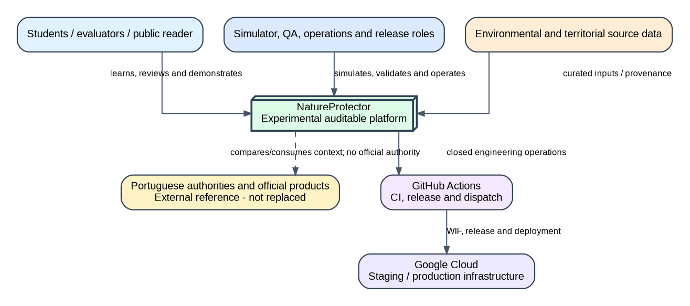
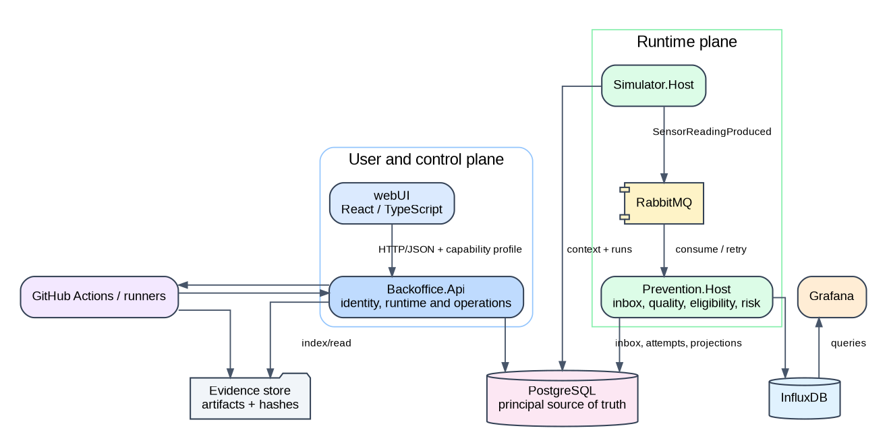
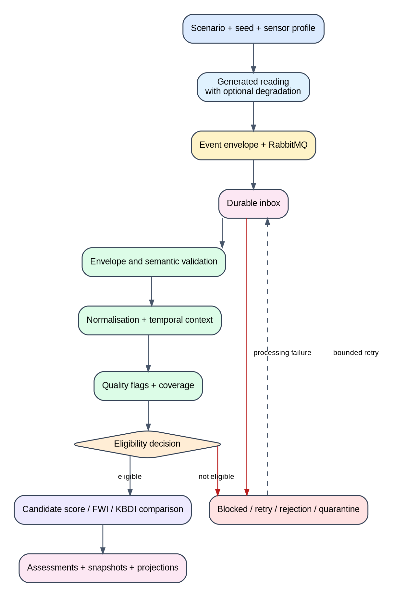
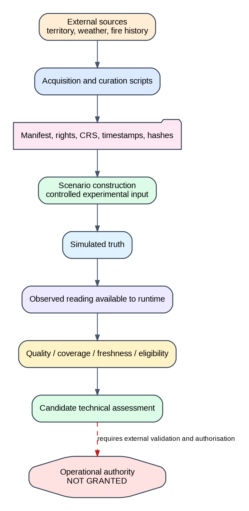
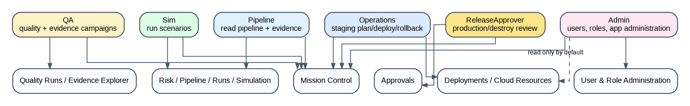
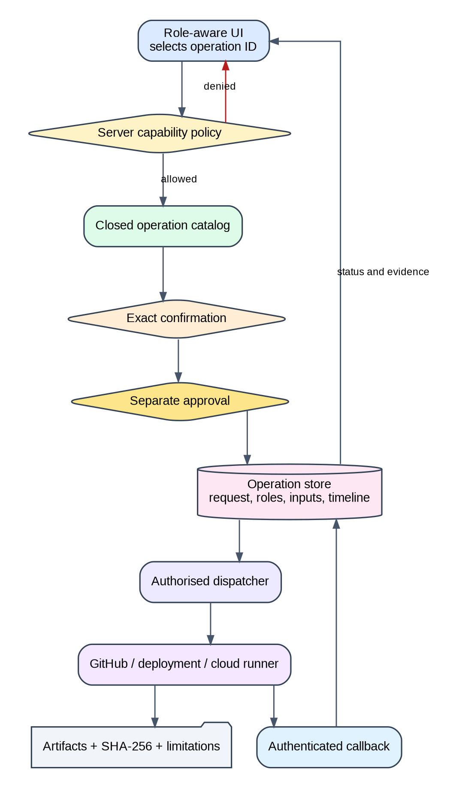
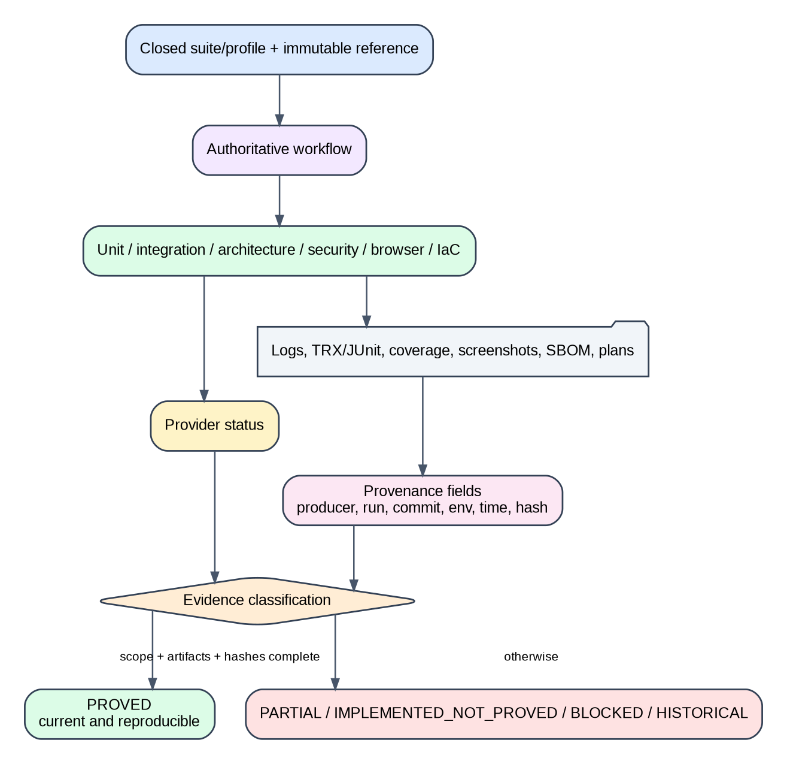
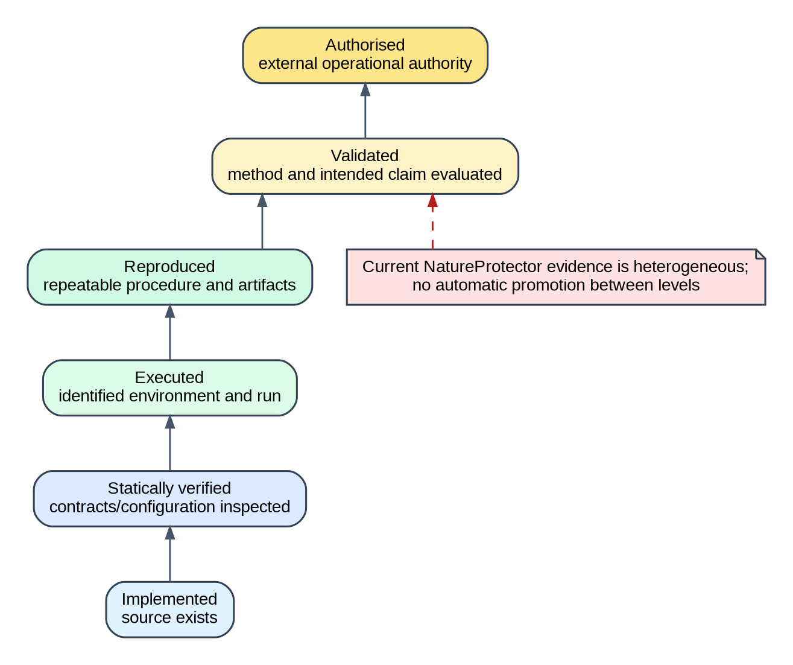
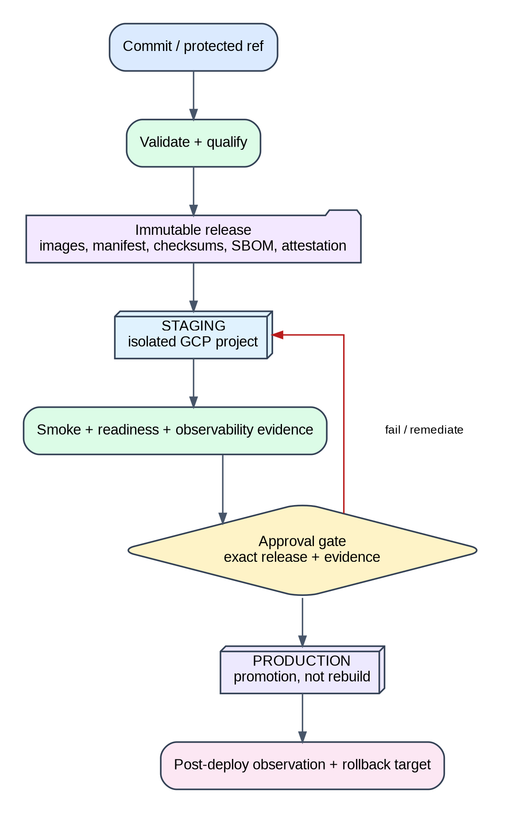

# NatureProtector - Referência Rápida para a Defesa

> Objetivo: permitir rever a narrativa, os diagramas, as frases-âncora e as respostas críticas em poucos minutos. Não substituir o compêndio nem o relatório.

## Abertura em 30 segundos

O NatureProtector é uma plataforma académica experimental que simula leituras ambientais e as processa numa pipeline auditável. O contributo não é um alerta oficial: é a separação explícita entre verdade simulada, observação, qualidade, elegibilidade, falha, avaliação candidata, evidence e autoridade.

**Frase de transição:** “Vou mostrar primeiro onde o sistema está inserido, depois como uma leitura percorre a cadeia e, por fim, como provamos sem sobreafirmar.”

# 1. Contexto e âmbito



## Dizer

- Entradas ambientais e territoriais são preparadas com proveniência.
- A plataforma simula e processa; autoridades externas mantêm autoridade oficial.
- GitHub Actions e GCP são superfícies de engenharia, não fontes científicas.

## Não dizer

- “prevê incêndios”; “alerta real”; “dados live”; “produto oficial”.

# 2. Arquitetura



## Dizer

- Simulator produz eventos controlados.
- RabbitMQ desacopla, mas não é o estado de negócio.
- Prevention + PostgreSQL preservam processamento e projeções.
- API/UI expõem tarefas e contexto.

## Pergunta provável

**Porque não um monólito?** Separação de responsabilidades, testabilidade e evolução controlada; o custo é maior coordenação e observabilidade.

# 3. Cadeia runtime



## Dizer

- O ACK e o processamento são fronteiras distintas.
- Qualidade e elegibilidade precedem a interpretação do score.
- Missing nunca é convertido silenciosamente em risco baixo.
- Retry e quarentena preservam falha e diagnóstico.

# 4. Dados, proveniência e ciência



## Dizer

- O simulador conhece ground truth experimental; o runtime recebe observações.
- Manifests devem preservar fonte, direitos, CRS, tempo, transformação e hash.
- FWI, KBDI e proxy português são candidatos, não métodos validados/oficiais.

## Limitação principal

Proveniência/reprodução completa, calibração, generalização territorial e validação externa ainda não estão fechadas.

# 5. UI, roles e operações



## Dizer

- Pipeline lê; Sim executa simulações; QA executa quality/evidence.
- Operations atua em staging; ReleaseApprover revê ações críticas.
- Admin gere a aplicação, mas não herda automaticamente produção/destroy.
- Capabilities são aplicadas no backend.

# 6. Operations Control Plane



## Dizer

- A UI solicita uma operação fechada.
- O backend valida, regista, confirma e pede approval quando necessário.
- Um runner especializado executa; artifacts e hashes regressam à UI.
- O browser não recebe shell nem credenciais cloud.

**Frase-âncora:** “A UI solicita; o backend autoriza; o runner executa; a evidence regressa.”

# 7. Qualidade e evidence



## Dizer

- Cada camada de teste responde a uma pergunta diferente.
- Uma execução só suporta o claim do snapshot e ambiente identificados.
- Status verde sem artifacts esperados não é proof completa.

# 8. Maturidade dos claims



## Memorizar

```text
planeado -> implementado -> verificado estaticamente -> executado
         -> reproduzido -> validado -> autorizado
```

Nunca saltar níveis por narrativa.

# 9. Cloud e deployment



## Dizer

- Release imutável por digest.
- Staging deve provar a release exata antes de produção.
- Produção promove; não reconstrói.
- Destroy exige plano imutável, hash, project/state checks e approval separado.

## Estado atual autorizado

- implementação cloud/CD presente;
- signed release final não provada pelos artifacts fornecidos;
- staging não provado;
- produção não implantada/provada.

# 10. Guião da demo

1. Mission Control: mostrar gates.
2. Sim: iniciar run curta com seed.
3. Pipeline: mostrar lifecycle, tentativa e projeção.
4. Degradação: explicar quality/eligibility.
5. QA: solicitar suite fechada.
6. Evidence Explorer: mostrar snapshot e hash.
7. Deployments/Cloud: mostrar bloqueios e `DeclaredNotObserved`.
8. Approvals: separação de deveres.
9. Fechar com limites e próximo passo.

## Plano B

Replay/screenshot/evidence package claramente rotulado como histórico. Nunca depender exclusivamente de Internet/cloud durante a defesa.

# 11. Dez respostas críticas

1. **Inovação?** Integração e auditabilidade, não um novo índice oficial.
2. **Porque simulação?** Repetibilidade, ground truth e falhas deliberadas.
3. **Porque RabbitMQ?** Desacoplamento; inbox preserva o estado de negócio.
4. **Missing?** Coverage/quality/eligibility; não vira risco baixo.
5. **FWI validado?** Não; candidato sujeito a conformidade e validação.
6. **Produção?** Não provada no snapshot final.
7. **Porque Operations UI?** Tornar operações e proof acessíveis sem shell/credenciais no browser.
8. **Porque Admin separado?** Identidade e infraestrutura têm autoridades diferentes.
9. **Maior limitação?** Dados/métodos e proof runtime/cloud final.
10. **Próximo passo?** Snapshot reproduzível + staging, depois avaliação científica externa.

# 12. Fecho

> “O resultado é uma plataforma experimental substancial que torna visíveis as fronteiras que sistemas ambientais frequentemente escondem. O valor está tanto no que o sistema consegue fazer como na forma explícita como impede que implementação, score ou dashboard sejam confundidos com validação e autoridade.”
