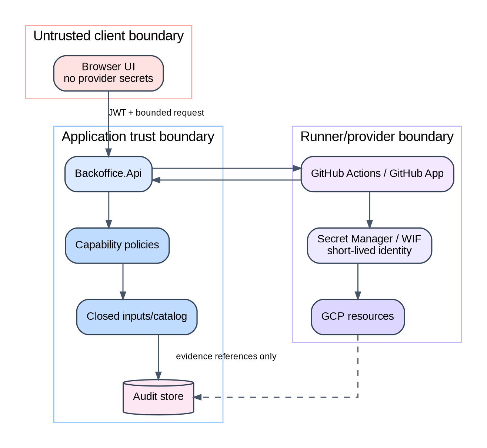

# NatureProtector - Compêndio Completo de Estudo

> Documento pessoal de estudo e preparação da apresentação. Não substitui o relatório académico. Quando existe divergência, prevalecem o código/configuração do snapshot identificado e a evidence associada ao claim.

## Como usar este documento

1. Ler as Partes I e II para dominar a narrativa.
2. Usar as Partes III a VII para perguntas técnicas.
3. Ensaiar a Parte VIII antes da demonstração.
4. Treinar as perguntas da Parte IX em voz alta.
5. Consultar os apêndices como referência rápida.

## Regra de ouro

**Distinguir sempre implementação, execução, evidence, validação e autorização.** Uma capacidade existente no código não é automaticamente uma capacidade provada em runtime, validada cientificamente ou autorizada para uso operacional.

## Mapa mental de uma página

```text
PROBLEMA  informação ambiental pode estar ausente, degradada ou atrasada
RESPOSTA  simulação controlada + eventos + estado durável + qualidade/elegibilidade
RESULTADO cadeia técnica auditável com UI e operações de engenharia controladas
CLAIM     integração e auditabilidade de engenharia
NÃO CLAIM previsão oficial, calibração científica ou alerta operacional
PROVA     associar sempre snapshot + execução + artifact + hash + limitação
PRÓXIMO   provar runtime/staging final, fechar dados/métodos e validar externamente
```


# Parte I - Narrativa, problema e identidade

## 1. Pitch de 30 segundos

O NatureProtector é uma plataforma académica experimental que simula leituras ambientais e as processa através de uma pipeline orientada a eventos e auditável. A sua ideia distintiva não é afirmar que prevê incêndios: é tornar explícita a separação entre verdade simulada, observação disponível, qualidade, elegibilidade, falha técnica, avaliação candidata, evidence e autoridade. O sistema inclui uma UI orientada a roles e um Operations Control Plane que solicita workflows fechados de qualidade, evidence e deployment sem expor credenciais cloud ao browser.

## 2. Problema

Sistemas ambientais distribuídos recebem mais do que valores numéricos. Recebem valores com origem, idade, cobertura, qualidade e possíveis falhas. Sem essas fronteiras, um valor ausente pode ser interpretado como risco baixo, um score interno pode ser apresentado como produto oficial e um dashboard pode ser confundido com a verdade operacional.

O NatureProtector explora uma resposta de engenharia: preservar contexto e incerteza desde a origem simulada até à projeção e à evidence.

## 3. Objetivos

- Produzir cenários controlados e repetíveis.
- Transportar eventos com identidade, versão, correlação e tempo.
- Persistir receção, tentativas, falhas e projeções.
- Avaliar qualidade e elegibilidade antes da interpretação do score.
- Expor resultados com contexto, limitações e role adequada.
- Reunir testes e evidence de forma rastreável.
- Automatizar release/deployment sem transferir autoridade para o browser.

## 4. Âmbito e exclusões

**Incluído:** simulação, degradações, RabbitMQ, inbox/retry/quarentena, PostgreSQL, InfluxDB, observabilidade, API, UI, testes, evidence, CI/CD e infraestrutura GCP.

**Não demonstrado como claim concluído:** previsão real-time, alerta oficial, conformidade oficial FWI, calibração, generalização nacional, validação institucional, staging final provado ou produção provada.


## 5. Evolução resumida

A história mostra uma passagem de experimentação e documentação fragmentada para contratos mais explícitos, persistência durável, reconstrução factual, qualidade/evidence e operações cloud controladas.


| Data | Marco | Implementação | Evidence | Leitura |
| --- | --- | --- | --- | --- |
| 2025-11-06 | Energy Meter experience becomes a NatureProtector precursor | NOT_APPLICABLE | PARTIALLY_PROVED | The project needed a practical starting point for distributed services and telemetry. |
| 2026-04-19 | Implementation reality and architecture documentation baseline | PARTIAL | PARTIALLY_PROVED | Create a factual implementation baseline before higher-level architecture documentation or system change. |
| 2026-05-02 | Research Day 2 to controlled V1 implementation contract | PARTIAL | DOCUMENT_CORROBORATED | Translate research into classified requirements and bounded implementation decisions. |
| 2026-05-08 | Patch A closes lease, recovery and payload boundaries | IMPLEMENTED | HISTORICAL_EXECUTION_EVIDENCE | Interrupted Processing entries and malformed inputs could cross weak boundaries. |
| 2026-05-11 | Final report truth baseline and writing sequence | PARTIAL | DOCUMENT_CORROBORATED | Write the report from a truth baseline, chapter evidence map and honest claim boundaries. |
| 2026-05-11 | Patch B separates quality, eligibility and scoring | IMPLEMENTED | PARTIALLY_PROVED | Risk could not safely absorb invalidity, incomplete observations and quality uncertainty. |
| 2026-05-11 | Controlled V1 implementation master plan | PARTIAL | PARTIALLY_PROVED | Convert V1 documents and reported repository state into the minimum safe implementation sequence. |
| 2026-05-29 | ML feasibility, problem definition and claims boundary | PARTIAL | DOCUMENT_CORROBORATED | Determine meaningful ML problems and required data, baselines and evidence before implementation. |
| 2026-06-13 | M02 — Engineering foundations, tests, quality, CI and minimum observability | PARTIAL | HISTORICAL_EXECUTION_EVIDENCE | Strengthen infrastructure, tests, tooling, CI and minimum observability. |
| 2026-06-14 | M06 — Delivery, capacity, simulation and cutover readiness | PARTIAL | HISTORICAL_EXECUTION_EVIDENCE | Prepare local delivery, capacity, controlled workload and cutover evidence without production deployment. |
| 2026-06-18 | Project reconstruction archive begins | IMPLEMENTED | DOCUMENT_CORROBORATED | The report required recoverable decisions, plans, real ordering, evidence and limitations across fragmented conversations. |


## 6. Contribuição e responsabilidade

A contribuição central é a integração da cadeia técnica com fronteiras explícitas e auditáveis. O relatório é elaborado por Miguel Alves, que define a estrutura, seleciona e verifica informação, integra alterações e assume responsabilidade pelo conteúdo. Os contributos técnicos do grupo devem ser atribuídos segundo evidence concreta, sem confundir participação no projeto com autoria do relatório.

## 7. Como contar a história

Uma narrativa eficaz usa três atos:

1. **Ambiguidade:** dados ambientais podem faltar ou degradar-se e ser sobreinterpretados.
2. **Resposta de engenharia:** simulação controlada, processamento durável, qualidade/elegibilidade e evidence.
3. **Resultado honesto:** plataforma experimental substancial, com fronteiras e limitações explícitas, não um sistema oficial de alerta.


# Parte II - Arquitetura e componentes

## 8. Visão por containers


### Simulator.Host

Resolve cenário, área e sensores; aplica seed e perfis de degradação; produz envelopes e regista o ciclo de vida da run. A reprodutibilidade exige preservar run spec, manifests e snapshot.

### RabbitMQ

Desacopla produtores e consumers. A entrega no broker não prova processamento de negócio; esse estado reside na inbox e nas tentativas duráveis.

### Prevention.Host e Prevention

O Host recebe, persiste e coordena. A biblioteca Prevention contém normalização, qualidade, elegibilidade, avaliação e projeções. Esta separação facilita testes e reduz acoplamento ao transporte.

### PostgreSQL

Autoridade para plano de controlo, pipeline e projeção. Preserva runs, inbox, tentativas, rejeições, quarentena e estado operacional.

### InfluxDB e Grafana

Superfícies de séries temporais e observabilidade. Não substituem o estado relacional nem constituem, por si só, proof de operação.

### Backoffice API e webUI

A API aplica autenticação, policies e contratos. A UI organiza tarefas por perfil: simulação, pipeline, QA, evidence, deployment, cloud, approvals e administração.

### GitHub Actions e GCP

Executam quality, evidence, release e deployment através de identidades e workflows limitados. O browser nunca deve receber tokens de administração ou chaves de service account.

## 9. Inventário da solução .NET


| Projeto | Tipo | Responsabilidade | Caminho |
| --- | --- | --- | --- |
| NatureProtector.Benchmarks | Benchmark | Microbenchmarks com BenchmarkDotNet. | benchmarks/NatureProtector.Benchmarks/NatureProtector.Benchmarks.csproj |
| NatureProtector.AppHost | Produção | Orquestração de desenvolvimento baseada em .NET Aspire. | src/NatureProtector.AppHost/NatureProtector.AppHost.csproj |
| NatureProtector.Backoffice.Api | Produção | API, autenticação, plano de controlo, runtime e operações de engenharia. | src/NatureProtector.Backoffice.Api/NatureProtector.Backoffice.Api.csproj |
| NatureProtector.Core | Produção | Conceitos e regras centrais do domínio. | src/NatureProtector.Core/NatureProtector.Core.csproj |
| NatureProtector.Infrastructure.Influx | Produção | Persistência e consulta temporal em InfluxDB. | src/NatureProtector.Infrastructure.Influx/NatureProtector.Infrastructure.Influx.csproj |
| NatureProtector.Infrastructure.Postgres | Produção | DbContext, records, migrations, bootstrap e serviços PostgreSQL. | src/NatureProtector.Infrastructure.Postgres/NatureProtector.Infrastructure.Postgres.csproj |
| NatureProtector.Postgres.Bootstrap | Produção | Aplicação explícita do bootstrap do plano de controlo. | src/NatureProtector.Postgres.Bootstrap/NatureProtector.Postgres.Bootstrap.csproj |
| NatureProtector.Postgres.Migrations | Produção | Executável de migrations para ambientes controlados. | src/NatureProtector.Postgres.Migrations/NatureProtector.Postgres.Migrations.csproj |
| NatureProtector.Prevention | Produção | Normalização, qualidade, elegibilidade, scoring e projeções. | src/NatureProtector.Prevention/NatureProtector.Prevention.csproj |
| NatureProtector.Prevention.Host | Produção | Consumer RabbitMQ, inbox, retry, quarentena e pipeline runtime. | src/NatureProtector.Prevention.Host/NatureProtector.Prevention.Host.csproj |
| NatureProtector.Shared | Produção | Contratos, envelope, topologia RabbitMQ e vocabulário partilhado. | src/NatureProtector.Shared/NatureProtector.Shared.csproj |
| NatureProtector.Shared.Observability | Produção | Configuração OpenTelemetry e observabilidade partilhada. | src/NatureProtector.Shared.Observability/NatureProtector.Shared.Observability.csproj |
| NatureProtector.Simulator.Host | Produção | Resolução de cenários, simulação, degradações e publicação. | src/NatureProtector.Simulator.Host/NatureProtector.Simulator.Host.csproj |
| NatureProtector.Backoffice.Api.Tests | Testes | Projeto de testes dirigido ao componente indicado pelo nome. | tests/NatureProtector.Backoffice.Api.Tests/NatureProtector.Backoffice.Api.Tests.csproj |
| NatureProtector.Core.Tests | Testes | Projeto de testes dirigido ao componente indicado pelo nome. | tests/NatureProtector.Core.Tests/NatureProtector.Core.Tests.csproj |
| NatureProtector.Infrastructure.Influx.Tests | Testes | Projeto de testes dirigido ao componente indicado pelo nome. | tests/NatureProtector.Infrastructure.Influx.Tests/NatureProtector.Infrastructure.Influx.Tests.csproj |
| NatureProtector.IntegrationTests | Testes | Projeto de testes dirigido ao componente indicado pelo nome. | tests/NatureProtector.IntegrationTests/NatureProtector.IntegrationTests.csproj |
| NatureProtector.Prevention.Host.Tests | Testes | Projeto de testes dirigido ao componente indicado pelo nome. | tests/NatureProtector.Prevention.Host.Tests/NatureProtector.Prevention.Host.Tests.csproj |
| NatureProtector.Prevention.Tests | Testes | Projeto de testes dirigido ao componente indicado pelo nome. | tests/NatureProtector.Prevention.Tests/NatureProtector.Prevention.Tests.csproj |
| NatureProtector.Shared.Tests | Testes | Projeto de testes dirigido ao componente indicado pelo nome. | tests/NatureProtector.Shared.Tests/NatureProtector.Shared.Tests.csproj |
| NatureProtector.Simulator.Host.Tests | Testes | Projeto de testes dirigido ao componente indicado pelo nome. | tests/NatureProtector.Simulator.Host.Tests/NatureProtector.Simulator.Host.Tests.csproj |


## 10. Fluxo nominal de uma leitura


1. A run spec define cenário, seed, sensores, ciclos, intervalo e degradação.
2. O simulador resolve o contexto e publica `SensorReadingProduced` num `EventEnvelope`.
3. O consumer valida a fronteira técnica e persiste a inbox.
4. É criada uma tentativa; o ACK ocorre depois do commit durável quando essa capacidade está ativa.
5. O pipeline normaliza, classifica validade temporal/semântica e calcula qualidade.
6. A elegibilidade decide se existe base para avaliar.
7. Os métodos candidatos produzem outputs contextualizados.
8. Logs e projeções são persistidos.
9. API, UI e evidence leem o estado projetado sem recalcular silenciosamente a verdade.

## 11. Falhas, retry e quarentena

- **Falha transitória:** pode voltar a ser tentada dentro de budget e backoff.
- **Rejeição:** contrato ou semântica invalida; deve conservar código e payload seguro para diagnóstico.
- **Quarentena:** falha permanente ou retries esgotados; não deve entrar num ciclo infinito.
- **Projeção falhada:** não equivale a mensagem não recebida; as fases devem ser diagnosticadas separadamente.

## 12. Semântica temporal

- `event_time`: tempo representado pelo evento.
- `ingest_time`: entrada no sistema.
- tempo de processamento: quando cada etapa executa.
- freshness: adequação temporal para interpretação.
- ordering/progresso: evita que um evento antigo substitua silenciosamente estado mais recente.

## 13. Catálogo de eventos e sinais


| Nome | Tipo | Produtor | Consumidor | Estado | Forma/leitura |
| --- | --- | --- | --- | --- | --- |
| SensorReadingProduced | Evento externo RabbitMQ | Simulator.Host | Prevention.Host | Ativo | `EventEnvelope<SensorReadingProducedPayload>` |
| EventEnvelope<T> | Envelope de transporte | Simulator.Host | Consumers | Ativo | SchemaVersion, EventId, CorrelationId, Producer, EventType, AreaId, EventTime, IngestTime, Payload |
| OperationalEvent | Fronteira interna | Prevention pipeline | Normalização e risco | Interno | Adaptador interno, não é contrato RabbitMQ |
| ReadingAccepted | Semântica operacional | Pipeline | Persistência/evidence | Parcial | Materializada por logs/projeções; não publicada formalmente |
| ReadingRejected | Semântica operacional | Worker/inbox | Rejeição/quarentena | Parcial | Materializada em persistência; não publicada formalmente |
| ReadingNormalized | Semântica operacional | Pipeline | Elegibilidade/scoring | Parcial | `NormalizedReading` interno |
| area-risk-high | Código de projeção | Projection store | API/UI | Ativo como estado | Não é evento formal |
| WarningRaised / AlarmRaised | Evento futuro | Futuro | Futuro | Futuro | Contrato ainda não materializado end-to-end |


## 14. Operations Control Plane


Uma `EngineeringOperation` representa uma ação de quality, evidence, deployment ou cloud. Regista operação do catálogo, requester, roles/capabilities, ambiente, referência, inputs sanitizados, confirmação, aprovação, provider, timeline e artifacts.

### Estado típico

```text
Requested -> Validated -> AwaitingConfirmation -> AwaitingApproval
          -> Queued -> Running -> Succeeded/Failed/Cancelled
          -> RollbackRequested -> RolledBack
```

### Princípio de segurança

A API não recebe comandos shell. Recebe apenas um `operationId` conhecido e inputs definidos pelo catálogo. O dispatcher chama um runner especializado.


# Parte III - Dados, cenários, qualidade e risco

## 15. Área piloto e fontes

A área piloto é Proença-a-Nova. Os dados preparados incluem geometria, grelha, atributos, meteorologia de referência, observações recentes e histórico de incêndios, acompanhados por manifests. A presença de ficheiros não prova, por si só, direitos completos, atualidade ou adequação científica; esses atributos devem ser registados individualmente.


## 16. Cenários

- **A:** nominal/baseline controlada.
- **B:** perfil de risco elevado controlado.
- **C:** cadeia degradada/falhas deliberadas.

A designação não transforma o cenário numa ocorrência real. O cenário é um contrato experimental.

## 17. Degradações

| Família | Efeito | Pergunta que permite testar |
|---|---|---|
| Missing | remove valor/campo | o sistema bloqueia ou inventa segurança? |
| Noise | adiciona variabilidade | qualidade e score reagem de forma explicável? |
| Bias | desloca sistematicamente | existe sensibilidade a erro persistente? |
| Drift | deslocamento progressivo | o sistema deteta evolução anómala? |
| Stuck | valor constante | é distinguido de estabilidade real? |
| Outlier | valor extremo isolado | é validado, rejeitado ou contextualizado? |
| Clipping | limita à faixa | a perda de informação fica explícita? |
| Lag | atraso temporal | freshness e ordering são preservados? |
| Duplicate | repetição | idempotência evita efeitos duplicados? |
| Out-of-order | ordem alterada | progresso temporal evita regressão de estado? |

## 18. Qualidade antes do score

Qualidade não é um rótulo decorativo. Inclui validade, coverage, freshness, integridade e contexto. A elegibilidade deve bloquear outputs quando faltam condições mínimas. O sistema deve dizer “não elegível” em vez de produzir um número enganador.

## 19. Métodos candidatos

### Score NatureProtector

Score específico do projeto para comparação e explicabilidade. Não é calibrado como indicador oficial de perigo.

### FWI

Família estabelecida de índices meteorológicos. Para reclamar conformidade são necessários equações, estado acumulado, convenções de input e casos oficiais. O componente atual é candidato e criticamente avaliado.

### KBDI

Indicador de secura dependente de precipitação, estado inicial, clima e calibração. É candidato técnico, não índice validado para decisão operacional neste projeto.

### Portuguese Context Proxy

Proxy experimental do contexto português. Não substitui RCM, IPMA, ICNF, ANEPC nem outra autoridade.

## 20. Validade científica

A validade técnica responde “o software implementa o contrato e comporta-se como testado?”. A validade científica responde “o método mede o constructo pretendido com generalização e incerteza conhecidas?”. O projeto tem material forte de engenharia; continuam abertas proveniência completa, calibração, comparação externa, generalização territorial e avaliação independente.


# Parte IV - Persistência, API, UI e autorização

## 21. PostgreSQL como autoridade

O desenho separa três schemas.

### `control`


| Tabela | Papel |
| --- | --- |
| configuration_versions | Versão ativa da configuração |
| areas | Área piloto e metadados |
| area_contexts | Contexto agregado preparado |
| grid_cells | Grelha operacional |
| sensor_profiles | Perfis de ruído/falha/publicação |
| sensor_networks | Rede lógica |
| sensor_nodes | Sensores ativos |
| scenario_definitions | Cenários e parâmetros JSON |
| simulation_runs | Execuções concretas |
| rule_set_versions | Versões de regras preparadas |
| dataset_artifacts | Catálogo de artefactos |
| scenario_dataset_bindings | Relações cenário-dataset |


### `pipeline`


| Tabela | Papel |
| --- | --- |
| event_inbox | Registo único do envelope e estado |
| processing_attempts | Histórico de tentativas |
| rejected_events | Rejeições técnicas e payload inválido |
| quarantined_events | Falhas permanentes ou retries esgotados |


### `projection`


| Tabela | Papel |
| --- | --- |
| accepted_reading_log | Leituras aceites |
| risk_assessment_log | Assessments |
| area_risk_snapshot_log | Snapshots por área |
| cell_operational_state | Estado atual por célula |
| area_operational_state | Estado atual por área |
| alert_state | Estados de alerta simples |


## 22. Estados da inbox

```text
Pending -> Processing -> Processed
                    \-> Failed -> RetryPending -> Processing
                    \-> Rejected
                    \-> Quarantined
```

O significado concreto deve ser lido em conjunto com tentativas, código de erro e timestamps.

## 23. UI por jornada

- **Mission Control:** visão da cadeia code -> quality -> evidence -> release -> staging -> production.
- **Scenario Lab / Simulation:** configuração de run.
- **Runs e Pipeline:** lifecycle, inbox, tentativas, projeções e timings.
- **Quality Runs:** suites fechadas e provider reference.
- **Evidence Explorer:** artifacts, hashes, claims e limitações.
- **Deployments:** planos, release, staging, promoção e rollback.
- **Cloud Resources:** declarado versus observado.
- **Approvals:** revisão separada de ações de risco elevado.
- **Users & Roles:** administração de identidade e capabilities.

## 24. Roles e capabilities


| Role | Finalidade | Capabilities atuais |
| --- | --- | --- |
| Pipeline | Leitura do pipeline, runs, risco e evidence, sem mutações de engenharia. | `demo.read`, `area.read`, `risk.read`, `pipeline.read`, `run.read`, `quality.read`, `evidence.read`, `evidence.download`, `evidence.compare`, `data_context.read`, `help.read` |
| Sim | Configuração e execução de simulações controladas. | `demo.read`, `area.read`, `risk.read`, `run.read`, `scenario.read`, `simulation.read`, `simulation.execute`, `evidence.read`, `data_context.read`, `help.read` |
| QA | Execução de suites de qualidade e campanhas de evidence. | `demo.read`, `area.read`, `risk.read`, `run.read`, `quality.read`, `quality.execute.static`, `quality.execute.full`, `evidence.read`, `evidence.download`, `evidence.execute.campaign`, `evidence.compare`, `data_context.read`, `help.read` |
| Operations | Planos, deployment e operação controlada de staging. | `demo.read`, `area.read`, `risk.read`, `pipeline.read`, `run.read`, `quality.read`, `evidence.read`, `evidence.download`, `evidence.compare`, `deployment.read`, `deployment.plan`, `deployment.deploy.staging`, `deployment.rollback`, `cloud.read`, `cloud.operate.staging`, `data_context.read`, `help.read` |
| ReleaseApprover | Revisão e aprovação de ações de produção e destrutivas. | `demo.read`, `quality.read`, `evidence.read`, `evidence.download`, `evidence.compare`, `deployment.read`, `deployment.plan`, `deployment.deploy.production`, `deployment.rollback`, `cloud.read`, `cloud.operate.production`, `cloud.destroy`, `approval.review`, `data_context.read`, `help.read` |
| Admin | Administração de utilizadores/roles e aplicação, sem herdar automaticamente autoridade cloud crítica. | `demo.read`, `area.read`, `risk.read`, `pipeline.read`, `run.read`, `scenario.read`, `simulation.read`, `simulation.execute`, `quality.read`, `evidence.read`, `evidence.download`, `evidence.compare`, `deployment.read`, `cloud.read`, `users.manage`, `roles.manage`, `admin.read`, `admin.execute`, `p3.read`, `data_context.read`, `help.read` |


### Regra essencial

A UI pode esconder ações, mas só o backend autoriza. Alterar JavaScript não pode conceder uma capability.

## 25. Catálogo fechado de operações


| ID | Categoria | Designação | Disponibilidade | Evidence |
| --- | --- | --- | --- | --- |
| frontend-fast | quality | Frontend fast | implemented | IMPLEMENTED_NOT_PROVED |
| frontend-full | quality | Frontend full | implemented | IMPLEMENTED_NOT_PROVED |
| backend-unit | quality | Backend unit | implemented | IMPLEMENTED_NOT_PROVED |
| backend-integration | quality | Backend integration | implemented | IMPLEMENTED_NOT_PROVED |
| architecture | quality | Architecture | implemented | IMPLEMENTED_NOT_PROVED |
| security | quality | Security | implemented | IMPLEMENTED_NOT_PROVED |
| playwright-fixture | quality | Playwright fixture | implemented | IMPLEMENTED_NOT_PROVED |
| playwright-full-stack | quality | Playwright full stack | implemented | IMPLEMENTED_NOT_PROVED |
| accessibility | quality | Accessibility | implemented | IMPLEMENTED_NOT_PROVED |
| mutation | quality | Mutation | implemented | IMPLEMENTED_NOT_PROVED |
| terraform-static | quality | Terraform static | implemented | IMPLEMENTED_NOT_PROVED |
| cloud-static | quality | Cloud static | implemented | IMPLEMENTED_NOT_PROVED |
| quality-all | quality | All quality gates | implemented | IMPLEMENTED_NOT_PROVED |
| evidence-static | evidence | Static evidence campaign | implemented | IMPLEMENTED_NOT_PROVED |
| evidence-quality | evidence | Quality evidence campaign | implemented | IMPLEMENTED_NOT_PROVED |
| evidence-full-plan | evidence | Full evidence plan | implemented | IMPLEMENTED_NOT_PROVED |
| evidence-full-execute | evidence | Full evidence execution | implemented | IMPLEMENTED_NOT_PROVED |
| staging-plan | deployment | Plan staging | implemented | IMPLEMENTED_NOT_PROVED |
| staging-deploy | deployment | Deploy staging | implemented | IMPLEMENTED_NOT_PROVED |
| staging-rollback | deployment | Rollback staging | implemented | IMPLEMENTED_NOT_PROVED |
| production-plan | deployment | Plan production | blocked-no-authoritative-workflow | NOT_PROVED |
| production-deploy | deployment | Deploy production | implemented | IMPLEMENTED_NOT_PROVED |
| production-rollback | deployment | Rollback production | blocked-no-authoritative-workflow | NOT_PROVED |
| cloud-inventory | cloud | Collect cloud inventory | blocked-missing-qualified-owner-input | NOT_PROVED |
| cloud-costs | cloud | Collect cloud costs | blocked-no-authoritative-workflow | NOT_PROVED |
| cloud-smoke | cloud | Run cloud smoke | blocked-missing-qualified-input-contract | NOT_PROVED |
| cloud-open-staging | cloud | Open staging | implemented | IMPLEMENTED_NOT_PROVED |
| cloud-close-staging | cloud | Close staging | implemented | IMPLEMENTED_NOT_PROVED |
| cloud-destroy-plan | cloud | Prepare destroy plan | blocked-no-destroy-plan-workflow | NOT_PROVED |
| cloud-destroy-execute | cloud | Execute approved destroy plan | blocked-until-approved-plan | NOT_PROVED |


### Como interpretar disponibilidade

- `implemented`: existe caminho de dispatch, mas falta proof runtime quando indicado.
- `blocked-*`: o catálogo conhece a intenção, mas rejeita execução até existir workflow, input ou plano qualificado.
- `IMPLEMENTED_NOT_PROVED`: código presente sem proof fornecida para o snapshot final.
- `NOT_PROVED`: não existe base suficiente para claim de execução.


# Parte V - Qualidade, evidence, observabilidade e segurança

## 26. Pirâmide de validação


| Camada | Pergunta |
|---|---|
| Unitária | a regra local está correta? |
| Integração | componentes/dependências colaboram? |
| Contratos/arquitetura | fronteiras e dependências respeitam políticas? |
| API | autenticação, autorização e respostas estão corretas? |
| UI/browser | a jornada funciona e é acessível? |
| Full-stack | a cadeia real funciona no ambiente selecionado? |
| Segurança/supply chain | dependências, secrets, IaC, imagens e provenance são aceitáveis? |
| Staging | a release implantada passa smoke e qualificação? |
| Produção | existe promoção, observação e rollback comprovados? |

## 27. Escada de evidence


```text
PLANNED
IMPLEMENTED
STATICALLY_VERIFIED
EXECUTED
REPRODUCED
VALIDATED
AUTHORISED
```

Cada subida exige evidence adequada. Um artifact de commit antigo permanece histórico.

## 28. Regra dos artifacts

Para promover uma execução, registar:

- operação/suite;
- commit ou digest;
- ambiente;
- produtor/workflow e run ID;
- timestamps;
- status e códigos de saída;
- artifacts esperados;
- SHA-256;
- limitações e retenção.

## 29. Observabilidade

O sistema inclui logs estruturados, métricas e traces OpenTelemetry, health/readiness, InfluxDB e Grafana. Observabilidade explica comportamento; não substitui testes, estado durável ou validação científica.

## 30. Modelo de segurança



- JWT e configuração validados no arranque.
- Capabilities no servidor.
- Separação Admin / Operations / ReleaseApprover.
- Actions fixadas por SHA e dependências auditadas.
- Gitleaks e fronteira de secrets.
- WIF e credenciais curtas.
- Confirmação e approval para ações críticas.
- Catálogo fechado, sem shell arbitrário.
- Callback autenticado e artifacts com hash.

## 31. Threats a explicar

| Risco | Controlo |
|---|---|
| UI adulterada | autorização backend |
| token no browser | dispatcher server-side e WIF |
| workflow alterado | pin por SHA, review e evidence |
| operação repetida | idempotency/operation record |
| produção sem staging | gate e exact release identity |
| destroy no state errado | plan imutável, project/state checks e approval |
| dashboard sobreinterpretado | fonte de verdade e labels de evidence |


# Parte VI - CI/CD, cloud e ciclo de release

## 32. Topologia e promoção


A arquitetura cloud materializada no repositório usa projetos/ambientes isolados, Artifact Registry, GKE Autopilot, Cloud SQL/PostgreSQL, RabbitMQ Operator, KEDA, cert-manager, Cloud Deploy, Terraform e GitHub Actions com WIF.

## 33. Cadeia de delivery

```text
commit/ref
 -> validate/qualify
 -> build de imagem/pacote
 -> checksum, SBOM, provenance/attestation
 -> release imutável por digest
 -> staging
 -> smoke/readiness/qualification
 -> approval
 -> promoção da mesma release
 -> observação e rollback readiness
```

## 34. Estado factual

| Tema | Estado autorizado |
|---|---|
| Infraestrutura e workflows | Implementados no repositório |
| Pin de attestation | Remediação presente em source |
| Signed release do head final | Não provada pelos artifacts fornecidos |
| Staging | Não provado |
| Produção | Não implantada/provada |
| Inventário/custos vivos | Não observados neste pacote |
| Destroy | Definido no catálogo, bloqueado até plano/workflow/approval qualificados |

## 35. Terraform e state

Terraform descreve intenção e cria recursos; o state é autoridade sobre a gestão desses recursos. Ambiente, project IDs, backend/state e recursos partilhados devem ser explicitamente verificados antes de apply ou destroy.

## 36. Destroy seguro

1. Selecionar ambiente.
2. Verificar project IDs, backend e workspace/state.
3. Recolher inventário pré-destruição.
4. Confirmar ausência/isolamento de recursos partilhados.
5. Gerar plano de destroy imutável.
6. Armazenar hash e artifacts.
7. Exigir confirmação exata e approval separado.
8. Aplicar exatamente o plano aprovado.
9. Verificar recursos restantes e custos finais.
10. Preservar evidence.


# Parte VII - Operação local e leitura do projeto

## 37. Percurso de exploração do repositório

1. `README.md` e `docs/index.md`.
2. `docs/current-state/` para verdade atual.
3. `docs/architecture/diagrams/current/` para o modelo visual.
4. `src/NatureProtector.Shared` para contratos.
5. `Simulator.Host` e `Prevention.Host` para runtime.
6. `Infrastructure.Postgres` para estado durável.
7. `Backoffice.Api/Operations` para operations plane.
8. `webUI/src/app`, em especial `App.tsx` e `navigation/pageRegistry.ts`, para jornadas.
9. `.github/workflows`, `infra/gcp` e `scripts/cloud` para delivery.
10. `docs/evidence` e packages de resultado para proof.

## 38. Sequência local conceptual

```text
setup -> infra up -> migrations/bootstrap -> API/hosts/UI
      -> run controlada -> inspeção pipeline/projection
      -> quality/evidence -> shutdown e preservação de outputs
```

Os comandos concretos dependem do ambiente Windows/PowerShell e devem ser executados a partir dos runbooks canónicos, não copiados de registos históricos sem revisão.

## 39. Diagnóstico por sintoma

| Sintoma | Primeiras fronteiras a verificar |
|---|---|
| run não inicia | role/capability, config, runtime orchestrator, provider |
| eventos não chegam | publisher, exchange/routing key, queue/binding, TLS |
| eventos chegam mas não projetam | inbox, tentativas, erro semântico, projection store |
| retries infinitos | classificação, budget/backoff, estado da inbox |
| UI sem dados | API auth, endpoint, source profile, projection freshness |
| workflow não arranca | catálogo, token/app, inputs, workflow_dispatch |
| deploy falha | release identity, WIF, APIs, Terraform/Cloud Deploy, smoke |
| claim sem proof | snapshot, run ID, artifacts, hash e limitação |

## 40. Workflows do repositório


| Ficheiro | Nome | Triggers detetados |
| --- | --- | --- |
| _cloud-operation.yml | _cloud operation | workflow_dispatch |
| _deploy.yml | _deploy | workflow_call |
| _deployment-operation.yml | _deployment operation | workflow_dispatch |
| _evidence-campaign.yml | _evidence campaign operation | workflow_dispatch |
| _qualify.yml | _qualify | workflow_call |
| _quality-operation.yml | _quality operation | workflow_dispatch |
| _release.yml | _release | workflow_call |
| _validate.yml | _validate | workflow_call |
| cd-staging.yml | CD staging | push, workflow_dispatch |
| ci.yml | CI | pull_request, push, workflow_dispatch |
| documentation.yml | Documentation | pull_request, push, workflow_dispatch |
| engineering-foundations.yml | Engineering foundations | pull_request, push, workflow_dispatch, schedule |
| gcp-g8-1-deploy-staging.yml | G8.1 deploy verified release to staging | workflow_dispatch |
| gcp-g8-1-production-policy.yml | G8.1 cloud production policy | pull_request, push, workflow_dispatch |
| gcp-g8-1-promote-production.yml | G8.1 promote verified release to production | workflow_dispatch |
| gcp-g8-1-release.yml | G8.1 build immutable release | workflow_dispatch |
| gcp-g8-1-teardown.yml | G8.1 controlled one-week environment teardown | workflow_dispatch |
| gcp-g8-2-authorization-request.yml | G8.2 authorization request | workflow_dispatch |
| gcp-g8-2-authorization-verification.yml | G8.2 authorization verification | workflow_dispatch |
| gcp-g8-2-independent-review.yml | G8.2 independent review verification | workflow_dispatch |
| gcp-g8-2-policy.yml | G8.2 qualification integrity policy | pull_request, push, workflow_dispatch |
| gcp-g8-2-runtime-probe.yml | G8.2 runtime probe | workflow_dispatch |
| gcp-g8-2-runtime-qualification.yml | G8.2 runtime qualification | workflow_dispatch |
| gcp-g8-2-submit-signed-governance.yml | G8.2 submit signed governance document | workflow_dispatch |
| gcp-g9-convergence-policy.yml | G9 repository convergence policy | pull_request, push, workflow_dispatch |
| open-staging.yml | Open staging | workflow_dispatch |
| quality-guardrails.yml | Quality guardrails | pull_request, push, workflow_dispatch |
| release-candidate.yml | Release candidate | workflow_dispatch |
| rollback-staging.yml | Rollback staging | workflow_dispatch |
| security.yml | Security | pull_request, push, workflow_dispatch |
| teardown-staging.yml | Teardown staging | workflow_dispatch, schedule |
| wif-deploy-probe.yml | WIF deploy authority probe | workflow_dispatch |
| wif-readonly-probe.yml | WIF read-only probe | workflow_dispatch |

# Parte VIII - Demonstração e apresentação

## 41. Demonstração recomendada

1. Abrir Mission Control e mostrar a cadeia de gates.
2. Entrar como `Sim` e iniciar uma run curta com seed conhecida.
3. Mostrar identidade, lifecycle e outputs da run.
4. Introduzir missing/lag e explicar quality/eligibility.
5. Entrar como `QA` e solicitar uma suite fechada.
6. Abrir Evidence Explorer e mostrar producer, snapshot e hash.
7. Mostrar Deployments/Cloud Resources e o rótulo `DeclaredNotObserved` ou bloqueios.
8. Mostrar Approvals e separação de deveres.
9. Fechar com a escada de evidence e limitações.

## 42. Plano offline

- screenshots atuais por role;
- gravação curta ou evidence package;
- run histórica rotulada;
- diagramas A4/16:9;
- nunca fingir que um replay é uma execução ao vivo.

## 43. Estrutura de 10-15 minutos

| Tempo | Conteúdo | Visual |
|---:|---|---|
| 1 min | problema e âmbito | system context |
| 2 min | arquitetura | containers |
| 2 min | runtime e falhas | risk pipeline |
| 2 min | dados, qualidade e métodos | provenance + quality |
| 2 min | UI, roles e operations | roles + lifecycle |
| 2 min | quality/evidence/cloud | evidence + deployment |
| 1-3 min | resultados, limites e futuro | maturity ladder |

## 44. Frases-âncora

- “Não transformamos ausência em segurança.”
- “Broker delivery não é business processing.”
- “Implementado não significa provado.”
- “A UI solicita; o backend autoriza; o runner executa; a evidence regressa.”
- “A contribuição é a auditabilidade integrada, não um alerta oficial.”


# Parte IX - Banco de perguntas da defesa


## 1. Qual é a contribuição principal?

A integração de uma cadeia auditável que separa verdade simulada, observação, qualidade, elegibilidade, falha, avaliação candidata, evidence e autoridade. Não é a criação de um índice oficial.


## 2. Porque usar simulação?

Permite entradas repetíveis, seed conhecida e falhas deliberadas. É adequada para testar comportamento técnico, mas não substitui validação com dados externos reais e rastreáveis.


## 3. Porque RabbitMQ?

Desacopla produção e consumo. A entrega do broker não é o estado de negócio; a inbox PostgreSQL preserva idempotência, tentativas, retry e quarentena.


## 4. Porque é necessário um EventEnvelope?

Preserva identidade, correlação, versão, origem e tempos em torno do payload, permitindo compatibilidade e auditoria.


## 5. O que acontece antes do ACK?

Quando a persistência durável está ativa, o envelope é registado na inbox e a tentativa é criada antes do ACK, reduzindo o risco de perda invisível.


## 6. O que distingue Rejected de Quarantined?

Rejected representa uma rejeição técnica/semântica; Quarantined representa uma falha permanente ou retries esgotados, preservada para diagnóstico.


## 7. Porque PostgreSQL e InfluxDB?

PostgreSQL é autoridade relacional para controlo e estado operacional; InfluxDB serve séries temporais e observabilidade. Grafana não é fonte de verdade.


## 8. Como são tratados valores ausentes?

Através de validade, coverage, freshness, flags e eligibility. Ausência não é convertida em risco baixo.


## 9. Qual a diferença entre qualidade e confiança?

Qualidade descreve propriedades do input/processamento; confiança é uma interpretação derivada e nunca deve esconder a causa concreta da limitação.


## 10. O score NatureProtector prevê incêndios?

Não. É um score técnico candidato para comparação controlada e explicabilidade.


## 11. O FWI está validado?

Não como implementação oficial/conforme. É um componente candidato, sujeito a convenções, estado acumulado, inputs e casos de validação oficiais.


## 12. O KBDI está validado?

Não. A interpretação exige clima, precipitação, inicialização e calibração adequados.


## 13. O que é o Portuguese Context Proxy?

Uma aproximação experimental do projeto; não é um produto oficial de IPMA, ICNF ou ANEPC.


## 14. Porque a UI é organizada por tarefas?

Os utilizadores precisam de simular, diagnosticar, avaliar e operar; reproduzir tabelas da base de dados na UI criaria acoplamento e pior compreensão.


## 15. As capabilities do frontend são segurança?

Não. A segurança efetiva é aplicada por policies no backend. O frontend apenas adapta navegação e affordances.


## 16. Porque Admin não pode automaticamente fazer deploy de produção?

Administração da aplicação e autoridade de release são deveres diferentes. A separação reduz privilégio excessivo e melhora auditoria.


## 17. O que é uma EngineeringOperation?

Um pedido auditável de quality, evidence, deployment ou cloud com catálogo fechado, inputs limitados, confirmação, aprovação, timeline e artifacts.


## 18. Porque não executar shell a partir da API?

Isso juntaria vulnerabilidade Web, credenciais e autoridade de infraestrutura. A API despacha workflows especializados e limitados.


## 19. Como se prova uma operação?

Não basta status de sucesso. É necessário associar snapshot, produtor, ambiente, artifacts e hashes às expectativas da operação.


## 20. Qual a diferença entre IMPLEMENTED e PROVED?

IMPLEMENTED significa que o caminho existe; PROVED exige execução identificada e evidence suficiente para o claim e snapshot exatos.


## 21. Porque fixar GitHub Actions por SHA?

Reduz risco de alteração invisível de uma tag e melhora reprodutibilidade da supply chain.


## 22. O que é WIF?

Workload Identity Federation permite que GitHub obtenha credenciais curtas para GCP sem guardar uma service-account key de longa duração.


## 23. Porque staging antes de produção?

A mesma release imutável deve ser implantada, testada e qualificada num ambiente isolado antes de promoção.


## 24. O sistema está em produção?

Não há proof fornecida de staging qualificado nem produção implantada para o head final. O código de infraestrutura não equivale a deployment provado.


## 25. Como funciona rollback?

Deve selecionar um target imutável conhecido, executar o workflow autorizado e recolher evidence pós-rollback. Não é “voltar ao branch anterior”.


## 26. Como deveria funcionar terraform destroy?

Primeiro gerar plano imutável, verificar projeto/state/recursos partilhados, recolher inventário e hash; depois aprovação separada e execução exata desse plano.


## 27. O que é DeclaredNotObserved?

Um recurso ou estado está declarado em configuração, mas não foi observado por recolha autenticada atual. Evita apresentar IaC como estado vivo.


## 28. Como é garantida reprodutibilidade de uma run?

Preservando run spec, cenário, seed, sensores, ciclos, degradação, snapshot de código, manifests e evidence de execução.


## 29. Porque event_time e ingest_time são diferentes?

Um descreve quando o fenómeno/evento é representado; outro quando entrou no sistema. A diferença é necessária para atraso, ordering e freshness.


## 30. Como são tratados duplicados?

A identidade do evento e a inbox permitem detetar repetição e evitar aplicar novamente efeitos de negócio sem controlo.


## 31. Como são tratados eventos fora de ordem?

A semântica temporal e o estado projetado devem comparar tempos/progresso; a policy depende do contrato e não pode assumir ordem de chegada.


## 32. Que observabilidade existe?

Logs estruturados, métricas e traces OpenTelemetry, health/readiness, InfluxDB/Grafana e evidence. A disponibilidade concreta depende do ambiente executado.


## 33. Qual é a maior limitação científica?

Dados/proveniência, calibração, generalização territorial e ausência de validação externa integrada.


## 34. Qual é a maior limitação técnica atual?

A ausência de proof runtime/remota completa para o snapshot final, sobretudo signed release, staging e produção.


## 35. Porque preservar documentação histórica?

Explica decisões e evolução, mas deve estar rotulada para não competir com a verdade atual.


## 36. Como a IA foi usada?

Como apoio à exploração, estruturação, implementação e revisão, com verificação proporcional ao claim. Não é fonte científica nem autora; Miguel Alves assume a autoria do relatório.


## 37. Como demonstrar sem Internet?

Usar evidence packages, screenshots e replay claramente rotulados como históricos, mantendo o mesmo guião de operação e proof boundary.


## 38. Qual é o próximo passo prioritário?

Provar um snapshot final reproduzível em runtime e staging; depois fechar limitações de dados/métodos e executar avaliação integrada externa.


# Apêndice A - Glossário


| Termo | Definição operacional no projeto |
| --- | --- |
| ACK | Confirmação ao broker de que a mensagem pode ser considerada entregue ao consumidor. |
| Artifact | Ficheiro produzido por build, teste, release, deployment ou recolha de evidence. |
| Attestation | Declaração verificável sobre origem/processo de construção de um artifact. |
| Capability | Permissão granular aplicada por policy no backend. |
| Control plane | Camada que gere configuração, runs, operações e autoridade; não é o fluxo principal de dados ambientais. |
| Coverage | Proporção do conjunto esperado de dados que está efetivamente disponível. |
| Degradação | Transformação controlada que introduz missing, ruído, bias, drift, lag ou outra anomalia. |
| Eligibility | Decisão sobre se os inputs satisfazem condições mínimas para uma avaliação. |
| Evidence | Artefacto e contexto que sustentam um claim específico. |
| Freshness | Relação entre idade/tempo do dado e a janela em que ainda pode ser interpretado. |
| Ground truth simulado | Estado conhecido pelo simulador usado como referência experimental; não é uma observação real do território. |
| Idempotência | Capacidade de repetir um processamento sem duplicar efeitos de negócio. |
| Inbox | Registo durável de mensagens recebidas e respetivo estado de processamento. |
| Lineage | Cadeia de origem e transformações de um dado. |
| Operation catalog | Lista fechada de operações que a UI/API está autorizada a solicitar. |
| Projection | Vista materializada do estado operacional atual, derivada de eventos/logs. |
| Provenance | Origem, propriedade, contexto e transformações associados a dados/evidence. |
| Quarentena | Estado de um evento que deixou de ser reprocessado automaticamente. |
| Release imutável | Pacote/imagem identificado por digest e não reconstruído durante promoção. |
| Run spec | Contrato que define cenário, seed, ciclos, sensores, intervalos e degradações. |
| SBOM | Inventário standard dos componentes incluídos num artifact. |
| Snapshot factual | Conjunto de código/configuração/evidence a que uma afirmação se refere. |
| WIF | Federação de identidade de workload para credenciais curtas sem chave estática. |


# Apêndice B - Linguagem autorizada

## Preferir

`experimental`, `candidato`, `simulação controlada`, `snapshot identificado`, `verificação estática`, `execução identificada`, `evidence histórica`, `parcial`, `bloqueado`, `limitação`, `declarado não observado`.

## Evitar sem proof específico

`real-time`, `live`, `dados reais`, `validado`, `calibrado`, `oficial`, `produção`, `production-ready`, `alerta real`, `previsão precisa`.

## Transformações seguras

| Formulação perigosa | Formulação segura |
|---|---|
| “o sistema prevê incêndios” | “o sistema calcula scores candidatos em cenários controlados” |
| “dados em tempo real” | “dados do cenário ou observações com timestamp e freshness conhecidos” |
| “FWI implementado corretamente” | “componente candidato FWI implementado e sujeito a validação de conformidade” |
| “deployment concluído” | “infraestrutura/workflow implementado; execução atual deve ser provada” |
| “a evidence prova o sistema” | “o artifact suporta este claim, neste snapshot e camada” |

# Apêndice C - Gates abertos

- restore/build/test .NET no tree documental final;
- PowerShell e PSScriptAnalyzer;
- Terraform init/validate nos ambientes selecionados;
- ShellCheck/actionlint;
- Docker/full-stack;
- dispatch e callback GitHub reais;
- signed release para o head final;
- staging, smoke, observabilidade e rollback;
- produção e destroy;
- calibração/validação científica;
- estudo com utilizadores e validação institucional;
- revisão humana final de agradecimentos, atribuições e seleção de figuras.

# Apêndice D - Checklist antes da apresentação

- [ ] Sei explicar o problema sem dizer “previsão oficial”.
- [ ] Consigo desenhar o fluxo Simulator -> RabbitMQ -> Prevention -> PostgreSQL -> API/UI.
- [ ] Sei distinguir `event_time`, `ingest_time` e processing time.
- [ ] Sei explicar missing, eligibility, retry e quarantine.
- [ ] Sei explicar PostgreSQL versus InfluxDB.
- [ ] Sei explicar roles e porque Admin não herda produção.
- [ ] Sei demonstrar evidence com snapshot e hash.
- [ ] Sei dizer exatamente o que staging/produção ainda não provam.
- [ ] Tenho demo offline.
- [ ] Conheço as três limitações científicas mais importantes.

# Apêndice E - Fontes e autoridade deste compêndio

Este documento foi consolidado a partir do repositório NatureProtector convergido de 28 de junho de 2026, do relatório factual R13, dos corpora de reconstrução, do handover visual e dos inventários gerados. Não substitui as fontes científicas citadas no relatório. Tabelas geradas a partir do código devem ser regeneradas quando roles, operations, projetos ou workflows mudarem.
