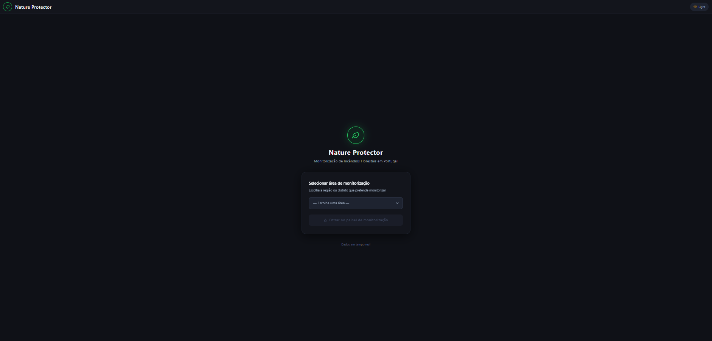
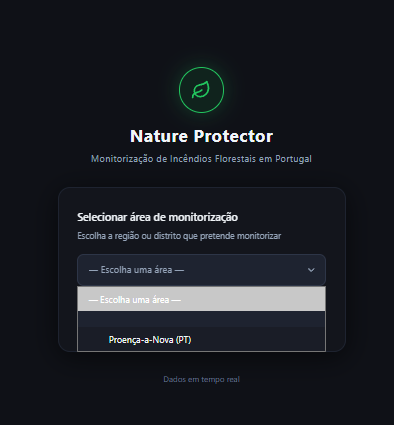
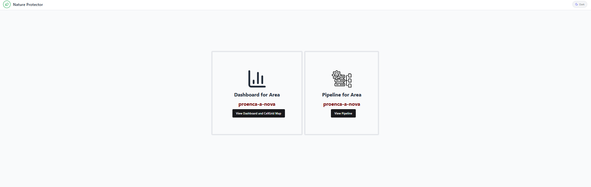
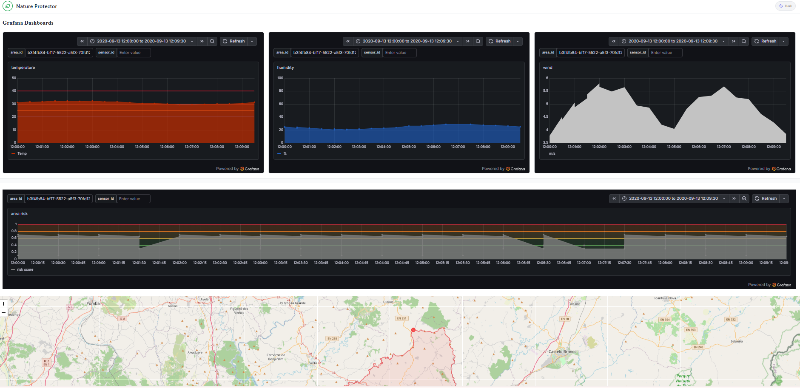
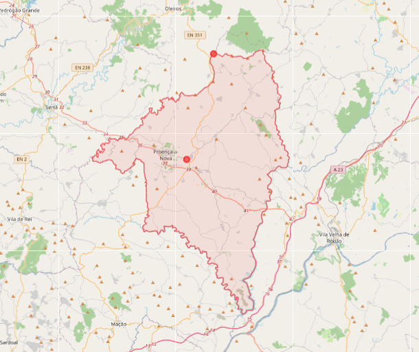

# Preparação

### É necessário ligar os serviços docker
```
    ./infra/scripts/up.ps1
```

### e também ligar pelo menos backendAPI
```
    .\scripts\dotnet\Use-RepoDotnetEnvironment.ps1
    dotnet run --project .\src\NatureProtector.Backoffice.Api
```

### Instalar:
```
    cd WebUI
    npm install
```

### Fazer Build com vite
```
    npm run build // ou npx vite build
```

### Ligar com vite se já tinha sido feito build
```
    npm run dev // ou npx vite
```

Entrar no link [http://localhost:XXXX] criado pelo vite

## O que existe de momento:

### Página principal (/):



Escolha de uma área a visualizar, a partir da lista proveniente da API



### Áreas (dashboards/:areaCode):



A primeira página vista após a escolha de uma área demonstra todos os links para páginas relativas a dashboards da área em análise

De momento existem 2 páginas:

### dashNMap:



Esta vista apresenta 4 dashboards relativas à base de dados influxdb:
    
    - Humidade (%)
    - Temperatura (ºC)
    - Vento (velocidade)
    - Risco da Área



Tal como o GeoJSON da Área num mapa, com pontos a representar Células de Sensores com pelo menos um sensor ativo

### pipeline:

De momento não mostra nada, mas esta vista tem como objetivo mostrar toda a pipeline de consumo de mensagens desde a entrada de valores dos sensores até ao envio de leituras aceites (accepted_readings)